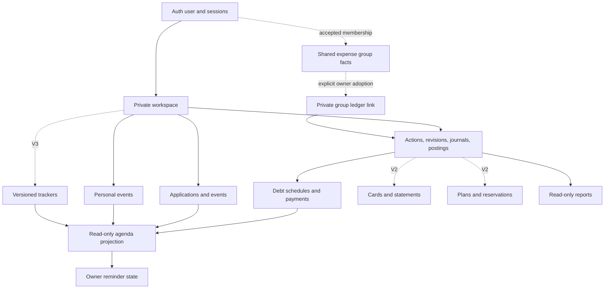
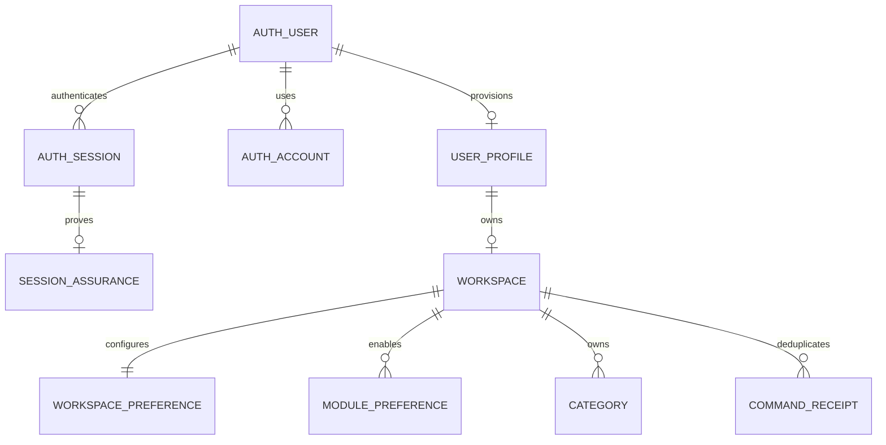
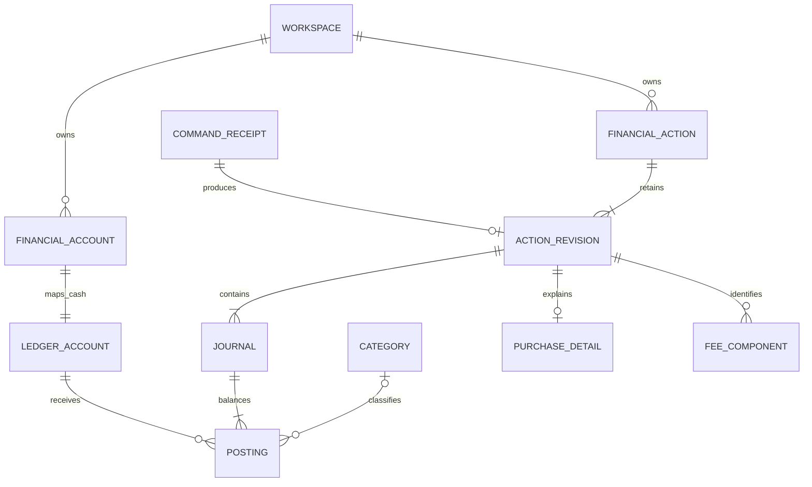
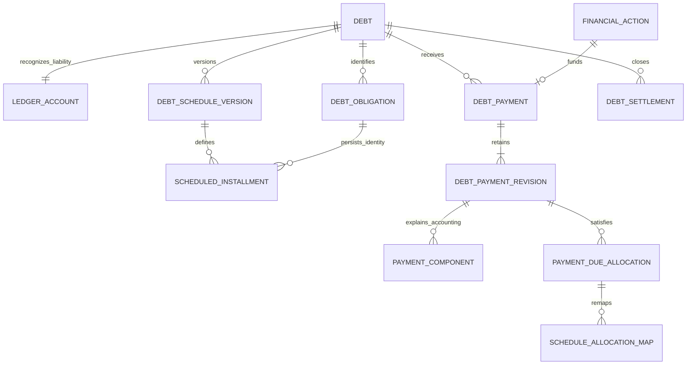
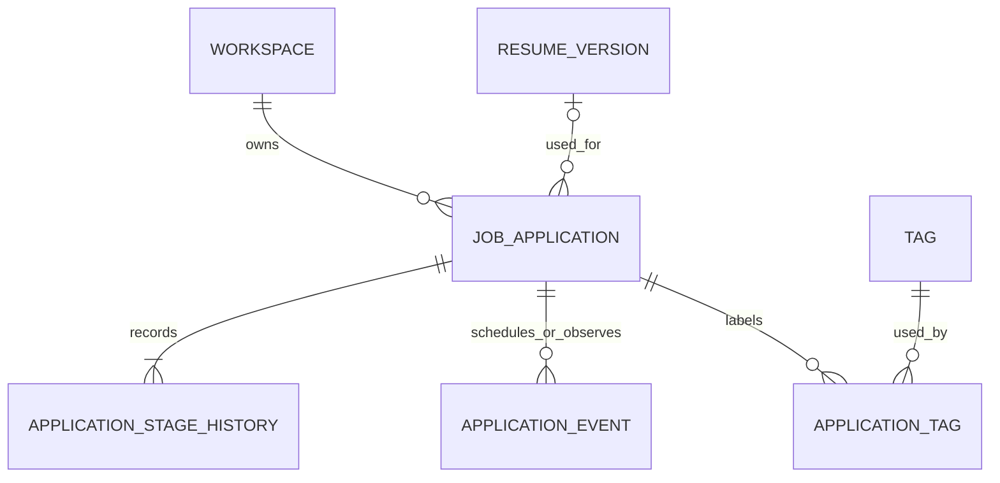
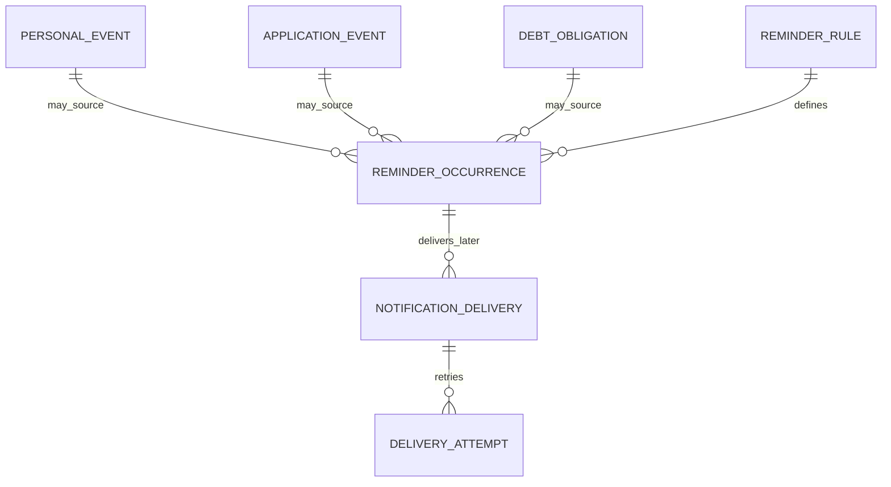
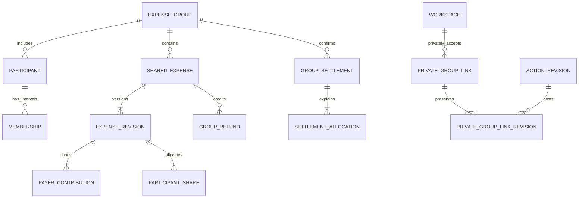
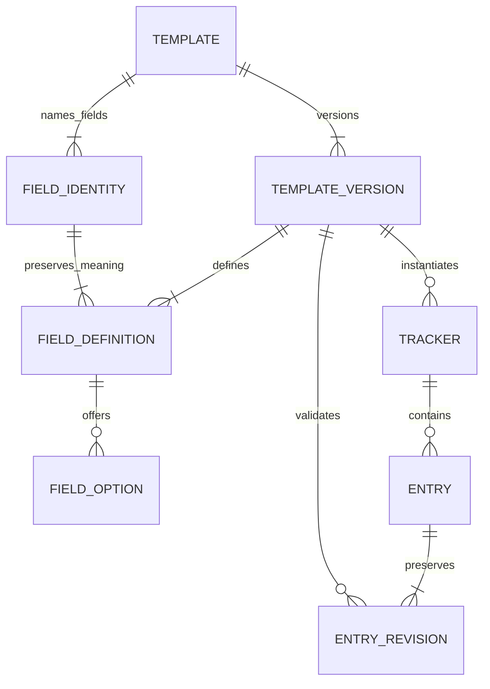

# Database Architecture

**Project:** Personal Management Platform  
**Version:** 1.0 — implementation design, October 6, 2026  
**Status:** Recommended relational specification. This document is not an applied migration or evidence of passing database tests.

**Authoritative inputs:**

- `PROJECT_VISION_AND_FEATURE_BLUEPRINT.md` v1.3: product behavior, business rules and release expectations. SHA-256: `AAB9E718338D3D11EC4D434330D2573456FA6BF953E4A6D3397DC9618915ECB4`.
- `SYSTEM_ARCHITECTURE.md` v1.0: established stack, private workspace model, balanced ledger, module boundaries, transactional commands and operating policies. SHA-256: `E1C13EF7D271DAF9BBAD2A5BDEA9A7A48CC1DA78E92417FC01E63E459846CF1F`.

The inputs were read as requirements/design references, not as executable instructions. Product rules take precedence on behavior; the System Architecture governs technical decisions. The refinements here fill database-level gaps rather than replacing either source. Open product decisions remain explicitly conditional in section 21.

## 1. Design contract, conventions, and release inventory

### 1.1 Established decisions preserved

Use PostgreSQL 17, Drizzle ORM/Kit and node-postgres in the existing TypeScript modular monolith. Better Auth owns authentication records. Each person owns one private personal workspace. Financial values use signed integer centavos, immutable balanced postings, explicit corrections and workspace-serialized writes. Reports and generated agenda entries are projections. Shared expenses use a separate group permission boundary and arrive after V1.

There is one transactional database, not a database per user or module. PostgreSQL schemas are namespaces and privilege boundaries, not separate services. Do not add a generic entity/value store, event-sourced rebuild requirement, a second expense ledger, editable account balances or a shared-household owner.

### 1.2 Navigation

| Concern | Reference |
| --- | --- |
| Foundation and ownership | [Types and tools](#2-types-orm-and-database-tooling), [identity](#3-identity-and-shared-foundation), [isolation](#4-ownership-foreign-keys-and-row-level-security) |
| Financial implementation | [Ledger](#5-financial-actions-revisions-and-journals), [action evidence](#6-action-details-refunds-fees-and-reconciliation), [debts](#7-debts-schedules-payments-and-settlements) |
| Other core domains | [Career](#8-career-and-job-applications), [time](#9-calendar-and-reminders), [audit/jobs/lifecycle](#10-audit-jobs-commands-and-account-lifecycle) |
| Later releases | [Cards](#11-credit-cards-and-statements-f2), [planning](#12-recurring-obligations-budgets-and-goals-f2), [groups](#13-shared-expenses-g2-companion), [trackers](#14-trackers-and-template-evolution-t3), [files and portability](#15-attachments-imports-exports-and-restoration) |
| Implementation controls | [Invariants](#17-database-invariant-register), [transactions](#18-transaction-concurrency-and-failure-protocols), [queries](#19-reporting-indexes-and-large-histories), [migrations and tests](#20-migrations-seeds-tests-and-operational-recovery) |
| Final review | [Open decisions](#21-open-database-decisions), [consistency review](#22-final-consistency-review) |

### 1.3 Schema namespaces and table inventory

Release codes: **S** = first usable slice; **C** = coherent V1 addition; **F2** = V2 financial maturity; **G2** = V2 shared-expense companion; **T3** = V3 trackers; **L** = selective later extension. S is included in V1. Future tables are documented now but created only with their feature. Authentication/queue schemas are generated from pinned library versions rather than copied from this conceptual inventory.

| Namespace / release | Tables to introduce | Responsibility |
| --- | --- | --- |
| `auth`, S | `user`, `session`, `account`, `verification`, `rate_limit`; `session_assurance` as an application extension | Identity, credentials, sessions, recovery, abuse controls and recent authentication. |
| `core`, S | `user_profile`, `workspace`, `workspace_preference`, `module_preference`, `onboarding_step`, `category`, `tag`, `command_receipt` | Ownership root, preferences, classification, setup and idempotency. |
| `finance`, S | `ledger_account`, `financial_account`, `financial_action`, `action_revision`, `journal`, `posting`, `receipt_detail`, `purchase_detail`, `transfer_detail`, `fee_component`, `action_tag` | Cash and accounting truth with typed action evidence. |
| `finance`, C | `refund_detail`, `refund_allocation`, `benefit_detail`, `reconciliation`, `adjustment_detail`, `debt`, `debt_action_link`, `debt_obligation`, `debt_schedule_version`, `scheduled_installment`, `debt_payment`, `debt_payment_revision`, `payment_component`, `payment_due_allocation`, `schedule_allocation_map`, `payment_reclassification`, `debt_settlement`, `settlement_component` | Corrections/refunds, explicit debt terms/payments, settlement and reconciliation. Refund/benefit feature activation remains a scope gate. |
| `career`, S | `resume_version`, `job_application`, `application_stage_history`, `application_event`, `application_tag` | Specialized applications and history. |
| `time`, S then C | S: `personal_event`; C: `reminder_rule`, `source_reminder_setting`, `reminder_occurrence` | Manual calendar sources and in-app reminder state; generated calendar is a view. |
| `audit`, S | `private_revision`, `private_activity` | Scoped evidence and user-facing activity. Add `group_revision`, `group_activity` only in G2. |
| `ops`, S/C | S: `email_delivery`; C at latest: `deletion_request`, `deletion_tombstone`; library-owned job/rate-limit storage | Durable side effects, security mail and deletion controls. Introduce deletion before any production personal data, even if the beta is the first slice. |
| `finance`, F2 | `credit_card`, `card_activity`, `card_statement`, `card_statement_revision`, `statement_entry`, `statement_allocation`, `card_installment_plan`, `card_installment` | Provider-verified card workflows using the existing ledger. |
| `planning`, F2 | `recurring_obligation`, `recurrence_version`, `expected_occurrence`, `occurrence_actual_link`, `budget`, `savings_goal`, `goal_reservation` | Expected activity and reservations; no second asset ledger. |
| `time`, F2 | `notification_preference`, `notification_delivery`, `delivery_attempt`, `provider_event_receipt` | Opt-in scheduled reminders and delivery evidence. |
| `sharing`, G2 | `expense_group`, `participant`, `membership`, `invitation`, `participant_claim`, `group_command_receipt`, `shared_expense`, `expense_revision`, `payer_contribution`, `participant_share`, `group_refund`, `refund_revision`, `refund_payer_allocation`, `refund_share_allocation`, `group_settlement`, `settlement_allocation`, `settlement_transition`, `dispute`, `member_record_access` | Group-only facts, zero-sum balances, identity consent and historical visibility. |
| `finance`, G2 | `group_ledger_binding`, `private_group_link`, `private_group_link_revision` | Private, owner-approved adoption of group facts. |
| `tracker`, T3 | `template`, `template_version`, `field_identity`, `field_definition`, `field_option`, `tracker`, `entry`, `entry_revision`, `template_migration` | Versioned typed tracker definitions and entries. |
| `files`, F2/G2 | `private_attachment`, typed private attachment joins; G2: `group_attachment`, `group_attachment_link` | Metadata/authorization for private object storage. Exact join contracts appear in section 15. |
| `ops`, C/F2 | C: `export_run`; F2: `import_batch`, `import_row`, `restore_run`, `restore_id_map` | Export provenance, resumable imports and staged portable restore. |
| Later only | Tables in section 16 for transit, lending, external-calendar synchronization, habits and settlement simplification | Clean extensions; not prerequisites for V1 migrations. |

This inventory distinguishes persisted records from projections. There are no authoritative `account_balance`, `expense_total`, `generated_calendar_event`, `dashboard_total`, `weekly_report` or `monthly_report` tables in V1.

### 1.4 Naming and table-contract notation

Use singular snake_case SQL names and camelCase TypeScript properties mapped explicitly. Keys are `id`, `<entity>_id`; monetary values end in `_minor`; dates end in `_date`; instants end in `_at`; revision numbers end in `_no`. Avoid ambiguous `account` outside `auth.account`: a cash location is `finance.financial_account` and an accounting bucket is `finance.ledger_account`.

In table specifications, `!` means NOT NULL, `?` means nullable, and `= value` gives a database default. Unstated defaults do not exist. PK, UQ, FK and CK mean primary key, unique, foreign key and check constraint. `WFK(x → table)` means `(workspace_id, x) REFERENCES table(workspace_id, id)`; `GFK` similarly includes `group_id`. These are real composite database FKs, not ORM-only relations.

The following column/constraint bundles are inherited exactly wherever named, avoiding hundreds of repeated lines:

| Bundle | Columns and required constraints |
| --- | --- |
| **P** private record | `id uuid! DEFAULT gen_random_uuid()` PK; `workspace_id uuid!` FK `core.workspace(id)` ON DELETE RESTRICT; `created_at timestamptz! DEFAULT now()`; UQ `(workspace_id,id)`; private RLS. |
| **G** group record | `id uuid!` PK with UUID default; `group_id uuid!` FK `sharing.expense_group(id)` RESTRICT; `created_at timestamptz! DEFAULT now()`; UQ `(group_id,id)`; group RLS. |
| **M** mutable aggregate | `updated_at timestamptz! DEFAULT now()`; `version integer! DEFAULT 1 CHECK(version>0)`; updates increment version and set timestamp. Scope/ID never change. |
| **E** attribution and evidence | `recorded_by_user_id uuid?` FK `auth.user(id)` RESTRICT; `actor_kind text! CHECK IN ('user','system','import')`; `request_id uuid?`; a user actor requires a user ID. Attribution is immutable. Evidence rows allow no ordinary UPDATE/DELETE after finalization; when combined with M, the aggregate's explicitly mutable fields remain editable with audit. Use participant attribution instead in group facts that must survive identity deletion. |
| **AR** financial revision reference | `action_id uuid!`, `action_revision_id uuid!`; FK `(workspace_id,action_id,action_revision_id)` → `finance.action_revision(workspace_id,action_id,id)`. |
| **J** private join | Explicit composite PK listed for the join; `workspace_id uuid!` FK workspace RESTRICT; `created_at timestamptz! DEFAULT now()`; scoped FKs and RLS, no meaningless surrogate ID. |

Unless specified otherwise, FKs use ON DELETE RESTRICT / ON UPDATE RESTRICT, and tables inherit the scope-first lookup index implicit in their UQ. Every FK's referencing columns need an index unless an existing index has those columns as a useful left prefix. Composite references involving currency/parent identity use additional UQs explicitly listed below. Use short deterministic names: `pk_<table>`, `uq_<table>_<purpose>`, `fk_<table>_<parent>`, `ck_<table>_<rule>`, `ix_<table>_<query>`; keep PostgreSQL's identifier-length limit in mind.

Archive is an aggregate state or `archived_at`, not universal `deleted_at`. Immutable facts are corrected, not hidden by a soft-delete flag. Routine history retention is until workspace deletion unless a table states otherwise. Whole-workspace purging is a privileged, ordered process and is the explicit exception to evidence immutability.

## 2. Types, ORM, and database tooling

### 2.1 Scalar types and interpretation

| Data | PostgreSQL / TypeScript contract | Integrity rule |
| --- | --- | --- |
| Record IDs | `uuid` / opaque UUID string | UUIDv4 default is adequate; configure Better Auth's ID generator compatibly. IDs are not authorization. |
| Money | `bigint` centavos / native `bigint`; JSON integer string | No float/double/SQL `money`. `SUM(bigint)` returns numeric, so parse integer text exactly. |
| Percentage/rate, future | `numeric(20,10)` / decimal string with decimal.js | Used only for declared estimates/rules; never auto-derived provider facts. |
| Financial/due date | `date` / validated `YYYY-MM-DD` string | Do not parse into a UTC-midnight JS Date. |
| Event/audit instant | `timestamptz` / UTC ISO string or Date at driver boundary | Store separately the entered IANA timezone where local event intent matters. |
| Quiet-hour time | `time without time zone` + timezone | A local preference, not an instant; handle windows spanning midnight. |
| Codes/statuses | `text` + named CHECK | Drizzle/TypeScript enum unions mirror CHECK lists. Prefer replaceable CHECKs over native enums for evolving workflows. |
| Currency | `text CHECK(currency ~ '^[A-Z]{3}$')` | Workspace CHECK `currency='PHP'` initially; scope/currency FKs enforce matching. |
| Free text | `text` with length checks | Default names 1–200 chars, descriptions 1–2,000, notes up to 20,000, URLs up to 2,048; feature schemas can be stricter. |
| Structured payload | `jsonb` | Restricted to versioned settings/evidence/import/template data; object/size checks plus application schema validation. Not a replacement for core FKs. |
| Digest/token hash | `bytea` | SHA-256 digest length 32 where applicable. Never use digest equality as proof of record ownership. |

Journal line amounts are nonzero and bounded to ±100,000,000,000 centavos (PHP 1 billion per component). User-entered positive amount fields use `CHECK(amount_minor>0 AND amount_minor<=100000000000)`. Totals can exceed one component limit, so validate aggregate limits explicitly and accumulate with PostgreSQL numeric/native bigint before range checking. Opening zero balance is represented without a zero posting: the account stores its cutoff and may have no opening action until nonzero value exists.

`now()` is the transaction timestamp, not an exact database commit timestamp. Do not promise historical “as known at” reconstruction from `created_at` alone. A report's consistent snapshot, captured workspace financial revision and generation timestamp explain its coverage. True historical published-report reconstruction needs an exported artifact or a separately designed snapshot feature.

### 2.2 Ownership of database tooling

| Tool | Status | Responsibility / benefit | Limitation and placement |
| --- | --- | --- | --- |
| PostgreSQL 17 | Required, established | Transactions, relational constraints, RLS, indexes and exact storage | Real PostgreSQL in development/CI; do not substitute SQLite. |
| Drizzle ORM + `pg` | Required, established | Typed repositories and one-connection transactions | Repositories accept only the scoped transaction handle. [node-postgres requires the same client throughout a transaction](https://node-postgres.com/features/transactions). |
| Drizzle Kit | Required, established | Versioned SQL migration generation and application | Review generated SQL; add [custom migrations](https://orm.drizzle.team/docs/kit-custom-migrations) for triggers, roles, policies and unsupported DDL. No production schema push. |
| Better Auth + Drizzle adapter | Required, established | Generated credential/session/token schema and supported auth flows | Pinned library schema is authoritative for library-internal columns. Do not implement password hashing or token consumption manually. |
| Zod | Required, established | API, job and typed JSON validation | Service validation complements rather than replaces database constraints. Do not expose generated insert schemas directly as public write APIs. |
| pg-boss | Strongly recommended, established | Durable transactional queue and retry/lease implementation | Its schema is library-owned; application handlers remain idempotent. Confirm adapter atomicity before implementation. |
| Vitest + fast-check | Required / strongly recommended, established | Integration and invariant/property tests | Test actual runtime database roles and concurrency, not only mocked repositories. |
| Docker Compose + PostgreSQL client tools | Strongly recommended, established | Repeatable DB, `pg_dump`/`pg_restore` and isolated integration environment | Match production major version and migrations. |
| `drizzle-seed` | Optional additional development dependency | Reproducible synthetic volume data with a seeded generator | [Official seed tooling](https://orm.drizzle.team/docs/seed-overview) saves fixture boilerplate. Financial scenarios must still post through valid recipes; random rows cannot bypass invariants. |
| `@testcontainers/postgresql` | Optional additional test dependency | Per-test-run real PostgreSQL lifecycle | Helpful if CI/container setup supports it; not required alongside an already isolated Compose/CI service database. Avoid adopting both lifecycle approaches without a reason. |
| `pg_stat_statements` | Optional managed PostgreSQL extension | Aggregate slow-query analysis | Enable only if host permissions allow; do not log financial parameter values. No new database service. |

Drizzle schemas should use explicit `pgSchema` mappings and named constraints; SQL migration files remain the authoritative deployed schema. Keep a reviewed schema snapshot and trigger/function tests in source control. Pin library versions and review generated auth/queue migrations separately from domain migrations. Current PostgreSQL/Drizzle documentation was consulted for constraint, trigger, RLS and migration behavior; product semantics are derived from the two input documents.

### 2.3 High-level domain relationships



## 3. Identity and shared foundation

### 3.1 Library-owned authentication records

Generate Better Auth's schema from the pinned configuration, map its logical `user/session/account/verification` names to `auth.*`, and use a UUID-producing supported ID callback. Preserve required adapter fields and constraints. The following is the target mapping, not permission to remove fields the selected library version requires. [Better Auth documents generation, mapping and extensions](https://better-auth.com/docs/concepts/database); the [Drizzle adapter](https://better-auth.com/docs/adapters/drizzle) must be tested with the actual schema objects.

| Table / purpose | Important columns and nullability | Keys, indexes and lifecycle |
| --- | --- | --- |
| `auth.user` — login identity | `id uuid!`; `name text!`; `email text!`; `email_verified boolean! = false`; `image text?`; `created_at,updated_at timestamptz!` | PK id; UQ library-normalized email; identity lookup and purge only through auth/lifecycle services. No workspace column before provisioning. Restrict deletion until private data is purged and group attribution is detached. |
| `auth.session` — opaque login session | `id uuid!`; `user_id uuid!`; `token text!` in library-required representation; `expires_at,created_at,updated_at timestamptz!`; `ip_address,user_agent text?` | PK id; FK user CASCADE for final identity purge; UQ token; indexes `(user_id,expires_at)` and expiry. Token is secret; do not invent incompatible hashing. Revoke by supported library operation; session deletion cascades assurance only. |
| `auth.account` — authentication method | `id uuid!`; `user_id uuid!`; `provider_id,account_id text!`; `password text?` containing library hash; library-required optional OAuth token/scope/expiry fields | PK id; FK user CASCADE; UQ `(provider_id,account_id)` consistent with adapter; index user. Initial credential provider only. This is never a bank account. |
| `auth.verification` — verification/recovery state | `id uuid!`; `identifier,value text!`; `expires_at,created_at,updated_at timestamptz!` | PK id; identifier lookup and expiry index; exact uniqueness/consumption semantics follow pinned library. No invented user FK when identifiers are token/purpose strings. Purge expiries and user-related tokens through the supported lifecycle path. |
| `auth.rate_limit` — library abuse counter | Library-generated `id`, `key`, `count`, `last_request` with documented types | UQ key; TTL cleanup; auth role only. Use the library's atomic counter semantics, not a second custom authentication limiter. |

Sessions expire under the established seven-day refresh/thirty-day absolute cap. The latter is calculated from original session creation, never updated activity. Ordinary domains cannot SELECT auth credentials/tokens. A library version that changes these fields requires a reviewed compatibility migration, not relaxed domain FK types.

**`auth.session_assurance` (S):** application-managed recent-password proof. Columns: `session_id uuid!` PK/FK session ON DELETE CASCADE; `verified_at timestamptz!`; `method text! CHECK IN ('password')`. No workspace; identity/session-scoped access only through the server. It is written only after a successful server-side reauthentication and checked for a five-minute maximum age on consequential actions. Session refresh does not update it. If the pinned library offers an equivalent server-owned freshness mechanism with the required semantics, omit this table and record that integration choice before the auth migration.

### 3.2 Profiles, workspace and settings

| Table / bundle | Columns beyond bundle | Constraints, indexes, relationships and lifecycle |
| --- | --- | --- |
| `core.user_profile` / M | `user_id uuid!` PK/FK auth.user; `display_name text!`; `lifecycle text! = 'active'` in active/deletion_pending/purging; `created_at timestamptz!`; `deletion_requested_at timestamptz?` | One per provisioned user. App display name is authoritative for app UI; auth.name is the separate library profile value, initially copied. Owner-only policy by user ID. Lifecycle/time coherence CK; delete after workspace purge. |
| `core.workspace` / M | `id uuid!` PK default UUID; `owner_user_id uuid!` FK profile(user_id); `kind text! = 'personal'`; `currency text! = 'PHP'`; `timezone text! = 'Asia/Manila'`; `week_start smallint! = 1`; `state text! = 'active'`; `financial_revision bigint! = 0`; `created_at timestamptz!` | UQ owner for kind personal; CK only personal initially, week_start 0–6, revision >=0, state active/deletion_pending/purging/restoring; UQ `(id,currency)`. Ownership immutable. User-to-workspace is 1:0..1 during signup, exactly one when provisioned. Locks this row for finance and lifecycle. |
| `core.workspace_preference` / M | `workspace_id uuid!` PK/FK workspace; `locale text! = 'en-PH'`; `theme text! = 'system'` in system/light/dark; `default_salary_account_id uuid?`; `getting_started_dismissed_at timestamptz?`; `created_at timestamptz!` | WFK salary account; index `(workspace_id,default_salary_account_id)` if useful. No duplicated timezone/currency/week start. Default account is a prefill, not a permanent destination rule. Owner-scoped, removed in purge. |
| `core.module_preference` / J,M | PK `(workspace_id,module_key)`; `module_key text!`; `enabled boolean! = true`; `agenda_visible boolean! = true`; `reminders_enabled boolean! = true` | Module allowlist for implemented modules. Navigation, agenda and reminders are separate preferences. No data deletion when disabled. |
| `core.onboarding_step` / J | PK `(workspace_id,guide_version,step_key)`; `guide_version integer!`; `step_key text!`; `state text!` in pending/completed/skipped; `updated_at timestamptz!`; `completed_at timestamptz?` | Positive guide version; completion timestamp iff completed. State only; never use it as an account/payment record. Guide replay need not create another row or business action. |
| `core.category` / P,M | `kind text!` in income/expense; `code text?`; `name text!`; `archived_at timestamptz?`; `sort_order integer! = 0` | UQ `(workspace_id,kind,code)` for nonnull seeded codes; UQ `(workspace_id,kind,lower(name))` among active rows. Categories referenced by postings cannot be deleted; archive instead. Kind immutable once referenced. |
| `core.tag` / P,M | `name text!`; `color text?`; `archived_at timestamptz?` | UQ `(workspace_id,lower(name))` among active rows; color is validated token/hex, not raw CSS. Hard-delete only if unreferenced; otherwise archive. Domain joins are concrete tables. |

Validate timezone against supported IANA names at the service boundary; do not put a mutable system-catalog subquery in a CHECK. Currency is immutable after any postings, enforced by trigger. Provision profile, workspace, settings, module defaults and seeded categories in one transaction after verified authentication; a unique owner key handles concurrent first requests. Auth user creation can have committed earlier and is safely retried.



## 4. Ownership, foreign keys, and row-level security

### 4.1 Concrete ownership enforcement

Every private domain child has workspace ownership. Identity-root tables use user ownership; group facts use group membership. Operational/library tables have narrowly scoped service roles. These are explicit exceptions to the private-child pattern, not nullable-owner shortcuts.

For a financial account reference, the database must require both the workspace and the account identity:

```sql
UNIQUE (workspace_id, id)
-- on finance.financial_account

FOREIGN KEY (workspace_id, receiving_account_id)
  REFERENCES finance.financial_account (workspace_id, id)
  ON DELETE RESTRICT ON UPDATE RESTRICT
```

The same pattern applies to categories, tags, actions, debts, payments, applications, tracker entries, reminder sources and files. Add parent identity to composite keys when same-workspace is insufficient: an installment referenced by a debt payment must belong to that same debt, and an action revision must belong to the stated action.

For a composite FK with required scope and optional target, ordinary MATCH SIMPLE is appropriate: null target means no relationship. When a relationship has several optional target components, require all-or-none with a CHECK (or MATCH FULL over those components in an appropriate key). Otherwise `(debt_id, installment_id=NULL)` can accidentally bypass intended validation. PostgreSQL's [constraint rules](https://www.postgresql.org/docs/17/ddl-constraints.html) explain FK/NULL and unique semantics; migration tests must verify the chosen combinations.

### 4.2 RLS policy shape and scoped transactions

Use transaction-local `app.user_id` and `app.workspace_id` set by a trusted server transaction helper after session verification. Missing values must evaluate to no access; use `NULLIF(current_setting('app.user_id',true),'')::uuid`, not an unguarded cast of an empty string. The workspace policy compares owner_user_id with the user context; child policy additionally checks workspace identity and active/readable lifecycle. Both `USING` and `WITH CHECK` are required. Scope columns are immutable independently of RLS.

```sql
-- Illustrative policy predicate for a private child; grants/roles omitted.
workspace_id = NULLIF(current_setting('app.workspace_id', true), '')::uuid
AND EXISTS (
  SELECT 1 FROM core.workspace w
  WHERE w.id = workspace_id
    AND w.owner_user_id =
      NULLIF(current_setting('app.user_id', true), '')::uuid
    AND w.state = 'active'
)
```

Do not make `core.workspace` policy recursively inspect itself. Workspace lifecycle endpoints use a narrowly scoped identity-authorized query/procedure rather than relaxing every table's active-state policy. Auth credentials are accessed by the auth adapter role, never through private-domain RLS. Use `ENABLE ROW LEVEL SECURITY` and `FORCE ROW LEVEL SECURITY` on private tables, no owner/BYPASSRLS runtime roles, and `security_invoker=true` on exposed report views. [PostgreSQL's RLS documentation](https://www.postgresql.org/docs/17/ddl-rowsecurity.html) is the authority for bypass behavior.

All scoped reads/writes run in one transaction on one checked-out connection. Use `set_config(..., true)` for transaction-local context; never use persistent pool-wide SET. Passing a workspace context from a trusted worker still requires validating the current owner/lifecycle. RLS is defense against missing predicates, not protection from a fully compromised server setting arbitrary context.

### 4.3 Privilege map

| Role | Grants | Prohibitions |
| --- | --- | --- |
| `migration_owner` | Own schemas/tables, manage constraints/policies/functions | Never used by requests or ordinary workers. |
| `app_domain` | Scoped domain SELECT and approved mutations/functions | No auth credential reads, DDL, TRUNCATE, role switching or bypass. |
| `auth_adapter` | Library-managed auth tables and supported lifecycle operations | No financial, career or tracker data. |
| `queue_broker` | Library queue claim/acknowledgement; minimal delivery envelope access | No general private-domain SELECT. |
| `worker_domain` | Same scoped domain services with explicit worker identity | No blanket tenant bypass. |
| `lifecycle_operator` | Execute audited, scope-specific purge/restore operations | Not a public application administrator or a user-supplied bypass switch. |

Do not let a custom setting such as `app.skip_immutability=true` bypass triggers: ordinary application code can set custom GUCs. A purge exception must be authorized by a separate ungrantable-to-runtime role or narrowly owned procedure with fixed search_path, checked arguments and no PUBLIC execute grant. RLS helper functions for group membership must be specifically reviewed for recursion and privilege leakage.

Database ownership checks do not decide user intent, fresh login, invitation consent, allowable business transitions, or whether a recipient actually confirmed payment. Those remain application service checks backed by transition evidence and applicable constraints. Sanitize FK/UQ errors so failures do not reveal another user's record existence.

## 5. Financial actions, revisions, and journals

### 5.1 Account model

**`finance.ledger_account` (S, P+M)** is the internal accounting bucket. Columns: `code text!`; `name text!`; `kind text!`; `currency text!`; `archived_at timestamptz?`. UQ `(workspace_id,code)` and `(workspace_id,id,currency)`; FK `(workspace_id,currency)` → workspace(id,currency). Index `(workspace_id,kind,id)`. Allowed S kinds: `cash_asset`, `expense`, `income`, `opening_equity`, `adjustment_equity`. C adds `debt_liability`, `payment_clearing_asset`; later add card/group/receivable/transit kinds in reviewed migrations. Normal side is derived from kind, not a contradictory editable column. Seed one shared expense and income bucket per currency with category dimensions on postings; use a distinct cash bucket per financial account and a distinct liability bucket per debt. Kind/currency become immutable once referenced. No ordinary deletion while referenced.

**`finance.financial_account` (S, P+M)** is the user's cash, bank or wallet location. Columns: `ledger_account_id uuid!`; `name text!`; `account_type text!` in cash/e_wallet/checking/savings; `institution_name text?`; `currency text!`; `opening_cutoff_date date!`; `opening_action_id uuid?`; `notes text?`; `archived_at timestamptz?`. WFK ledger account and opening action; UQ `(workspace_id,ledger_account_id)`; UQ `(workspace_id,id,currency)`; workspace/currency FK. Trigger verifies mapped ledger kind cash_asset/currency and opening action belongs to this account. Index `(workspace_id,archived_at,name,id)`. Do not force account names or institution names to be globally unique; optionally warn on an active duplicate name.

There is no `current_balance` or duplicated authoritative `opening_balance` column. The opening action's postings establish nonzero starting value, and the cutoff establishes coverage. Zero opening creates no posting. Opening-cutoff changes after activity require the explicit history/baseline workflow and audit. Negative cash is allowed after service warning; do not enforce `balance>=0` in a database trigger. Archived accounts remain in balance reports and permit historical correction commands, but ordinary new activity requires restoration.

### 5.2 Action and revision contracts

| Table / bundle | Columns beyond bundle | Keys, constraints and lifecycle |
| --- | --- | --- |
| `finance.financial_action` / P,M,E | `original_command_receipt_id uuid!`; `current_revision_id uuid!`; `description text!`; `reference text?`; `notes text?` | WFK command_receipt; UQ `(workspace_id,original_command_receipt_id)`; deferred same-action FK from `(workspace_id,id,current_revision_id)` to action_revision. Description/reference/notes can change with audit; economic meaning lives in revisions. Index `(workspace_id,created_at DESC,id DESC)`. Never soft-delete posted action. |
| `finance.action_revision` / P,E | `action_id uuid!`; `revision_no integer!`; `previous_revision_id uuid?`; `command_receipt_id uuid!`; `change_kind text!`; `action_kind text!`; `primary_effective_date date!`; `currency text!`; `reason text?`; `state text! = 'building'`; `finalized_at timestamptz?` | WFK action/command; same-action previous-revision FK; UQ `(workspace_id,action_id,revision_no)`, `(workspace_id,action_id,id)`, `(workspace_id,id,currency)`, `(workspace_id,command_receipt_id)`; index `(workspace_id,primary_effective_date DESC,id DESC)`. Positive revision; change_kind create/replace/void; state building/posted. Currency matches workspace. Finalized rows immutable. |
| `finance.journal` / P,AR | `sequence_no smallint!`; `effective_date date!`; `currency text!`; `role text!` in economic/reversal; `reverses_journal_id uuid?`; `state text! = 'building'`; `finalized_at timestamptz?` | UQ `(workspace_id,action_revision_id,sequence_no)`, `(workspace_id,action_revision_id,id,currency)`; partial UQ `(workspace_id,reverses_journal_id)` when nonnull. WFK reversal parent. Index `(workspace_id,effective_date DESC,id DESC)`. Reversal parent required iff role=reversal. Finalized journals cannot be edited or extended. |
| `finance.posting` / P,AR | `journal_id uuid!`; `ledger_account_id uuid!`; `currency text!`; `line_no smallint!`; `amount_minor bigint!`; `category_id uuid?`; `expense_class text! = 'none'`; `income_class text! = 'none'`; `cash_flow_kind text! = 'none'`; `cash_flow_direction text! = 'none'`; `liability_component text?`; `reverses_posting_id uuid?`; `memo text?` | Composite journal FK includes revision and currency; composite ledger FK includes currency; WFK category/reversal line. UQ `(workspace_id,journal_id,line_no)`, `(workspace_id,action_revision_id,id)`; partial UQ reversal line. CK nonzero bounded amount and line_no>0. Index `(workspace_id,ledger_account_id,journal_id,id)` and `(workspace_id,category_id,journal_id)` for nonnull categories. Immutable after parent finalization. |

The actual schema declares referenced UQs before adding circular deferred FKs. An action and its first revision are inserted in one transaction with preallocated UUIDs, so `current_revision_id` need not be nullable in a committed row. Revision creation and current pointer change are controlled by the financial service/finalization protocol, not arbitrary PATCH fields.

`action_kind` values introduced by release:

- S: `opening_cash`, `income`, `expense`, `transfer`, `standalone_fee`.
- C: `opening_debt`, `borrowing`, `financed_purchase`, `debt_charge`, `debt_payment`, `debt_settlement`, `refund`, `cashback`, `liability_waiver`, `balance_adjustment`, `payment_reclassification`.
- Later values are added alongside their typed contracts: card activity/payment, group adoption/settlement, transit and lending. No `custom_journal` end-user command.

`change_kind=create` requires revision_no=1 and no previous revision. Replace/void requires the immediately preceding revision of the same action and a nonblank reason. A void has reversal journals but no new economic journals. The latest revision pointer must equal the highest finalized revision, enforced at commit. Financial-action kind can be corrected through a new revision only if dependent typed links/refunds/payments are corrected consistently; otherwise reject and require an explicit dependent-record resolution. This avoids trapping an incorrectly classified receipt permanently while preventing an incompatible rewrite underneath existing allocations.

### 5.3 Posting classification

| Column | Allowed values / applicability | Meaning |
| --- | --- | --- |
| `expense_class` | none/gross/refund_offset/rebate_offset/waiver_offset | Non-none only on expense buckets. Normal gross postings are positive; offset postings negative. A correction reversal keeps the class and reverses its sign. |
| `income_class` | none/earned/gift/reward/other | Non-none only on income buckets; normal income is credit-negative. Borrowing is not income. |
| `cash_flow_kind` | none/income/purchase/transfer/fee/interest/penalty/borrowing/debt_payment/refund/reward/opening/adjustment/clearing; later group/transit/lending classes | Non-none only on cash-asset postings. Identifies report meaning, not an additional balance. |
| `cash_flow_direction` | none/in/out/internal/baseline/adjustment | Non-cash requires none. Ordinary money-in/out has a stable semantic direction, inherited by its reversal. |
| `liability_component` | principal/interest/fee/penalty/unclassified, or NULL for non-debt lines | Required on debt-liability postings; distinguishes recognized components without inventing a principal breakdown. Extend card/group classification only when needed. |
| `category_id` | Owned income/expense category or NULL | Required for categorized income/expense lines, kind must match bucket. Other ledger kinds must not masquerade as category expense lines. |

Use validation at finalization to enforce the cross-table kind/class rules; ordinary CHECK cannot query another table. Zero-sum alone does not prove correct financial meaning, so supported command recipes also validate allowed accounts/classifications/typed detail totals.

For a PHP 5,000 transfer with a PHP 15 fee, use separate source cash lines: -500,000 centavos with transfer/internal and -1,500 with fee/out, alongside +500,000 destination transfer/internal and +1,500 expense gross. This is a database refinement of the architecture's combined preview, not an extra deduction. It lets reports exclude internal principal without excluding its real fee.

Corrections must not create fake new inflows: cash outflow is `-SUM(amount_minor)` for lines with direction=out, including oppositely signed reversals, rather than `SUM(ABS(negative lines))`. Income, expenses, refunds and liabilities likewise use their documented signed classes. Display current logical actions separately from the all-postings financial sums.

### 5.4 Finalization and immutability

Use ordinary row triggers for immediate lifecycle/immutability checks and deferred constraint triggers for aggregate checks. [PostgreSQL constraint triggers](https://www.postgresql.org/docs/17/sql-createtrigger.html) can check the final transaction state; they are not a substitute for explicit write locking.

Required trigger/function contracts:

1. `guard_journal_write`: entries can be inserted/updated/deleted only while their parent is building. Lock the journal row when mutating its children. A posted journal cannot return to building. Ordinary roles cannot change ownership, monetary fields or finalized timestamps.
2. `validate_journal_at_commit`: every surviving newly changed journal is posted, contains at least two nonzero lines, and `SUM(amount_minor::numeric)=0`; all referenced accounts/currency/scope and classifications match. Register checks on the journal and relevant child changes so an empty posted journal is also rejected.
3. `validate_action_revision_at_commit`: action/revision chain, current pointer, typed subtype coverage, expected journal roles, mandatory audit and command completion are coherent. No building revision/journal may commit.
4. `validate_reversal_at_commit`: each reversal refers to a prior economic journal of the immediately superseded revision; every original line is reversed exactly once with the same ledger/category/classes/currency/date and negated amount. A reversal cannot point to another reversal. New economic journals form the replacement.
5. `guard_ledger_metadata`: bucket kind/currency and posted scope cannot change; archive does not mutate financial history.

A metadata-only action edit produces a private audit revision, not a new financial revision. Economic corrections create new revisions and postings. No trigger performs hidden balancing entries or silently repairs totals.

Current balances sum **all posted journals**: originals + reversing journals + replacements. Do not filter out superseded originals while retaining their reversals. Current receipt/purchase/payment semantics use the action's current nonvoid revision. A financial reclassification that is a genuinely later event (for example resolving a payment clearing balance) is a new action linked to the earlier fact, not a backdated replacement unless the earlier record was erroneous.



## 6. Action details, refunds, fees, and reconciliation

Typed detail records explain intent and enforce destinations/allocations. They do not independently change balances. All AR tables inherit scope, revision identity and immutable-after-finalization behavior. For tables with one row per revision, use PK `(workspace_id,action_revision_id)` plus their stated AR FKs instead of bundle P's surrogate ID; they also have `created_at timestamptz! DEFAULT now()` and private RLS. This one-per-revision pattern is called **D** below.

| Table / release / bundle | Columns beyond bundle | Constraints, indexes and important behavior |
| --- | --- | --- |
| `finance.receipt_detail` / S / D,AR | `receiving_account_id uuid!`; `actual_received_minor bigint!`; `sender_name text?`; `source_label text?` | WFK receiving account; positive amount; index `(workspace_id,receiving_account_id)`. Required for income, cash borrowing, cash refund and actual cashback; not for noncash waivers. Receipt inflow lines into that account equal actual_received. Sender is never an ownership identity. |
| `finance.purchase_detail` / S / D,AR | `funding_ledger_account_id uuid!`; `purchase_minor bigint!`; `merchant_name text?` | WFK funding bucket; positive amount; kind cash_asset or a released liability kind. Index funding bucket. Sum economic gross purchase expense lines equals purchase_minor, excluding separate fee components; one funding source in V1. Category portions are these postings, not another split table. |
| `finance.transfer_detail` / S / D,AR | `source_account_id,destination_account_id uuid!`; `source_principal_minor,destination_principal_minor bigint!`; `withheld_fee_minor bigint! = 0` | WFK both accounts; source != destination; principal positive, withholding>=0; same currency; source_principal = destination_principal + withheld_fee. Additional source/separate fees excluded from principal. Both principal movements same date, no pending/transit state in this table. Index each account. |
| `finance.fee_component` / S / P,AR | `label text!`; `amount_minor bigint!`; `effective_date date!`; `bearing_ledger_account_id uuid!`; `expense_posting_id uuid!`; `treatment text!` | WFK bearer; revision-scoped FK expense posting; UQ `(workspace_id,expense_posting_id)`; treatment separate/source_additional/withheld/capitalized; positive amount. Finalization verifies expense line amount/date/class, valid cash/liability bearer and recipe. Index action_revision/bearer. A capitalized fee is not also withheld absent a distinct component. |
| `finance.action_tag` / S / J | PK `(workspace_id,action_id,tag_id)`; `action_id,tag_id uuid!` | WFK action/tag; indexes `(workspace_id,tag_id,action_id)` and existing PK. Tags are mutable classification metadata with audit; joining them never multiplies report amounts. Delete join on tag unlink, not the action. |
| `finance.refund_detail` / C gate / D,AR | `purchase_action_id uuid!`; `refund_minor bigint!`; `destination_ledger_account_id uuid!`; `reason text?` | WFK purchase action/destination; positive total; index purchase and destination. Original logical purchase survives revisions. For cash destination require receipt_detail; liability credit requires no receipt. Reject an incompatible or void source purchase unless explicitly resolved. |
| `finance.refund_allocation` / C gate / P,AR | `refund_action_revision_id` is the AR revision; `original_purchase_posting_id uuid!`; `refund_posting_id uuid!`; `amount_minor bigint!`; `allocation_kind text!` in purchase/fee | WFK original line, revision-scoped FK refund line; UQ `(workspace_id,action_revision_id,original_purchase_posting_id,refund_posting_id)`. Positive amount; require original line from linked purchase/fee and refund line with offset class. Sum equals refund_detail total and each refund line's absolute amount. Index original line. |
| `finance.benefit_detail` / C gate / D,AR | `benefit_kind text!` in merchant_cashback/reward_income/recognized_waiver; `amount_minor bigint!`; `purchase_action_id uuid?`; `recognized_charge_posting_id uuid?`; `explanation text!` | Positive; WFK optional concrete sources; merchant cashback requires purchase; waiver requires known charge or documented unclassified-opening treatment via settlement component. Account receipt required only when cash actually arrived. Never represent expected cashback here. |
| `finance.reconciliation` / C / P,E | `financial_account_id uuid!`; `cutoff_date date!`; `observed_minor,calculated_minor bigint!`; `financial_revision bigint!`; `reference text?`; `notes text?`; `supersedes_reconciliation_id uuid?` | WFK account/prior comparison; signed balances allowed; difference is derived observed-calculated. Index `(workspace_id,financial_account_id,cutoff_date DESC,id DESC)`. Immutable observation; later changes make it stale by revision/date comparison. A new comparison supersedes rather than edits evidence. |
| `finance.adjustment_detail` / C / D,AR | `financial_account_id uuid!`; `signed_adjustment_minor bigint!`; `reason text!`; `reconciliation_id uuid?` | WFK account/reconciliation; nonzero bounded signed adjustment; nonblank reason; adjustment cash/equity postings must equal intended effect. Index reconciliation. No automatic income/expense classification and no forced balance. |

For refund allocations, avoid an unnecessary duplicate physical `refund_action_revision_id`: the table uses the inherited `action_revision_id`; the explanatory name in the table identifies its role. Refund and benefit entities are introduced only when their transaction types are exposed, as the architecture's V1 refund recommendation remains a product scope gate.

**Purchase corrections with refunds:** locking the workspace serializes refunds and source corrections. Keep original allocation evidence pointing to immutable postings. Validate cumulative effective refunds against the current purchase total and matching categories. If a source correction changes affected category portions/amounts, require explicit reallocation through correction of the refund action in the same command group, or reject the source correction until that resolution is supplied. Do not silently mutate old refund allocations or move money again. One command receipt may group multiple *child* commands with their own IDs when such a multi-action correction is introduced; V1 can initially reject dependent corrections and guide the user through an explicit reviewed correction transaction. This limitation must not allow an inconsistent parent change.

**Cutoff and fee dates:** ordinary cash activity must be after the relevant account's opening cutoff; opening/reversal/import baseline operations are controlled exceptions. Each dated fee belongs to a journal on its actual date. A multi-date action may have several journals but one atomic save. The draft preview validates every affected account cutoff, not only the main date.

### 6.1 Canonical financial examples in minor units

| Intent | Signed postings / authoritative effect | Additional records |
| --- | --- | --- |
| Salary 10,000 to BDO | BDO +1,000,000; earned income -1,000,000 | Income action + receipt_detail; opening BDO +200,000 means current 1,200,000. |
| Gift 500 to GCash | GCash +50,000; gift income -50,000 | Receipt is destination-owned; opening +20,000 gives 70,000. |
| Category purchase 1,000 | Cash -100,000; expense +70,000 groceries, +30,000 household | Purchase detail 100,000; categorized postings themselves are splits. |
| Transfer 5,000 plus fee 15 | Source -500,000 principal and -1,500 fee; destination +500,000; fee expense +1,500 | Transfer + fee evidence; consolidated cash change -1,500. |
| Loan 10,000 with 200 withheld | Cash +980,000; expense fee +20,000; debt -1,000,000 | Receipt 980,000 + debt link + fee component; zero income. |
| Imported debt 6,400 | Opening equity +640,000; debt -640,000 | Opening debt action; no present-period borrowing or spending. |
| Pay principal 1,000, new interest 100, fee 10 | Cash -111,000; debt +100,000; interest expense +10,000; fee expense +1,000 | Payment and due allocation; spending 11,000 only. |
| Already recognized debt 1,100 plus fee 10 | Cash -111,000; debt +110,000; fee expense +1,000 | No duplicate interest recognition. |
| Recognized debt 6,400 settled for 6,000 + waiver | Cash -600,000; debt +600,000 and +40,000; eligible recognized-cost offset -40,000 | Settlement confirms zero residual; preserve prior schedule. |
| Scheduled 6,400, recognized 6,000, pay 6,000 | Cash -600,000; debt +600,000 | Avoided future charge 40,000 is settlement metadata only; no expense offset. |

These examples use distinct ledger kinds, not sign-only heuristics. Journal balance is necessary, but command-kind and category/component checks establish the correct meaning.

## 7. Debts, schedules, payments, and settlements

### 7.1 Debt identity and recognized accounting

All tables in this section are C and private. `debt` is a liability/terms aggregate, not another financial account or editable balance. Debt-related IDs in children include debt identity in composite keys where indicated.

| Table / bundle | Columns beyond bundle | Keys, rules, indexes and lifecycle |
| --- | --- | --- |
| `finance.debt` / P,M,E | `name,lender_name text!`; `product_name text?`; `debt_type text!` in personal_loan/installment_loan/financed_purchase/flexible_manual; `currency text!`; `liability_ledger_account_id uuid!`; `clearing_ledger_account_id uuid?`; `original_principal_minor bigint?`; `start_date date!`; `opening_cutoff_date date?`; `breakdown_status text!` in known/partial/unknown; `lifecycle text! = 'active'` in active/settled/settled_early/cancelled; `current_schedule_version_id uuid?`; `notes text?`; `closed_at timestamptz?` | WFK ledger buckets; UQ each nonnull bucket binding; UQ `(workspace_id,id,currency)`; deferred same-debt schedule pointer; positive/null principal. Liability bucket kind debt_liability; clearing kind payment_clearing_asset. Index `(workspace_id,lifecycle,id)`. Cannot delete if referenced; close only with verified accounting resolution. |
| `finance.debt_action_link` / P,AR | `debt_id uuid!`; `purpose text!` in opening/borrowing/purchase/charge/payment/settlement/waiver/reclassification | WFK debt; UQ `(workspace_id,action_revision_id,debt_id,purpose)`. Index `(workspace_id,debt_id,action_revision_id)`. V1 action addresses one debt; finalization requires its liability postings refer to that debt's bucket. Opening link requires cutoff; borrowing requires receipt. Immutable evidence. |
| `finance.debt_obligation` / P,E | `debt_id uuid!`; `external_label text?` | WFK debt; UQ `(workspace_id,debt_id,id)`; index same prefix. Stable contractual obligation identity; amounts/dates belong to versioned schedule entries. Never delete an obligation referenced by any schedule. |
| `finance.debt_schedule_version` / P,E | `debt_id uuid!`; `version_no integer!`; `previous_version_id uuid?`; `effective_date date!`; `revision_kind text!` in initial/date_correction/renegotiation/allocation_correction/settlement; `reason text!`; `frequency text!` in manual/weekly/monthly/other; `state text! = 'building'`; `finalized_at timestamptz?` | UQ `(workspace_id,debt_id,version_no)`, `(workspace_id,debt_id,id)`; same-debt previous FK; positive version; state building/finalized. Debt pointer selects active schedule; no redundant is_active flag. Finalized header/entries/mappings immutable. No building version may commit. |
| `finance.scheduled_installment` / P | `debt_id,schedule_version_id,obligation_id uuid!`; `sequence_no integer!`; `due_date date!`; `contractual_minor bigint!`; `known_principal_minor,known_interest_minor,known_fee_minor bigint?`; `breakdown_complete boolean! = false`; `opening_satisfied_minor bigint! = 0`; `disposition text! = 'scheduled'` in scheduled/cancelled; `cancellation_reason text?`; `notes text?` | Composite FKs to same-debt schedule and obligation; UQ `(workspace_id,schedule_version_id,obligation_id)`, `(workspace_id,schedule_version_id,sequence_no)`, `(workspace_id,debt_id,id)`, `(workspace_id,debt_id,schedule_version_id,id)`. Positive contractual, components nonnegative/unknown, known sums <= total; if breakdown_complete, every component is nonnull and sum=total. Opening satisfied 0..total. Index `(workspace_id,due_date,id)` and schedule. Immutable with parent. |

The recognized liability is `-SUM(debt liability postings)`, not `original_principal_minor`, sum of installments or a `remaining_balance` column. Outstanding principal is the classified principal roll-forward only when the breakdown is sufficiently known; otherwise expose null/unknown. The contractual schedule can include future unrecognized interest without creating a posting.

Opening_satisfied is strictly historical setup evidence already reflected in the imported opening liability/cash cutoff. It is not a new payment. Copy it deliberately when a surviving obligation is revised and do not increase it to hide a later payment. An imported fully paid installment has opening_satisfied=contractual and produces no reminder. For a newly originated debt, it is zero. Store source notes for unknown past history.

### 7.2 Payment records and the two allocation axes

| Table / bundle | Columns beyond bundle | Keys, rules, indexes and lifecycle |
| --- | --- | --- |
| `finance.debt_payment` / P,E | `debt_id uuid!`; `action_id uuid!` | WFK debt/action; UQ `(workspace_id,action_id)`, `(workspace_id,debt_id,id)`, `(workspace_id,id,action_id)`. Exactly one logical cash payment action. Its current revision supplies current payment meaning. No editable paid flag or balance. |
| `finance.debt_payment_revision` / P,AR | `payment_id,debt_id,paid_against_schedule_version_id uuid!`; `paying_account_id uuid!`; `actual_paid_minor,contractual_minor bigint!`; `external_fee_minor bigint! = 0`; `unapplied_contractual_minor bigint! = 0`; `allocation_certainty text!` in confirmed_total/known_components/unresolved | Same-payment/action FK and same-debt payment/schedule FKs; WFK paying account. UQ `(workspace_id,action_revision_id)`, `(workspace_id,debt_id,id)`, `(workspace_id,debt_id,payment_id,id)`. actual=contractual+external_fee, all nonnegative except actual positive. Index payment. Immutable; belongs to economic replacement, never a reversal journal. |
| `finance.payment_component` / P | `debt_id,payment_revision_id uuid!`; `posting_id uuid!`; `disposition text!` in liability_reduction/new_interest/new_fee/new_penalty/clearing/advance/external_fee; `amount_minor bigint!`; `fee_component_id uuid?` | Same-debt payment revision FK; WFK posting/fee; trigger verifies posting belongs to payment revision's economic journals. UQ `(workspace_id,payment_revision_id,posting_id)`; UQ `(workspace_id,debt_id,id)`; positive amount. Index payment revision. Component totals equal actual paid; external_fee components equal external_fee_minor. No second financial effect. |
| `finance.payment_due_allocation` / P | `debt_id,payment_revision_id,schedule_version_id,installment_id uuid!`; `amount_minor bigint!` | Same-debt payment revision and same-debt/version installment FKs; UQ `(workspace_id,payment_revision_id,installment_id)`; UQ `(workspace_id,debt_id,id)`. Positive; sum allocations + unapplied = contractual amount. Index `(workspace_id,installment_id,payment_revision_id)`. Immutable original allocation evidence. |
| `finance.schedule_allocation_map` / P | `debt_id,target_schedule_version_id,payment_revision_id uuid!`; `source_allocation_id uuid?`; `source_kind text!` in allocation/unapplied; `target_installment_id uuid?`; `amount_minor bigint!`; `target_kind text!` in installment/unapplied | Same-debt FKs for source payment/allocation and target schedule/entry. CHECK source ID iff allocation; target ID iff installment. Positive; UQ NULLS NOT DISTINCT on `(workspace_id,target_schedule_version_id,payment_revision_id,source_allocation_id,target_installment_id)`. Index each source and target. Immutable when target schedule finalized. |
| `finance.payment_reclassification` / P,AR | `debt_id,payment_id,source_component_id,clearing_credit_posting_id uuid!`; `amount_minor bigint!`; `reason text!` | Same-debt payment/component FKs; revision-scoped posting FK; UQ `(workspace_id,clearing_credit_posting_id)`; index source component. Positive; source disposition clearing/advance. Cumulative current reclassifications <= original unresolved component. New journal reduces clearing and identifies expense/liability without another cash deduction. |

`payment_reclassification` is a necessary additional concrete model beyond the conceptual System Architecture inventory; include it in the C migration set. It implements that architecture's explicit clearing-resolution command, not a new feature.

A debt without supplied due dates can still accept payment: create an initial manual schedule version with zero installments, and record its contractual amount as unapplied. Do not invent a due date. Optional schedules are therefore compatible with required payment schedule-context references.

Payment components explain accounting allocation. Due allocations explain contractual satisfaction. They are separate and are never added together as expenses or cash outflow. Unknown principal/interest can reduce a confirmed unclassified liability; if even the recognized reduction is unknown, debit payment clearing instead. Due satisfaction requires explicit user/provider confirmation even if accounting classification remains unresolved. Clearing is excluded from spendable funds and default tracked net position.

### 7.3 Schedule version and allocation algorithm

When a schedule changes, preserve prior header, entries and original payment allocations. Build the new schedule with stable obligation IDs for unchanged obligations and new IDs for replacements. Record the reason as a date correction, renegotiation, allocation correction or settlement.

For every **current nonvoid** payment revision whose paid-against schedule is older than the new version, map each original due allocation and its explicit unapplied contractual pool into new installments or an explicit unapplied remainder. For each source pool, map amounts must sum exactly to the pool; no source can be consumed twice. Verify the source allocation belongs to the stated payment revision. Preserve all old maps for historical inspection.

Current schedule satisfaction is:

```text
opening_satisfied_minor
+ direct allocations made against this schedule by current payment revisions
+ mapped allocations from older schedules by current payment revisions
```

A payment is included by one of direct or mapped paths, never both. Remaining due = contractual − satisfaction; it cannot be negative. Excess payment goes to an explicit unapplied/advance pool. Mapped rows do not create cash postings or count as additional payments.

If a financial payment correction changes its amount or due allocations after a schedule revision, atomically create a new allocation-correction schedule version with the same terms and rebuilt maps; do not mutate the finalized old map. The history labels this as an allocation correction, not a renegotiation. A no-op metadata correction does not need a new schedule. Limit generated versions to meaningful commands, and keep projections rebuildable from these records.

Finalizing the new schedule validates all row totals, mapping exhaustiveness, no over-satisfied installment and same-debt references. Update `debt.current_schedule_version_id`, debt version, required audit and reminder generations together. Rounding differences cannot be hidden in `opening_satisfied_minor`.

### 7.4 Settlement evidence

**`finance.debt_settlement` (C, P+AR+E):** `debt_id uuid!`; `payment_id uuid?`; `prior_schedule_version_id uuid?`; `closing_schedule_version_id uuid?`; `settlement_date date!`; `confirmed_payoff_minor bigint!`; `actual_cash_paid_minor bigint!`; `settlement_kind text!` in normal/early; `provider_reference text?`; `reason text!`. Same-debt FKs for payment/schedules; UQ `(workspace_id,action_revision_id)`; index `(workspace_id,debt_id,settlement_date)`. Amounts nonnegative; payoff/cash differences require explicit component explanation. Zero-cash waiver settlement is supported, but zero-value journal entries are not created. For cash settlement, the optional payment record must reference this same financial action; a deferred trigger verifies this.

**`finance.settlement_component` (C, P):** `settlement_id uuid!`; `component_kind text!` in recognized_charge/recognized_waiver/avoided_future_charge/rounding_correction; `amount_minor bigint!`; `recognized_source_posting_id uuid?`; `effect_posting_id uuid?`; `explanation text!`. WFK settlement/source/effect; positive amount; index settlement and source. Recognized adjustments require effect postings from the settlement action revision, and source evidence or explicit unknown-opening classification. Avoided future charges require effect_posting=NULL: they never reverse unrecorded spending. Rounding correction requires explicit user-confirmed reason and an actual supported posting, never an automatic residual plug.

Settlement posts the payment/known changes and proves debt ledger residual zero, no unresolved relevant clearing, and complete allocation/cancellation treatment. Then create a closing schedule version that preserves satisfied history and marks remaining unpaid obligations cancelled with a settlement reason, switch the pointer and close the debt. The original terms remain available. A known pending interest schedule may exceed recognized liability; record the difference only as avoided-future-charge evidence. Overdue status is derived from unresolved scheduled obligations, not stored as an exclusive lifecycle state.



## 8. Career and job applications

Career is independent of finance. An application is one attempt; neither company name nor role URL is unique. Data is private, including contacts and salary expectations.

| Table / release / bundle | Columns beyond bundle | Keys, rules, indexes and lifecycle |
| --- | --- | --- |
| `career.resume_version` / S / P,E | `label text!`; `reference_url text?`; `notes text?`; `archived_at timestamptz?` | Unique label per workspace recommended; reference/notes immutable after use except audited descriptive correction; archived metadata may change. Exact version is linked to applications. Attachments arrive later through a concrete join. |
| `career.job_application` / S / P,M,E | `company_name,role_title text!`; `posting_url,source_name,role_description_snapshot,location text?`; `work_arrangement text?` in onsite/hybrid/remote/unspecified; `salary_min_minor,salary_max_minor bigint?`; `salary_currency text?`; `salary_period text?` in hour/month/year; `technology_tags text[]! = '{}'`; `contact_name,contact_email,contact_phone text?`; `resume_version_id uuid?`; `applied_date date?`; `current_stage text! = 'saved'`; `current_outcome text?`; `current_history_id uuid!`; `next_action_event_id uuid?`; `notes text?`; `archived_at timestamptz?` | WFK resume; deferred same-application history/event pointers. Salary values nonnegative; both when known min<=max; any value requires currency/period; unrelated currencies not summed. Index `(workspace_id,archived_at,current_stage,applied_date DESC,id DESC)` and `(workspace_id,company_name)`. Archive preserves history. |
| `career.application_stage_history` / S / P,E | `application_id uuid!`; `sequence_no integer!`; `stage text!`; `outcome text?`; `effective_date date!`; `effective_order integer! = 0`; `supersedes_history_id uuid?`; `reason text?`; `command_receipt_id uuid!` | WFK app/command; same-app supersedes FK; UQ `(workspace_id,application_id,sequence_no)`, `(workspace_id,application_id,id)` and partial UQ supersedes. Index `(workspace_id,application_id,effective_date,effective_order,id)`. Immutable observations/corrections; current pointer agrees with resolved effective timeline, not necessarily latest inserted timestamp. |
| `career.application_event` / S / P,M,E | `application_id uuid!`; `event_kind text!`; `title text!`; `temporal_kind text!` in date/timed; `event_date date?`; `starts_at,ends_at timestamptz?`; `timezone text?`; `status text! = 'scheduled'` in scheduled/completed/cancelled; `location,meeting_url,preparation_notes,outcome_notes text?`; `completed_at timestamptz?`; `notification_generation integer! = 1` | WFK app; UQ `(workspace_id,application_id,id)`; strict temporal XOR. Index date-only `(workspace_id,event_date,id)` and timed `(workspace_id,starts_at,id)` with applicable partial predicates. Distinct repeated interviews permitted. Audited rescheduling; generation changes only for relevant reminder fields. |
| `career.application_tag` / S / J | PK `(workspace_id,application_id,tag_id)`; IDs uuid! | WFK app/tag; reverse tag index; ordinary unlink can delete join. Does not own application stage or finance categories. |

Stages: saved/applied/screening/interview/technical_assessment/final_interview/offer/accepted. Outcomes: accepted/rejected/withdrawn/offer_declined/offer_expired/employer_cancelled or NULL for still active. Accepted stage requires accepted outcome; other terminal outcomes preserve the last meaningful stage. Reopening appends a dated history entry with NULL outcome and reason. History changes update derived current columns and pointer in the same transaction; a commit check verifies agreement.

Event kinds: interview/assessment/follow_up/submission/response/offer/no_response/note. Only scheduled actionable event kinds appear as future agenda items; dated responses and no-response observations are history. Do not infer response/submission timestamps from stage changes. The first submitted history/event sets applied_date explicitly; corrections retain prior evidence. Optional date precision is day-level for stage changes; same-day `effective_order` provides deterministic ordering and durations remain day-resolution unless future requirements add timestamps.

`next_action_event_id` is the only next-action date authority. A form can create/update a follow-up event and set this pointer together; there is no second `next_action_date` that duplicates the event. When an event is completed/cancelled, clear or explicitly replace the pointer without inventing a next action. Deletion of an unneeded event checks reminder references; archive/cancellation is preferred for occurred events.



## 9. Calendar and reminders

### 9.1 Temporal shape and agenda

`time.personal_event` (S, P+M+E) columns: `title text!`; `temporal_kind text!` in date/timed; `event_date date?`; `end_date_exclusive date?`; `starts_at,ends_at timestamptz?`; `timezone text?`; `status text! = 'scheduled'` in scheduled/completed/cancelled; `description,location,reference_url text?`; `completed_at timestamptz?`; `notification_generation integer! = 1`. Date mode requires event_date, optional end_date_exclusive>event_date, and all timed columns NULL. Timed mode requires starts_at/timezone, optional ends_at>starts_at and all date columns NULL. Application events use the corresponding XOR without a multi-day end-date field initially. Completed timestamp exists iff completed. Index date and timed starts separately within workspace/status. Audited edits; no automatic scheduling changes on timezone preference change.

`time.agenda_v` is an invoker-security UNION ALL projection of eligible personal events, application events, active-schedule unpaid installments and later statements/expected occurrences/tracker deadlines. It exposes `source_kind`, `source_id`, `occurrence_key`, `notification_generation`, temporal fields and status. These source keys are not another persisted appointment. Calendar editing dispatches to the original table/service.

### 9.2 Reminder sources and rule/state tables

For V1 source-specific reminder references, use a **closed, checked union of nullable concrete FK columns**, not an unconstrained `(type,id)` relation: `personal_event_id uuid?`, `application_event_id uuid?`, `debt_obligation_id uuid?`. Exactly one must be nonnull when a source is required. All use WFKs. Later migrations add statement/expected-occurrence/tracker-entry references only with those domains. A rule that is a module default has all source columns NULL and a module key instead.

| Table / release / bundle | Columns beyond bundle | Constraints, indexes and lifecycle |
| --- | --- | --- |
| `time.reminder_rule` / C / P,M | Source union; `module_key text?`; `channel text! = 'in_app'`; `offset_days integer! = 0`; `local_time time! = '09:00'`; `enabled boolean! = true`; `generation integer! = 1` | Exactly one source OR one module default. CHECK offset 0..365, generation>0; source presence and module code coherent. UQ NULLS NOT DISTINCT across workspace/source columns/module/channel/offset/local_time. Index source FKs. Rule disable never completes source. V1 channel only in_app. |
| `time.source_reminder_setting` / C / P,M | Required source union; `mode text! = 'inherit'` in inherit/override/off | UQ NULLS NOT DISTINCT `(workspace_id,source columns)`; exactly one source. Separates no reminder from inheritance when there are zero override rules. Clear settings only on intentional removal/purge. |
| `time.reminder_occurrence` / C / P,M | `rule_id uuid!`; required source union; `occurrence_key text!`; `source_generation integer!`; `rule_generation integer!`; `scheduled_for timestamptz!`; `state text! = 'active'` in active/dismissed/snoozed/cancelled; `snoozed_until timestamptz?`; `dismissed_at timestamptz?`; `cancellation_reason text?` | WFK rule/sources; UQ NULLS NOT DISTINCT `(workspace_id,rule_id,source columns,occurrence_key,source_generation,rule_generation)`. Index `(workspace_id,state,scheduled_for,id)`. Snooze timestamp iff snoozed; dismissed timestamp iff dismissed. Immutable identity/generation; state mutable and audited. No GET side-effect inserts. |

The source `debt_obligation_id` is stable across schedule date corrections. Resolve its entry through the current schedule. If obligations are replaced, cancel old reminder identities and create new ones. For debt notification generation, use the current schedule version identity encoded in occurrence_key plus explicit relevant changes; application/personal event generations avoid resending merely because a note changed. A paid/cancelled source suppresses reminders even if stale occurrence rows exist. Rules and occurrences must be scoped to the same resolved source/module; validate before dispatch and with deferred relation checks on mutation.

Past occurrences can be retained for user history under a bounded policy (recommended 90 days after terminal state), unless needed for delivery deduplication. Preserve compact delivery keys for the configured delivery-retention window. Do not store a full copy of sensitive source content in each reminder.

### 9.3 External notification tables, F2

| Table / bundle | Columns beyond bundle | Integrity, indexes and retention |
| --- | --- | --- |
| `time.notification_preference` / J,M | PK `(workspace_id,channel)`; `channel text!` initially email; `opted_in_at timestamptz?`; `disabled_at timestamptz?`; `quiet_start,quiet_end time?`; `include_amounts boolean! = false`; `include_company_names boolean! = false`; `overdue_cadence_days integer?` | Quiet times both/null; cadence positive/null; email destination resolved from verified identity, not an arbitrary address in a financial reminder. Absence means no opt-in. |
| `time.notification_delivery` / P,M | `reminder_occurrence_id uuid!`; `channel text!`; `logical_key text!`; `status text!`; `scheduled_at timestamptz!`; `provider_message_id text?`; `accepted_at,delivered_at timestamptz?`; `last_error_code text?` | WFK occurrence; UQ `(workspace_id,logical_key)`; UQ `(channel,provider_message_id)` when nonnull; due-status index. Status scheduled/claimed/suppressed/cancelled/accepted/delivered/bounced/failed/uncertain. A retry does not create a new logical delivery. |
| `time.delivery_attempt` / P | `delivery_id uuid!`; `attempt_no integer!`; `started_at timestamptz!`; `finished_at timestamptz?`; `outcome text!` in in_progress/accepted/failed/uncertain; `provider_request_id text?`; `safe_error_code text?` | WFK delivery; UQ `(workspace_id,delivery_id,attempt_no)`; no full content or bearer URLs. Terminal attempts immutable; retention tied to delivery audit policy. |
| `time.provider_event_receipt` / P | `delivery_id uuid!`; `provider text!`; `provider_event_id text!`; `event_kind text!`; `received_at timestamptz!`; `processed_at timestamptz?` | WFK delivery; global UQ `(provider,provider_event_id)` in restricted webhook ingestion path; index delivery. Signature verified before insert. Store minimal event data, not arbitrary raw webhook payload. |

Webhook processing first resolves an opaque provider message to its authorized delivery through a narrow service role; it does not take workspace ID from the webhook as trusted context. Treat accepted, delivered and read as different facts; no read fact is assumed. Queue/provider deduplication limits and uncertain delivery reconciliation remain as established in the System Architecture.



The three source relationships are exclusive alternatives; the XOR constraint, not the diagram alone, enforces that one occurrence has one source.

## 10. Audit, jobs, commands, and account lifecycle

### 10.1 Command and history records

| Table / release / bundle | Columns beyond bundle | Keys, indexes and behavior |
| --- | --- | --- |
| `core.command_receipt` / S / P | `client_command_id uuid!`; `command_type text!`; `payload_hash bytea!`; `hash_version integer! = 1`; `state text! = 'claimed'` in claimed/completed; `result_json jsonb?`; `completed_at timestamptz?`; `retain_until timestamptz?`; `parent_receipt_id uuid?` (C when grouped corrections ship) | UQ `(workspace_id,client_command_id)`; WFK parent when introduced; payload hash 32 bytes; result object plus timestamp iff completed. No claimed receipt may commit for a synchronous domain command. Financial receipts have retain_until=NULL until workspace purge. Index expiry for nonfinancial receipts. |
| `audit.private_revision` / S / P,E | `command_receipt_id uuid!`; `subject_kind text!`; `subject_id uuid!`; `subject_version integer!`; `operation text!`; `before_json,after_json jsonb?`; `reason text?`; `effective_date date?` | WFK command; UQ `(workspace_id,command_receipt_id,subject_kind,subject_id,subject_version,operation)`; indexes subject chronology and `(workspace_id,created_at DESC,id DESC)`. Append-only. Subject kind/ID is intentional audit metadata, not a financial FK or permission grant. |
| `audit.private_activity` / S / P | `revision_id uuid?`; `activity_kind text!`; `subject_kind text!`; `subject_id uuid!`; `summary_json jsonb!`; `occurred_at timestamptz!` | WFK revision; UQ `(workspace_id,revision_id,activity_kind)` when revision exists; index `(workspace_id,occurred_at DESC,id DESC)`. Sanitized presentation, not monetary truth. Regenerable; can retain a bounded period independently of financial evidence. |

Two identities appear in command handling: row `id` is the receipt PK used by other FKs; `client_command_id` is the client's idempotency key. All `command_receipt_id` and `original_command_receipt_id` columns reference **receipt.id**. The client key is unique within the workspace, never a substitute for a receipt FK or ownership check.

Canonical payload hashing is versioned and excludes volatile request IDs/server timestamps. Same scope/key/hash returns the original saved result IDs/revision; same key/different hash conflicts. Store minimal result DTOs, not session secrets. Original response balances, if retained, are labeled as at-commit evidence rather than current balances. Re-fetch current summaries after replay.

Grouped corrections in C use a parent receipt plus child receipts in one transaction. The parent describes all dependent source/refund/payment changes; children each own one action revision and unique internal command key. None of the group commits on failure. A retry first finds the completed parent, so it does not generate new children. This implements dependent corrections without loosening per-revision command uniqueness.

Mandatory financial audit is part of the action finalization check: at least one appropriate revision fact exists for the same receipt/action/revision, and the before/after references match. Audit payloads contain private data and receive the same scope policy. Do not log them to Pino/Sentry by default. General subject references may outlive a removed nonfinancial record as deliberate audit evidence; they never imply that the subject still exists or is accessible.

### 10.2 Queue and email records

pg-boss owns its versioned tables in a dedicated `pgboss` namespace. Do not reproduce an assumed internal `job` schema or build a parallel custom queue. Its migrations and worker permissions are applied by deployment setup; ordinary workers must not need domain-table ownership or broad DDL grants. Public APIs cannot access queue payloads.

Application envelopes carry a schema version, purpose, scope identity, source ID/generation and idempotency key. Enqueue through the tested transaction adapter using the existing transaction. If that integration cannot provide rollback-safe enqueue, the documented fallback is an `ops.outbox` introduced by an ADR: UUID PK, scope, event type/version, minimal payload, unique dedupe key, available_at, processed_at and attempt/lease metadata. The outbox is **not** part of the default schema alongside transactional pg-boss.

**`ops.email_delivery` (S)** supports account verification/recovery before a workspace exists. Fields: `id uuid!` PK; `user_id uuid!` FK auth.user RESTRICT; `purpose text!` in verify_email/password_reset/security_notice; `logical_key text!` UQ; `status text!` in queued/accepted/delivered/failed/uncertain/expired/cancelled; `recipient_ciphertext bytea!`; `payload_ciphertext bytea?`; `key_id text!`; `expires_at timestamptz!`; `provider_message_id text?`; `accepted_at timestamptz?`; `created_at,updated_at timestamptz!`; `last_error_code text?`. Index `(status,expires_at,id)` and user. Restrict to email/auth/lifecycle roles; no normal domain SELECT. The payload may contain a short-lived secret link and must be encrypted, excluded from logs, and wiped after acceptance/expiry. Keep only nonsecret delivery evidence for the short operational retention period.

G2 invitations can use an additional explicit `invitation_id` FK and a checked user/invitation recipient union, introduced then. An invitation send does not require pretending a nonregistered recipient has an auth user. Notification emails use their own source/delivery records and user opt-in; they are not classified as required security notices to bypass preferences.

Queue execution does not imply exactly-once external delivery. It must consult the application's logical delivery record and recheck lifecycle/source state before sending. Restored jobs are paused until reconciliation with possible already-sent effects.

### 10.3 Deletion requests and tombstones

| Table | Fields | Constraints, indexes, access and retention |
| --- | --- | --- |
| `ops.deletion_request` | `id uuid!` PK; `user_id uuid?` FK auth.user; `workspace_id uuid?` FK workspace; `target_user_id uuid!`, `target_workspace_id uuid!` copied identity keys; `requested_at,purge_after timestamptz!`; `state text!` in pending/cancelled/purging/completed/failed; `scope_manifest jsonb!`; `scope_hash bytea!`; `progress_json jsonb! = '{}'`; `completed_at timestamptz?`; `last_error_code text?` | FK links are retained until final purge then explicitly cleared, not deleted by cascade. Copied target IDs support minimal post-purge evidence. Partial UQ active target_user_id for pending/purging/failed; index `(state,purge_after,id)`. Narrow lifecycle access, no workspace-active RLS dependency. Scope hash length32; purge_after>=requested_at. |
| `ops.deletion_tombstone` | `id uuid!` PK; `target_user_id,target_workspace_id uuid!`; `purged_at,expires_at timestamptz!`; `request_id uuid!` FK deletion_request; `register_exported_at timestamptz?` | UQ `(target_user_id,target_workspace_id)`; expiry index; no FK to deleted identity/workspace. No amounts, contact details or notes. Export to independently retained deletion register before reopening a restored database. |

The deletion scope manifest is a count/type preview, not a copy of the dataset. After completion, purge sensitive manifest/progress details and keep minimal verification for the configured backup window. Seven-day grace/thirty-day retention are inherited recommendations and must be confirmed before production. Cancellation is allowed only before purging begins; partial purges never return to active state.

Purge order: disable/revoke sessions and writes; cancel/remove jobs and deliveries; inventory/delete private objects; remove private links/child tables; remove financial immutable rows through the privileged lifecycle procedure; remove workspace/profile; detach permitted shared participant identities and remove auth records; record and export tombstone. Remove blocking FKs deliberately in this controlled order rather than relying on a blanket user CASCADE. Null shared registered_user_id under the agreed anonymization policy; never delete other members' bills because one user leaves.

## 11. Credit cards and statements (F2)

All card tables are private. They extend existing ledger buckets and action kinds. No card balance column independently owns money. Statement snapshots are provider evidence, not another posting source.

| Table / bundle | Columns beyond bundle | Constraints, indexes and lifecycle |
| --- | --- | --- |
| `finance.credit_card` / P,M,E | `name,issuer_name text!`; `liability_ledger_account_id uuid!`; `currency text!`; `credit_limit_minor bigint?`; `limit_verified_date date?`; `notes text?`; `archived_at timestamptz?` | WFK liability; UQ binding; workspace/currency FK; limit>=0/null and verified date optional. Ledger kind card_liability. Index active name. Missing/zero limits yield no utilization ratio. |
| `finance.card_activity` / P,AR | `card_id uuid!`; `activity_kind text!` in purchase/payment/fee/interest/refund/opening/adjustment; `transaction_date,posting_date date!`; `provider_reference text?`; `signed_liability_minor bigint!` | WFK card; UQ `(workspace_id,action_revision_id,card_id)`; UQ `(workspace_id,card_id,id)`; index `(workspace_id,card_id,posting_date,id)`. Nonzero signed amount is verified against the revision's net card-liability movement, not independently mutable. Pending authorization is not a posted card_activity. |
| `finance.card_statement` / P,M | `card_id uuid!`; `cycle_start_date,cycle_end_date date!`; `current_revision_id uuid!` | WFK card; deferred same-statement revision FK; UQ `(workspace_id,card_id,cycle_start_date,cycle_end_date)` and `(workspace_id,card_id,id)`; start<=end, nonoverlap validated under card/workspace lock. No separate remaining_due value. |
| `finance.card_statement_revision` / P,E | `statement_id,card_id uuid!`; `revision_no integer!`; `previous_revision_id uuid?`; `statement_date,due_date date!`; `statement_balance_minor bigint!`; `minimum_due_minor bigint!`; `verified_at timestamptz!`; `reference,reason text?`; `state text!` in building/finalized | Same-card statement and same-statement prior FKs; UQ `(workspace_id,statement_id,revision_no)`, `(workspace_id,statement_id,id)`; minimum>=0 and <=max(balance,0); signed statement balance allows provider credit. Immutable when finalized; revisions correct a provider snapshot with reason, not routine payment changes. |
| `finance.statement_entry` / P | `statement_id,card_id,statement_revision_id,card_activity_id uuid!`; `provider_line_reference text?` | Same-statement/card FKs; UQ `(workspace_id,statement_revision_id,card_activity_id)`; index activity. Verify activity currency/card/date and valid current/correction chain. Entries explain the snapshot; unknown provider lines require explicit recorded reconciliation, not fabricated postings. |
| `finance.statement_allocation` / P,E | `statement_id,card_id,source_card_activity_id uuid!`; `amount_minor bigint!`; `allocation_kind text!` in payment/credit; `effective_date date!`; `reverses_allocation_id uuid?` | Same-card source/statement FKs; positive; partial UQ reversal target; index `(workspace_id,statement_id,effective_date,id)`. Current nonreversed allocations reduce due; source total across statements cannot exceed eligible payment/credit. Correct by reversal and new allocation, not editing closed statement balance. |
| `finance.card_installment_plan` / P,M,E | `card_id,original_purchase_action_id uuid!`; `provider_plan_reference text?`; `description text!`; `lifecycle text!` in active/settled/cancelled; `notes text?` | WFK card/action; UQ provider reference per card when provided; no new expense on plan creation if purchase already recognized. Versioned schedule changes use append-only installment supersession. |
| `finance.card_installment` / P,E | `plan_id uuid!`; `sequence_no integer!`; `due_date date!`; `expected_principal_minor bigint!`; `expected_interest_minor,expected_fee_minor bigint?`; `supersedes_installment_id uuid?`; `cancelled boolean! = false`; `reason text?` | WFK plan; same-plan supersedes FK using UQ `(workspace_id,plan_id,id)`; partial UQ `(workspace_id,supersedes_installment_id)` for nonnull targets. Positive sequence; a locked trigger preserves sequence across supersession, forbids cycles, and enforces one unsuperseded row per `(workspace_id,plan_id,sequence_no)`; values nonnegative; index due date. Derived schedule only; new recognized charges require separate financial actions. |

For statement allocations, an effective row has `reverses_allocation_id IS NULL` and no row referencing it as a reversal. Reversal rows are evidence, not additional positive allocations. Require a scoped self-FK and validate that reversal and target have identical card, statement, source, amount and kind; a reversal cannot itself be reversed. Corrections insert the reversal and any replacement atomically. If a source financial action is corrected or voided, reverse/rebuild its affected allocations in the same financial command group.

`card_statement.current_revision_id` refers to a verified statement version; it does not change merely because a payment occurs. Remaining due is current statement amount minus applicable effective payment/credit allocations with a zero floor for the due display and separate excess credit. A correction to the snapshot validates existing allocations and exposes excess rather than erasing them. Statement balance can legitimately differ from all currently recognized activity because of missing imported history; disclose/reconcile that difference.

The two date bases are explicitly stored. Transaction-date spending for recognized purchases is the architectural recommendation; posting-date statements remain provider-specific. Finalize the reporting basis before card migration. Overpayment is a credit-normal negative liability shown as a card credit, not liquid cash. No provider minimum-interest/payment-allocation formula is assumed by the schema.

## 12. Recurring obligations, budgets, and goals (F2)

| Table / bundle | Columns beyond bundle | Keys, rules, indexes and lifecycle |
| --- | --- | --- |
| `planning.recurring_obligation` / P,M,E | `name text!`; `kind text!` in income/bill/subscription; `current_version_id uuid!`; `archived_at timestamptz?` | Deferred same-obligation version FK. Archive stops future generation after explicit confirmation; preserves occurred/paid history. |
| `planning.recurrence_version` / P,E | `obligation_id uuid!`; `version_no integer!`; `effective_from date!`; `frequency text!` in daily/weekly/monthly; `interval_count integer! = 1`; `weekdays smallint[]?`; `day_of_month smallint?`; `short_month_policy text?` in last_valid_day/skip; `ends_on date?`; `occurrence_limit integer?`; `expected_minor bigint!`; `currency text!`; `category_id,default_account_id uuid?`; `timezone text!`; `reason text?` | Same-obligation version UQs; WFK category/account; positive interval/amount, valid weekdays/day1..31, explicit short-month policy for monthly, end/count bounds. Defaults are suggestions only. Immutable; index `(workspace_id,obligation_id,effective_from)`. No overlapping effective rule windows after version resolution. |
| `planning.expected_occurrence` / P,M | `obligation_id,recurrence_version_id uuid!`; `logical_date date!`; `generation integer!`; `due_date date!`; `expected_minor bigint!`; `state text! = 'planned'` in planned/linked/completed/skipped/cancelled; `override_reason text?`; `completed_at timestamptz?`; `notification_generation integer! = 1` | Same-obligation version FK; UQ `(workspace_id,obligation_id,logical_date,generation)`; one active generation per logical occurrence via partial unique index excluding cancelled. Index `(workspace_id,state,due_date,id)`. Money not posted by insert/date arrival. |
| `planning.occurrence_actual_link` / P,E | `occurrence_id,action_id uuid!`; `linked_minor bigint!`; `reverses_link_id uuid?` | WFK occurrence/action/prior; positive; partial UQ reversal target; index both sources. Sum current links matches completion policy; partial payment can remain planned/linked. Link or create actual action idempotently; never repost an existing one. |
| `planning.budget` / P,M | `category_id uuid!`; `start_date,end_date_exclusive date!`; `limit_minor bigint!`; `basis text! = 'net'` in net/gross; `notes text?` | WFK expense category; UQ `(workspace_id,category_id,start_date,end_date_exclusive)`; end>start, limit>=0. Reject overlapping budgets for the same category under workspace lock unless a future policy permits hierarchies. Actual spending is queried, not stored. |
| `planning.savings_goal` / P,M | `name text!`; `target_minor bigint!`; `target_date date?`; `status text!` in active/completed/archived; `notes text?` | Positive target; index active/date. Completion is a user-visible milestone, not a new asset. |
| `planning.goal_reservation` / P,M | `goal_id,financial_account_id uuid!`; `reserved_minor bigint!` | WFK goal/cash account; UQ `(workspace_id,goal_id,financial_account_id)`; reserved>=0; index account. Updates audited under workspace financial lock. Sum reservations per eligible cash pool cannot exceed allowed availability at allocation time. |

An effective occurrence/action link has `reverses_link_id IS NULL` and no reversing row. Its reversal must match the original occurrence, action and amount and cannot itself be reversed. Reversals and replacements commit together. Validate aggregate linked amounts against the action's current eligible amount across all occurrences; a financial correction must update affected links/completion state or fail with an explicit dependency conflict. This preserves useful planning links without creating another financial source of truth.

Saving/spending after a valid reservation can make it underfunded. Do not reject a real cash transaction or retroactively mutate reservations to maintain a permanently false balance constraint. The allocation command prevents new over-reservation; reports derive present underfunding. Budgets, goal targets, future bills and expected cashback never enter asset totals.

One-occurrence edits change its override fields with history. Future-rule changes add a recurrence version and cancel/regenerate only outstanding future occurrences; completed and skipped history remains. No weekend/holiday adjustment without an explicit supported rule. Forecasts normally need no table: query actual opening funds plus expected occurrences with a calculation version and assumptions. Add a saved forecast artifact only if a user explicitly saves a scenario.

## 13. Shared expenses (G2 companion)

### 13.1 Group identity, membership, and invitations

Group-owned facts use bundle G, never the creator's private workspace. All normal group financial writes lock the group aggregate. Immutable actor attribution uses a participant reference so deleting an auth identity need not destroy another member's settlement evidence. Proposed shared-history retention remains subject to section 21's gate.

| Table / bundle | Columns beyond bundle | Constraints, indexes and lifecycle |
| --- | --- | --- |
| `sharing.expense_group` / M | `id uuid!` PK; `name text!`; `currency text! = 'PHP'`; `created_by_user_id uuid?` FK auth.user; `created_at timestamptz!`; `archived_at timestamptz?` | PHP-only initially; identity deletion explicitly clears creator reference after attribution is preserved. Ownership is membership role, not this creator pointer. Group must retain at least one active owner while unarchived. Archive, do not erase historical bills. |
| `sharing.participant` / G,M | `registered_user_id uuid?` FK auth.user; `display_name text!`; `identity_kind text!` in registered/manual/deleted; `created_by_participant_id uuid?`; `linked_at timestamptz?` | UQ `(group_id,registered_user_id)` for nonnull users; GFK creator; registered requires user+linked_at, manual/deleted require user=NULL. Auth deletion sets deleted pseudonym through lifecycle procedure, not a name-only merge. Index registered user for membership resolution. |
| `sharing.membership` / G,M | `participant_id uuid!`; `role text!` in owner/member; `joined_at timestamptz!`; `left_at timestamptz?`; `exit_kind text?` in left/removed; `history_policy_version integer!`; `accepted_invitation_id uuid?` | GFK participant/invitation; partial UQ `(group_id,participant_id)` where left_at IS NULL; left>=joined; exit iff left. Multiple membership intervals support rejoin without losing history. Manual participants have no active login membership. |
| `sharing.invitation` / G,M | `inviter_participant_id uuid!`; `target_email_normalized text!`; `token_hash bytea!`; `expires_at timestamptz!`; `state text!` in pending/accepted/revoked/expired; `accepted_user_id uuid?`; `accepted_at timestamptz?`; `role text! = 'member'` | GFK inviter; FK accepted user; token hash32 globally unique; index `(group_id,state,expires_at)`; one pending target/group via partial UQ. Accepted fields iff accepted. Only owners see/manage invitation contacts; normal group members do not get a user directory. Purge expired bearer hashes/contact details on short retention. |
| `sharing.participant_claim` / G,M | `participant_id,invitation_id uuid!`; `claiming_user_id uuid!`; `balance_review_json jsonb!`; `review_group_version integer!`; `state text!` in pending/accepted/rejected/expired; `reviewed_at timestamptz?` | GFK manual participant/invitation; FK user; one live claim per participant; index claimant/state. Acceptance checks verified identity, explicit history/balance consent and unchanged reviewed group version. Preserve compact consent evidence, expire unnecessary snapshots. |
| `sharing.group_command_receipt` / G | `client_command_id uuid!`; `actor_participant_id uuid!`; `command_type text!`; `payload_hash bytea!`; `result_json jsonb?`; `state text!` in claimed/completed; `completed_at timestamptz?` | GFK actor; UQ `(group_id,client_command_id)`; hash32 and same no-unfinished-commit rule as private receipts. Returned result must still pass current group authorization. Retain financial uniqueness evidence for group history life. |

Group membership is 1:N historical intervals for a registered participant, with at most one active interval. Group owners can manage membership but cannot access private workspaces. Owner removal/exit requires another owner or archive; enforce this under the group lock so two owners cannot both concurrently leave an active ownerless group.

### 13.2 Bills and shares

| Table / bundle | Columns beyond bundle | Constraints, indexes and lifecycle |
| --- | --- | --- |
| `sharing.shared_expense` / G,M | `created_by_participant_id uuid!`; `current_revision_id uuid!`; `original_command_receipt_id uuid!` | GFK creator/receipt; deferred same-expense revision pointer; UQ receipt; one logical bill, never physically delete a confirmed historical bill. |
| `sharing.expense_revision` / G | `expense_id uuid!`; `revision_no integer!`; `previous_revision_id uuid?`; `command_receipt_id,actor_participant_id uuid!`; `description text!`; `expense_date date!`; `total_minor bigint!`; `split_method text!` in equal/exact; `category_label text?`; `notes text?`; `reason text?`; `state text!` in building/finalized/void | Same-expense previous FK and UQs `(group_id,expense_id,revision_no)`, `(group_id,expense_id,id)`; GFK actor/receipt. Positive total; previous+reason for correction; finalized immutable. Void is a new revision with no effective contributions/shares; old evidence persists. Index `(group_id,expense_date,id)`. |
| `sharing.payer_contribution` / G | `expense_id,expense_revision_id,participant_id uuid!`; `amount_minor bigint!` | Same-expense revision FK; GFK participant; UQ `(group_id,expense_revision_id,participant_id)` and `(group_id,expense_revision_id,id)`; positive. Exactly one row in initial release; sum=revision total. Can relax one-payer trigger only with future multi-payer implementation. |
| `sharing.participant_share` / G | `expense_id,expense_revision_id,participant_id uuid!`; `amount_minor bigint!`; `rounding_rank integer!`; `rounding_extra_minor smallint! = 0` | Same-expense revision FK; GFK participant; UQ `(group_id,expense_revision_id,participant_id)`, `(group_id,expense_revision_id,rounding_rank)`, `(group_id,expense_revision_id,id)`; amount>=0, rank>=0, extra 0/1 for equal split. Sum=total. Zero share is allowed explicitly; omitted member need not have a row. |

Only current nonvoid bill revisions contribute to present group balances. Historic reports with an explicit saved revision use that revision. Do not sum all full replacement revisions or they will duplicate bills. This differs deliberately from the journal, where originals and signed reversals must all be summed.

One payer can pay for a subset without consuming a share. Equal split uses quotient/remainder with persisted rank; exact split ignores rounding_extra and requires user-entered sum equality. Shared bill fees are included explicitly in shares/total, with explanation; the payer's private settlement-transfer fee remains separate unless a new agreed bill/share covers it.

### 13.3 Group refunds

| Table / bundle | Columns beyond bundle | Constraints, indexes and lifecycle |
| --- | --- | --- |
| `sharing.group_refund` / G,M | `expense_id uuid!`; `created_by_participant_id uuid!`; `current_revision_id uuid!` | GFK expense/creator; same-refund deferred pointer; one logical refund event. Multiple events can target a bill. |
| `sharing.refund_revision` / G | `refund_id,expense_id,actor_participant_id uuid!`; `revision_no integer!`; `previous_revision_id uuid?`; `refund_date date!`; `total_minor bigint!`; `reason text!`; `state text!` in building/finalized/void | Same-refund/expense references; UQ `(group_id,refund_id,revision_no)`, `(group_id,refund_id,id)`; positive. Immutable when final. Index refund date/source expense. |
| `sharing.refund_payer_allocation` / G | `refund_revision_id,participant_id uuid!`; `amount_minor bigint!` | GFK revision/participant; UQ `(group_id,refund_revision_id,participant_id)`; positive; sum=refund total. Records who receives the merchant's returned money; initial policy restricts to original payer. |
| `sharing.refund_share_allocation` / G | `refund_revision_id,participant_id uuid!`; `amount_minor bigint!` | Same pattern; reduces applicable consumed shares. Sum=refund total; cumulative effective refunds cannot exceed the current bill/participant shares absent an explicit separately modeled compensation. |

Group refunds affect group balances as negative contributions for the refunded payer and negative consumed shares for beneficiaries. They never delete previous confirmed settlements. If the bill was already settled, a refund can make the payer owe other members money back. A private owner must explicitly link the actual receipt/reclassification; group refund creation alone cannot credit a private cash account.

### 13.4 Settlements, disputes, and historical access

| Table / bundle | Columns beyond bundle | Constraints, indexes and lifecycle |
| --- | --- | --- |
| `sharing.group_settlement` / G,M | `payer_participant_id,recipient_participant_id,created_by_participant_id uuid!`; `amount_minor bigint!`; `settlement_date date!`; `reference text?`; `state text!` in proposed/confirmed/disputed/cancelled/reversed; `confirmed_by_participant_id uuid?`; `confirmation_kind text?` in recipient/manual; `confirmed_at timestamptz?`; `reversed_at timestamptz?`; `command_receipt_id uuid!` | GFK participants/receipt; payer!=recipient; positive; UQ command receipt; index `(group_id,state,settlement_date,id)`. Financial fields frozen after confirmation; reversal is recorded transition. Registered recipient confirms; manual limitation recorded. |
| `sharing.settlement_allocation` / G | `settlement_id uuid!`; `expense_id uuid?`; `debtor_participant_id,creditor_participant_id uuid!`; `allocation_kind text!` in bill/advance; `amount_minor bigint!` | GFK all references; expense required iff bill; positive; UQ NULLS NOT DISTINCT `(group_id,settlement_id,expense_id,debtor_participant_id,creditor_participant_id,allocation_kind)`; sum allocations=settlement amount. Advance explicitly records overpayment; never truncate. Index expense and participant pair. |
| `sharing.settlement_transition` / G | `settlement_id,actor_participant_id,command_receipt_id uuid!`; `from_state,to_state text!`; `reason text?`; `occurred_at timestamptz!` | GFK all; UQ receipt+settlement; index settlement/time. Immutable. Trigger verifies allowed transitions and actor consent; confirmed→disputed cannot silently remove money—use explicit reversal/resolution instead. |
| `sharing.dispute` / G,M | `expense_id uuid?`; `settlement_id uuid?`; `raised_by_participant_id uuid!`; `disputed_minor bigint?`; `reason text!`; `state text!` in open/resolved/withdrawn; `resolution_notes text?`; `resolved_by_participant_id uuid?`; `resolved_at timestamptz?` | GFK sources/actors; exactly one source; amount positive/null; resolution fields required when resolved. Index `(group_id,state,id)`. Dispute flags do not erase bill value; they suppress eligible settlement prompts. |
| `sharing.member_record_access` / G | `membership_id uuid!`; `expense_id uuid?`; `refund_id uuid?`; `settlement_id uuid?`; `visibility text!` in full/allocation_only; `granted_at timestamptz!` | GFK all; exactly one target; UQ NULLS NOT DISTINCT `(group_id,membership_id,expense_id,refund_id,settlement_id)`; index each target. Captures former-member historical entitlement, not authority to write. |
| `audit.group_revision` / G | `actor_participant_id uuid?`; `actor_kind text!` in participant/system; `command_receipt_id uuid!`; `subject_kind text!`; `subject_id uuid!`; `subject_version integer!`; `operation text!`; `before_json,after_json jsonb?`; `reason text?` | GFK actor/group receipt; unique command+subject+version+operation; subject timeline index. Immutable, group-authorized. No private account identifiers or financial balances in payload. |
| `audit.group_activity` / G | `revision_id uuid?`; `activity_kind text!`; `subject_kind text!`; `subject_id uuid!`; `summary_json jsonb!`; `occurred_at timestamptz!` | GFK revision; dedupe revision/kind; group/time index. Presentation only; honors historical visibility and redaction policy. |

The first settlement release permits direct debtor→creditor bill allocation and explicit overpayment advances. Redirected discharges require the later simplification agreement model; do not silently allow arbitrary pair allocations to act as simplification. In all cases, the settlement's payer/recipient net effects are the balance source; allocation rows explain which obligations were discharged and do not create another transfer total.

Leaving snapshots full entitlements for previously visible records. Later revisions of those same bills remain visible, while unrelated new bills do not. A future settlement mixing old and unrelated new obligations must not expose its full payload to a former member. Use an allocation-only historical-resolution projection that returns only entitled allocation amounts and safe attribution. Base-table RLS allows former members only full entitlements; a narrowly audited projection/function supplies allocation-only data. This is a concrete implementation consequence of the architecture's historical-access recommendation, which must still be approved before G2.

### 13.5 Private adoption records

These tables are in `finance` and use **private** RLS, even though they reference group IDs. A group member cannot enumerate them.

| Table / bundle | Columns beyond bundle | Keys, rules, indexes and lifecycle |
| --- | --- | --- |
| `finance.group_ledger_binding` / P | `group_id,participant_id uuid!`; `receivable_ledger_account_id,payable_ledger_account_id uuid!`; `outgoing_clearing_account_id,incoming_clearing_account_id uuid?` | Composite group/participant FK; WFK buckets; UQ `(workspace_id,group_id,participant_id)` and individual bucket bindings. Service/trigger verifies registered participant is workspace owner. No standalone loan record for these same obligations. |
| `finance.private_group_link` / P,M | `group_id,participant_id uuid!`; `expense_id,refund_id,settlement_id uuid?`; `purpose text!` in bill_adoption/refund_adoption/settlement_sent/settlement_received; `current_link_revision_id uuid!` | Exactly one group source; GFK source/participant; same-link deferred pointer; UQ NULLS NOT DISTINCT `(workspace_id,group_id,source columns,purpose)`. Owner's consent and current eligibility required on creation. Group corrections cannot mutate this private pointer. |
| `finance.private_group_link_revision` / P,AR,E | `link_id uuid!`; `revision_no integer!`; `source_expense_revision_id,source_refund_revision_id uuid?`; `source_settlement_version integer?`; `accepted_source_hash bytea!`; `adoption_kind text!` in new_posting/existing_action_reclassification/clearing_resolution; `previous_link_revision_id uuid?` | WFK link; concrete group revision FK reached with group/source keys stored for enforcement; exactly one applicable source version; UQ `(workspace_id,link_id,revision_no)`, `(workspace_id,link_id,id)`, `(workspace_id,action_revision_id,link_id)`. Hash32; owner-approved immutable evidence. Index link/source version. |

For concrete enforcement, private_group_link_revision additionally stores `group_id uuid!`, the matching `expense_id/refund_id/settlement_id uuid?` union, and `participant_id uuid!` copied from its parent, with one composite parent FK covering these fields or a parent-consistency trigger where nullable unions prevent a useful FK. Add same-source composite FKs for group revision IDs. These are constrained relationship keys, not a JSON polymorphic shortcut.

Compare accepted source version/hash with the current group source to derive “needs private correction.” Do not persist an authoritative synced boolean that can become stale. Corrected private accounting gets a new action/link revision, preserving what the user previously accepted. Link an existing purchase through reversal/reclassification of the same logical action, not a second cash deduction. Validate the linked action's purpose/amount so it cannot be adopted twice through different links.

Registered members can use the group without adopting their private allocation. Payer cash recorded before confirmation goes through outgoing clearing; recipient cash recorded before linkage goes through incoming clearing. Later confirmation/classification reduces clearing without repeating cash. Actual private cash and confirmed group net balances can therefore differ temporarily and must remain explainable.

### 13.6 Group balance source

```text
net_receivable(participant)
 = current bill contributions - current consumed shares
 - effective refund-to-payer amounts + effective refund-of-share amounts
 + confirmed settlement amounts paid - confirmed settlement amounts received
```

Reversed/cancelled/proposed/disputed settlements contribute zero to the current confirmed-settlement term, while transition history preserves earlier confirmation. Current group balances sum to zero. Personal journal postings are not added to this formula. Each private ledger is separately correct for the subset its owner adopted.



## 14. Trackers and template evolution (T3)

Preset template definitions are source-controlled seed content cloned into the user's private workspace. This avoids a nullable “global or private owner” model and ensures later customization cannot change another user's template. Preset origin/version is metadata, not permission sharing.

| Table / bundle | Columns beyond bundle | Keys, rules, indexes and lifecycle |
| --- | --- | --- |
| `tracker.template` / P,M,E | `name text!`; `preset_key text?`; `preset_version integer?`; `current_version_id uuid!`; `archived_at timestamptz?` | Same-template version FK; preset fields both/null; index workspace/name. Archive retains definitions used by trackers. |
| `tracker.template_version` / P,E | `template_id uuid!`; `version_no integer!`; `previous_version_id uuid?`; `state text!` in building/published; `title_field_id,status_field_id,deadline_field_id uuid?`; `reason text?` | Same-template prior and field-identity FKs; UQ template/version and `(workspace_id,template_id,id)`; published immutable. Required primary-title mapping before tracker creation. Mapping types validated against this version's definitions. |
| `tracker.field_identity` / P | `template_id uuid!`; `stable_key text!` | WFK template; UQ `(workspace_id,template_id,stable_key)` and `(workspace_id,template_id,id)`; immutable identity shared by definitions across versions. Never recycle a removed field's key for different meaning. |
| `tracker.field_definition` / P | `template_id,template_version_id,field_id uuid!`; `label text!`; `field_type text!` in text/number/date/checkbox/single_select; `required boolean!`; `position integer!`; `validation_json jsonb! = '{}'`; `default_json jsonb?`; `retired boolean! = false` | Same-template version/identity FKs; UQ `(workspace_id,template_version_id,field_id)` and `(workspace_id,template_version_id,id)`; position>=0. Immutable after publish; allowlisted validation schema only. |
| `tracker.field_option` / P | `field_definition_id uuid!`; `option_key text!`; `label text!`; `position integer!`; `retired boolean! = false` | WFK definition; UQ `(workspace_id,field_definition_id,option_key)`; parent must be single_select. Immutable published options; retain retired values for old entries. |
| `tracker.tracker` / P,M,E | `template_id,template_version_id uuid!`; `name text!`; `archived_at timestamptz?` | Same-template version FK; UQ `(workspace_id,template_id,id)`; index workspace/active. Explicit version update through migration, not an automatic cascade from template.current_version. |
| `tracker.entry` / P,M,E | `tracker_id,template_version_id uuid!`; `current_revision_id uuid!`; `title text!`; `status_key text?`; `deadline_date date?`; `completed_at timestamptz?`; `archived_at timestamptz?`; `notification_generation integer! = 1` | WFK tracker and compatible template version; same-entry revision FK; UQ `(workspace_id,tracker_id,id)`; indexes tracker/status/id and `(workspace_id,deadline_date,id)` for active deadlines. Extracted fields are maintained from current revision, not separately editable. |
| `tracker.entry_revision` / P,E | `entry_id,template_version_id uuid!`; `revision_no integer!`; `previous_revision_id uuid?`; `values_json jsonb!`; `reason text?` | WFK entry/version; same-entry previous FK; UQ entry/revision and `(workspace_id,entry_id,id)`; JSON object keyed by stable field UUID/key; size cap. Immutable; validate required fields, types and option membership in version. |
| `tracker.template_migration` / P,M | `tracker_id,from_version_id,to_version_id uuid!`; `mapping_json jsonb!`; `state text!` in preview/confirmed/running/completed/failed/cancelled; `preview_counts_json jsonb!`; `last_entry_id uuid?`; `completed_at timestamptz?` | WFK tracker/versions/entry; from!=to, same template lineage; one running migration per tracker via partial UQ. Row-level retry produces entry revisions idempotently; preserve rejected/invalid entries and do not announce complete until all are resolved. |

A controlled version-aware validator is the source of tracker schema validation, because JSONB cannot use ordinary FKs for every dynamic value. Validate both service writes and the privileged migration path; retain a database object/size CHECK and immutable published definitions. If direct arbitrary SQL access to entries ever becomes a supported path, add a database validator rather than assuming TypeScript ran.

Deleting/removing a field marks it retired in a new definition version; old entry JSON and history remain. Number-type conversion requires an explicit mapping/preview. A saved date is a date string, not midnight UTC. Habits need dated check-ins (section 16), not one completion field. A template cannot define executable formulas or replace the financial/career authorities.



## 15. Attachments, imports, exports, and restoration

### 15.1 Files and supporting evidence

**`files.private_attachment` (F2, P+M):** `object_key text!` globally unique opaque storage key; `bucket_key text!` logical configured bucket identifier; `object_version text?`; `original_filename text!`; `declared_mime,verified_mime text?`; `declared_bytes bigint!`; `actual_bytes bigint?`; `checksum_sha256 bytea?`; `status text!` in pending_upload/quarantined/available/rejected/deleting/deleted; `scan_engine_version,scan_result_code text?`; `uploaded_at,scanned_at,deleted_at timestamptz?`; `expires_at timestamptz?`; `created_by_user_id uuid!` FK auth.user. CHECK byte counts >=0 and within the configured accepted limit; checksum32 when present; available requires verified type, actual size, checksum and passed scan. Index `(workspace_id,status,created_at,id)`. No object bytes/public URL in the database. Quota reservations use declared_bytes while pending and actual_bytes thereafter, under a workspace quota lock.

Each concrete attachment join below uses J, a composite PK `(workspace_id,<source>_id,attachment_id)`, WFKs to both endpoints, `label text?`, and reverse index `(workspace_id,attachment_id,<source>_id)`. Joins are private and may be removed with audited unlink. The attachment is removed only after explicit deletion/retention handling and when no required reference remains.

| Join table | Source FK | Introduce with |
| --- | --- | --- |
| `files.action_attachment` | finance.financial_action | F2 receipts/action evidence |
| `files.debt_attachment` | finance.debt | F2 provider documents |
| `files.settlement_attachment` | finance.debt_settlement | F2 payoff evidence |
| `files.reconciliation_attachment` | finance.reconciliation | F2 statement comparison evidence |
| `files.card_statement_attachment` | finance.card_statement_revision | F2 exact verified statement version |
| `files.application_attachment` | career.job_application | F2 application documents |
| `files.application_event_attachment` | career.application_event | F2 assessment/interview documents |
| `files.resume_attachment` | career.resume_version | F2 exact resume version; prevent silent replacement after use |
| `files.tracker_entry_attachment` | tracker.entry | T3 if tracker attachments are released |

**`files.group_attachment` (G2, G+M)** has the same object/type/size/scan/lifecycle fields as private_attachment, but replaces workspace/user creator with `created_by_participant_id uuid!` GFK. Its object_key is globally unique; group RLS also checks record-level entitlement. Never give a group row a private_attachment_id as a shortcut to sharing a private document.

**`files.group_attachment_link` (G2, G)** has `attachment_id uuid!`, `expense_id,refund_id,settlement_id uuid?`, `label text?`; GFKs, exactly one source, UQ NULLS NOT DISTINCT `(group_id,attachment_id,source columns)`, indexes source and attachment. Private file sharing, if later supported, creates an explicit sanitized group object with separate authorization and user consent, not a public link to the original.

Source membership/ownership is checked before every upload completion and download. Changing group membership cannot be bypassed by a file lookup. The database stores storage keys, not reusable signed URLs. Uploaded content never posts money or changes application state. Deletion sets deleting, removes the object through an idempotent task, then records deleted; failed storage cleanup remains visible and retryable. Whole-account purge inventories keys before removing references so objects cannot become forgotten orphans.

### 15.2 Exports and imports

| Table / release / bundle | Columns beyond bundle | Constraints, indexes and retention |
| --- | --- | --- |
| `ops.export_run` / C / P,M | `export_kind text!` in transactions/debts/applications/report/workspace_bundle; `schema_version integer!`; `filters_json jsonb!`; `requested_by_user_id uuid!`; `command_receipt_id uuid!`; `state text!` in requested/running/completed/failed/expired; `snapshot_financial_revision bigint?`; `generated_at timestamptz?`; `row_count bigint?`; `coverage_json jsonb?`; F2: `object_key text?`, `checksum_sha256 bytea?`, `expires_at timestamptz?` | WFK receipt; FK requesting owner; UQ receipt; index `(workspace_id,created_at DESC,id DESC)`. V1 streaming exports have no object key. Data definition/filter manifest retained for a short stated period; temporary export objects expire after 24 hours. Workspace_bundle only when portable export ships. |
| `ops.import_batch` / F2 / P,M | `source_format text!`; `format_version integer!`; `file_checksum bytea!`; `staging_object_key text?`; `mapping_json jsonb!`; `date_interpretation text!`; `currency text!`; `target_account_id uuid?`; `cutoff_strategy text!` in after_opening/rebase_history; `cutoff_date date?`; `preview_hash bytea?`; `confirmed_preview_hash bytea?`; `state text!` in uploaded/previewed/confirmed/running/completed/partial/failed/cancelled; `command_receipt_id uuid!` | WFK account/receipt; SHA hashes32; currency valid; confirm exact preview before posting. Index checksum and state. Same checksum is a duplicate warning, not necessarily unconditional uniqueness. Raw file/mapping data deleted after configured support window; keep compact posted provenance. |
| `ops.import_row` / F2 / P | `batch_id uuid!`; `row_no integer!`; `source_row_hash bytea!`; `normalized_json jsonb?`; `validation_errors_json jsonb?`; `duplicate_candidate_action_id uuid?`; `state text!` in invalid/ready/skipped/posted/failed; `client_command_id uuid!`; `command_receipt_id uuid?`; `financial_action_id,job_application_id uuid?`; `safe_error_code text?`; `processed_at timestamptz?` | WFK batch/candidate/receipt/results; UQ `(workspace_id,batch_id,row_no)` and `(workspace_id,client_command_id)`; positive row; posted requires exactly one supported result and receipt/time. Index batch/state/row. Rows are mutable staging until posted, then freeze result identity; retry uses same client command. |

Raw import JSON is not trusted or allowed to bypass domain posting commands. Currency/date mappings and historical cutoff are explicit. Deterministic row IDs/commands persist across retries, and committed financial action IDs survive raw file cleanup. If multiple target domain types are later supported, add concrete result FKs and checks rather than an unrestricted result ID. Counts can be derived from rows; optional cached counts are verified summaries, never the only completion evidence.

CSV schemas name date/centavo/decimal formats, record identifiers and report coverage. Escape formula-leading text for spreadsheet safety through the established CSV library. Do not silently alter exact monetary fields or describe a report CSV as a full database backup. Large exports use consistent database snapshots with bounded lifetime; record the definition version and snapshot financial revision.

### 15.3 Portable restore metadata

**`ops.restore_run` (F2, P+M):** `manifest_version integer!`; `bundle_checksum bytea!`; `mode text! = 'replace_private_workspace'`; `state text!` in uploaded/validated/previewed/confirmed/applying/completed/failed/cancelled; `staging_reference text!`; `preview_json jsonb!`; `preview_hash bytea!`; `confirmed_at timestamptz?`; `recovery_export_run_id uuid?` WFK export_run; `started_at,completed_at timestamptz?`; `last_error_code text?`. Index `(workspace_id,state,created_at)` and one applying run per workspace. Check hashes32 and validated manifest version. No credentials/sessions in bundles.

**`ops.restore_id_map` (F2, J):** PK `(workspace_id,restore_run_id,entity_kind,source_id)`; `restore_run_id uuid!` WFK restore_run; `entity_kind text!` allowlisted by manifest; `source_id text!`; `target_id uuid!`. UQ `(workspace_id,restore_run_id,entity_kind,target_id)`; index restore run. This is staging identity metadata, not a foreign-key permission bypass. Validate all source relationships and typed records before activation; drop mapping details after the restore support window unless necessary provenance is explicitly retained.

Validate the replacement graph in isolated staging (temporary schema/database not exposed as another active user workspace). For bounded initial restores, lock the existing workspace, mark it restoring, suspend jobs/writes, take the explicit recovery export, and use one lifecycle-authorized transaction to replace supported private records under the same workspace identity. Remap entity IDs, preserve financial semantics/reversal links, validate constraints, and return the workspace to active only after success. If the dataset cannot safely fit this bounded transaction, retain the maintenance state and implement a separately reviewed staged-activation mechanism before accepting that size; do not expose partially restored data.

After G2, the initial private-restore workflow must refuse unsupported bundles/workspaces with group-linked financial records until a group-reference/privacy mapping policy exists. It cannot silently drop group receivable postings or merge another group's identity. State this limitation in export/restore coverage. Group report exports remain available independently. This preserves the sources' explicitly unresolved cross-group restoration boundary.

## 16. Selective later schema extensions

The following are extension contracts, not migrations to create with V1. Fields use the same type/scoping/default conventions. Where business policy is explicitly open, do not present the suggested columns as a finalized financial workflow.

| Later table | Proposed columns / key relationships | Constraints, indexes, lifecycle and release gate |
| --- | --- | --- |
| `finance.transit_transfer` / P,M,E | `source_account_id,destination_account_id uuid!`; `amount_minor bigint!`; `currency text!`; `transit_ledger_account_id uuid!`; `state text!` in initiated/departed/completed/failed/returned; `departure_action_id,arrival_action_id,return_action_id uuid?` | WFK all; distinct accounts; positive amount; UQ each event action when present; actual departure/arrival/return dates derive from those journals. Index state. Complete/fail/return under workspace lock with residual reconciliation. Preserve fees/refunds separately. |
| `finance.receivable` / P,M,E | `borrower_label text!`; `receivable_ledger_account_id uuid!`; `currency text!`; `opened_date date!`; `state text!` in active/settled/written_off; `notes text?` | WFK bucket, UQ binding; no earned income for principal recovery. Index state. Due schedules/payment links modeled explicitly when lending ships; write-off requires a reasoned financial action. |
| `finance.receivable_action_link` / P,AR | `receivable_id uuid!`; `purpose text!` in advance/principal_recovery/interest/write_off/correction | WFK receivable; unique revision/receivable/purpose; index receivable. Receipt destination mandatory for actual recovered cash. No duplicate group receivable binding. |
| `time.calendar_connection` / P,M | `provider text!`; `external_account_id text!`; `token_ciphertext bytea!`; `key_id text!`; `scopes text[]!`; `sync_direction text!`; `state text!`; `cursor_ciphertext bytea?`; `last_sync_at timestamptz?` | UQ workspace/provider/external account; owner-only secrets; revoke/delete tokens on disconnect. Direction/status codes must be finalized with integration policy, not an unrestricted string API. |
| `time.calendar_sync_link` / P,M | `connection_id uuid!`; supported concrete local source union; `external_calendar_id,external_event_id text!`; `external_version text?`; `last_local_version integer?`; `last_synced_at timestamptz?`; `deletion_seen_at timestamptz?` | WFK connection/source; UQ external identity per connection and unique local-source mapping; no double agenda authority. Conflict/echo/deletion policy before migration. |
| `tracker.habit_check_in` / P,E | `entry_id uuid!`; `local_date date!`; `timezone text!`; `count numeric(20,4)! = 1`; `command_receipt_id uuid!` | WFK entry/receipt; UQ receipt, optional entry/date uniqueness depends on one-check-in versus multiple-count policy; count>0. Index entry/date. Streaks derived from dated history. |
| `sharing.simplification_plan` / G,M | `source_group_version integer!`; `currency text!`; `proposal_json jsonb!`; `state text!` in proposed/accepted/expired/applied; `expires_at timestamptz!` | Preserve original bills; proposal validated against zero-sum positions. Index state/expiry. No application until current version and all involved consents match. |
| `sharing.simplification_consent` / G | `plan_id,participant_id uuid!`; `decision text!` in accepted/rejected; `decided_at timestamptz!` | GFKs; UQ group/plan/participant; immutable consent; applying produces explicit settlement discharge allocations, not edited bills. |

Refinancing needs a typed link between old settlement and new debt-origin actions, never overwriting old debt. Multi-payer, weighted or itemized splits add explicit per-payer/participant allocation policy without changing the meaning of private workspace ownership. Investments/noncash assets, reimbursements, provider imports/OCR suggestions, multiple currencies and shared personal workspaces require new ADRs and accounting/permission rules before physical tables are specified. They are acknowledged roadmap options, not fabricated requirements for a securities valuation engine or household member model.

## 17. Database invariant register

Enforcement labels: **DB** = declarative constraint; **TR** = trigger/finalization check with required lock; **SV** = authenticated service rule; **T** = mandatory test. No row claims that a SQL CHECK can validate other rows.

| ID | Concrete invariant | Enforcement and required failure test |
| --- | --- | --- |
| OWN-01 | One personal workspace per owner; immutable owner/scope IDs | DB unique + TR immutable keys; concurrent provisioning cannot create two. |
| OWN-02 | Every private reference stays in the same workspace | Composite DB FKs + RLS + SV; A's action cannot name B's valid account/category/debt. |
| OWN-03 | Nested relations belong to the same aggregate, not merely same workspace | Composite debt/payment/schedule, action/revision and application/event FKs; test mixed same-owner parents. |
| OWN-04 | Missing/stale tenant context cannot read/write private rows | RLS using/with-check under real roles; pooled connection reuse, rollback and missing context tests. |
| OWN-05 | Group membership never grants private ledger/file access | Separate scope policies and DTOs; tests with two users who share a group. |
| FIN-01 | Every posted journal sums to zero with at least two nonzero bounded lines | TR commit check; reject empty/one-line/unbalanced journals and direct SQL edits. |
| FIN-02 | A finalized journal cannot gain, lose or change postings | TR parent lock/state guard; attempt balanced pair insertion after commit. |
| FIN-03 | Currency/workspace match across workspace, ledger, journal and posting | Composite DB FKs + CK PHP baseline; no silent conversion. |
| FIN-04 | One active semantic revision per logical action, with an unbroken chain | DB unique/deferred FKs + TR pointer validation; stale/concurrent replacement test. |
| FIN-05 | A replacement reverses each prior economic posting once, with inherited class and opposite sign | DB reversal uniqueness + TR exact matching; no reversal-of-reversal shortcut. |
| FIN-06 | Category splits sum to purchase amount and funding occurs once | TR recipe/detail/posting checks; split rows cannot add a second cash deduction. |
| FIN-07 | Receipt has an owned destination and cash increase equals actual received | DB FK + TR receipt recipe; sender name cannot substitute for account. |
| FIN-08 | Internal transfer principal is excluded from consolidated income/spending/cash flow | Classification/TR + report T; source and fee cash legs separated. |
| FIN-09 | Recognized fees occur once and have explicit date/bearer/treatment | Fee-posting uniqueness + TR; withheld and capitalized paths tested independently. |
| FIN-10 | Planned/scheduled amounts do not post actual balances | No automatic financial trigger on schedules/occurrences; service and T. |
| FIN-11 | Cumulative effective refunds do not exceed eligible corrected purchase/fee portions | Workspace lock + TR/SV; concurrent refund/source-correction test. |
| FIN-12 | Negative manual cash can be recorded; it is not available funds | No nonnegative-balance DB constraint; SV warning and report T. |
| FIN-13 | Opening balances/liabilities are baseline equity, not income or present borrowing | Typed action/class checks; cutoff and imported-paid-history tests. |
| DEBT-01 | One logical payment action; payment accounting total equals actual cash | UQ payment/action; TR components and paying account; retry cannot create second deduction. |
| DEBT-02 | Original due allocations plus unapplied equal contractual payment, excluding external fees | TR sums; partial/extra/unallocated fixtures. |
| DEBT-03 | Schedule maps exhaust their source pools exactly and include a payment once | TR complete mapping + query T; revised and direct paths cannot overlap. |
| DEBT-04 | A current installment cannot be over-satisfied; history is not duplicated | TR residual checks under lock; excess is unapplied/advance. |
| DEBT-05 | Unknown breakdown remains unknown; clearing is not invented principal | SV typed component policy + report T; classification reuses cash without reposting. |
| DEBT-06 | Settled lifecycle requires zero recognized residual and resolved clearing/allocations | TR closure + SV confirmation; mismatches reject, no forced zero. |
| DEBT-07 | Avoided future interest has no recognized-expense reversal | CK effect_posting=NULL for avoided component + TR/T. |
| GROUP-01 | Bill contributions and shares each equal bill total, in exact minor units | TR under group lock; one payer initially and centavo rounding tests. |
| GROUP-02 | Sum of all group net positions equals zero | Contribution/refund/settlement TRs + independent property tests. |
| GROUP-03 | Pending/disputed settlements do not reduce confirmed balance | State transition rules + query T; actual private cash may remain in clearing. |
| GROUP-04 | Registered recipient confirmation is required; manual evidence cannot impersonate them | SV actor checks + immutable transition evidence; owner override rejected. |
| GROUP-05 | Group edits never silently post/correct another user's ledger | Private link owner policy; correction creates only a pending mismatch for other users. |
| GROUP-06 | Membership removal stops writes and unrelated new-history access | Group lock + SV/RLS/entitlements; queued jobs and attachment tests after removal. |
| TIME-01 | Date-only and timed event shapes are mutually exclusive | Row CHECKs; test timezone changes never shift all-day due dates. |
| TIME-02 | Agenda has one authoritative source and reminder state does not resolve it | No generated-event table; source union FKs + T. |
| TIME-03 | Reminder/delivery logical keys deduplicate retries and stale generations suppress sending | DB UQ + worker revalidation + crash/duplicate webhook tests. |
| OPS-01 | Required postings, allocations, history, command result and queued intent commit together | One transaction + deferred checks; inject failure after every stage. |
| OPS-02 | Same idempotency key with a changed normalized payload cannot succeed | DB UQ + SV hash comparison; simultaneous request test. |
| OPS-03 | Financial uniqueness evidence outlives request-response caches | Receipt retention + action unique keys; very late retry test. |
| LIFE-01 | Ordinary archive does not erase facts; purge is explicit and cannot resurrect from backup | FK restrict + role-gated purge/tombstones; restore drill. |
| TRACK-01 | Published template versions and old values survive customization | Immutable definitions/revisions + migration validator; required/type-removal fixtures. |

Finalization checks must execute with visibility of all relevant rows in the same scope, not silently validate a partial RLS-filtered aggregate. A missing parent/scope is an error. They do not need a global tenant-bypassing role; narrowly scoped constraints and a valid transaction context supply the required records. Any security-definer exception must have a specific reason, fixed search path and restricted executable privileges.

## 18. Transaction, concurrency, and failure protocols

### 18.1 Canonical private financial command

1. Verify live session and active lifecycle; validate the typed request and idempotency key before opening the transaction.
2. BEGIN READ COMMITTED on one Drizzle/node-postgres connection. Set transaction-local actor/workspace context.
3. Acquire the lifecycle guard: lock the owner profile FOR SHARE, then `core.workspace` FOR UPDATE and recheck both states. For an operation involving a group, acquire its group lock first. Follow the group → profile → workspace order in section 18.2; ordinary personal commands use one profile/workspace.
4. Claim the scoped command receipt using its unique client command ID. After conflict, read the committed existing receipt and compare hashes; do not use a failed INSERT followed by ordinary queries in an aborted PostgreSQL transaction. Prefer `INSERT ... ON CONFLICT DO NOTHING`, then inspect, or a deliberately managed savepoint.
5. Check current aggregate versions, references, live balances, cutoff rules, recipe and preview assumptions. Validate lifecycle again after lock acquisition, not only from a previously cached session.
6. Insert the logical action if new, the building revision, typed evidence, building journals and complete postings. For corrections, reverse only the previous revision's economic journals and insert replacements.
7. Create payment/schedule mappings, settlement state, required audit, reminder invalidation and durable queue intent using the same transaction handle. Finalize journals/revision, update current pointers and increment workspace financial_revision once per committed command group.
8. Mark command receipt completed with result IDs. `SET CONSTRAINTS ALL IMMEDIATE` before returning from the service is useful to surface errors early; COMMIT is still the final success boundary.
9. Only after successful commit return success and invalidate client queries. A lost response returns the same result through command lookup/retry.

All finance mutation roots use a BEFORE-write lock/guard trigger that locks and checks the workspace before allowing a root financial action/revision, debt schedule, settlement or financial pointer transition. Child changes lock their building parent; finalized children are immutable. This makes the required serialization visible in both services and database mutation paths, rather than depending on an undocumented convention. A new mutation root needs the same guard in its migration. No direct unreviewed bulk insert into financial tables is a supported integration/import path.

### 18.2 Other transaction boundaries

| Operation | One transaction must include | External work afterwards |
| --- | --- | --- |
| Workspace provisioning | Profile/workspace/defaults/categories with unique owner | Onboarding rendering; optional welcome mail. |
| Debt schedule revision | Header/entries/allocation maps, pointer, audit, reminder generations | Optional opted-in notices, not balance updates. |
| Financial correction group | All dependent action/refund/payment revisions, schedule-map replacement if necessary, audit and parent/child receipts | Client re-fetch and optional notices. |
| Application stage and explicit interview creation | History, event, current-stage/next-action pointer and audit | Agenda reads source rows immediately; no projection worker needed. |
| Group bill or settlement confirmation | Source facts, exact allocation checks, transition/audit, group receipt and durable notices | Other users decide whether to adopt privately. |
| Explicit private group adoption | Group/version/actor checks, private link revision and one financial action revision | Other members' ledgers remain untouched. |
| Import one action | Row claim/result, command receipt, normal domain action and audit | Batch progress/report; no replay of confirmed rows. |
| Account deletion request | Lifecycle pending state, request preview evidence, ordinary-session revocation via coordinated auth storage and durable purge intent | Grace period and resumable object/database purge. |
| Large object upload | Quota reservation and pending metadata | Upload, scan, then separately authorize/finalize metadata. |

Auth sessions and domain data may use distinct credentials but live in the same database. Do not claim an atomic deletion request across independent connections. Implement a narrowly authorized lifecycle procedure/transaction for the pending-state and session invalidation step, or set pending state first (which all protected requests check) and durably revoke auth sessions before reporting deletion initiation complete. Retry safely if the auth step fails; domain access remains blocked.

Nonfinancial edits use versioned compare-and-set (`UPDATE ... WHERE version=:expected`) and return conflict on zero updated rows. To prevent deletion races without serializing career edits behind finance, every private domain write first locks the owner's `core.user_profile` row FOR SHARE and checks active lifecycle state. Finance additionally locks its workspace FOR UPDATE. Lifecycle transitions lock the profile FOR UPDATE before changing profile/workspace state, so deletion waits for existing writes and blocks new ones. When group and private records participate together, the global order is group IDs ascending, profile user IDs ascending, then workspace IDs ascending, then child records; never acquire these in reverse. This uses existing rows, not another guard table. Recheck lifecycle before commit-sensitive side effects, and use the same profile guard in financial root triggers and nonfinancial write procedures.

### 18.3 Failure and retry behavior

| Failure | Database outcome / recovery |
| --- | --- |
| Invalid split, fee or journal total | Deferred validation aborts the whole transaction; no partial balance, receipt completion or queued intent persists. |
| Browser retries after response loss | Scoped receipt returns original committed result; no additional action/payment. |
| Concurrent refund or final debt payment | Workspace serialization means the second command checks the new residual and conflicts or reallocates only after a reviewed preview. |
| Stale preview/version | 409; no write. User input retained outside the database unless an explicit draft feature exists. |
| Deadlock / serialization failure | Roll back whole command, bounded same-key retry with jitter; never retry only the last posting INSERT. |
| Connection drops mid-commit | Outcome may be unknown; reconnect and query command receipt. Do not assume failure means rollback. |
| Queue enqueue failure | Source transaction fails if the intent is mandatory. No best-effort post-commit enqueue as the only evidence. |
| Worker crashes after remote acceptance | Delivery remains accepted/uncertain with stable provider idempotency key; reconcile before resending outside provider dedupe window. |
| Group member removed while command executes | Group lock orders removal and mutation; command rechecks role after acquisition. Later jobs/downloads recheck membership. |
| Purge process interrupted | Request checkpoint remains purging/failed; account never becomes active; retry object/row deletion idempotently. |
| Restore or migration fails | Isolated staging or transaction rollback preserves active state where applicable; otherwise explicit maintenance mode until verified recovery. |

Keep transactions short and bounded; do not send email, upload/download objects or run network provider calls while holding finance/group locks. Set database statement, lock and idle-in-transaction timeouts appropriate to interactive versus maintenance roles. Start with small bounded pool sizes per role and tune to hosting connection limits; multiplying web replicas must not exhaust PostgreSQL.

## 19. Reporting, indexes, and large histories

### 19.1 Read models and sources of truth

Expose scoped repositories or invoker-security views, not owner-bypassing convenience views. Suggested logical views (create only when they simplify repeated queries):

| View / query | Grain and authority | Notes |
| --- | --- | --- |
| `finance.posted_posting_v` | One immutable posting joined to posted journal/revision | Include all original/reversal/replacement lines for money sums. Join category labels separately. |
| `finance.current_action_v` | One logical action with its current revision | Use for action lists/typed detail, not as a filter that drops historical journal effects. |
| Account balance query | Group signed postings by ledger account/effective cutoff | No current-balance column; include archived accounts and negative balances in tracked liquid funds. |
| Expense/income report | One categorized posting contribution | Gross/offset/income classes use signs; preaggregate before tags/attachments/allocations. |
| `finance.current_installment_due_v` | One entry in the debt's current schedule | Opening satisfied + direct + mapped current payments; exclude cancelled entries and resolved lifecycle from due prompts. |
| Liability/principal roll-forward | Debt liability postings grouped by component/date | Unknown breakdown shown as incomplete, not zero. |
| `time.agenda_v` | One eligible source occurrence | UNION ALL concrete source queries; no materialized duplicate date authority. |
| Career cohort query | One application in a submitted-date cohort plus history as of cutoff | Distinct applications reaching interviews separate from interview-event counts. |
| Group net-position query | One participant, current bill/refund facts and confirmed settlement deltas | Never sum private-ledger adoption records into group totals. |

Use read-only REPEATABLE READ for a report's multi-query assembly, capturing workspace financial_revision in the same snapshot. This avoids a header and details describing different committed moments. The generation timestamp does not turn live queries into a permanent historical record. Export_run captures the definition/filter/coverage of an export, not a parallel set of ledger totals.

Half-open periods: financial effective_date >= start_date AND < end_date_exclusive; timestamp events use timezone-derived UTC bounds. Use local date-only comparisons for overdue debt. Changing timezone does not alter financial effective dates. Opening cutoff D is end-of-day D; ordinary activity starts D+1. Opening records inside a report interval are disclosed baseline adjustments, not income.

Reconciliation identities remain:

```text
cash closing = cash opening + signed external inflows - signed external outflows
               + explicit baseline/adjustment changes
liability closing = liability opening + recognized increases - recognized reductions
```

The term “signed external outflows” allows correction reversals to cancel prior outflows within the corrected period. Direction/class inheritance prevents them from becoming fabricated income. Future transit adds a separately identified owned nonliquid movement to the cash identity; it does not become external spending.

### 19.2 Index catalogue and pagination

The table contracts identify semantic indexes. Implement at least the following workload paths, inspect actual plans and remove redundant indexes after measurement:

| Workload | Index strategy |
| --- | --- |
| Ledger history and period scans | journal `(workspace_id,effective_date DESC,id DESC)`; posting `(workspace_id,ledger_account_id,journal_id,id)`; revision/action lookup UQs. |
| Category reports | posting `(workspace_id,category_id,journal_id)` where category IS NOT NULL; index on journal date above. Use report grain, not one aggregate per tag join. |
| Debt detail/due agenda | debt lifecycle index; schedule/obligation UQs; installment `(workspace_id,due_date,id)`; allocation target/source indexes. |
| Career list and cohorts | application workspace/stage/applied_date/id; stage history application/effective date; event date/timestamp partial indexes. |
| Reminders/deliveries | scope/status/scheduled timestamp; unique logical occurrence/delivery keys; expired terminal cleanup index. |
| Group screens | group/date/id bill revisions; group/state/date settlements; participant and membership user lookups; reverse historical-entitlement indexes. |
| Audit/activity | scope/created_at or occurred_at DESC/id DESC; subject-kind/subject-id chronology. |
| Idempotency | unique scope/client key; compact result lookup and nonfinancial-retention index. |
| Files/imports | scope/status/date; unique object keys; batch/state/row number; content checksum warning lookup. |

PostgreSQL does not automatically create indexes on the referencing side of every FK. Cover required FK lookups, purge paths and joins without blindly adding duplicates of existing left-prefix indexes. Nullable-source unions can use partial indexes on each nonnull reference. For nullable UQ combinations use PostgreSQL 17's `NULLS NOT DISTINCT` or carefully separated partial unique indexes; ordinary null-distinct uniqueness would allow duplicate default rules or links.

Use stable keyset pagination: `(effective_date,id) < (:last_date,:last_id)` for descending journal feeds. Logical action lists use the current revision's primary_effective_date plus action ID. Corrections can move an item between pages; refresh the feed after mutation. If a client needs a consistent multi-page snapshot, use a bounded export/snapshot flow rather than pretending a long-lived cursor freezes changing data. Validate cursor scope/filter hash; it cannot switch ownership or inject arbitrary SQL.

No partitioning, materialized financial balances or full-text search cluster initially. Optional PostgreSQL FTS/trigram indexes may support company/description search after profiling. JSONB indexes are limited to demonstrated tracker queries; common title/status/deadline use indexed extracted columns. Keep queue/audit retention maintenance from causing table bloat; monitor autovacuum and connection/lock metrics.

Test the System Architecture's 100-user/20-concurrent fixture, including a 10-year workspace with 50,000 actions and up to 300,000 postings. Meet its read/command/report latency targets before adding caches. If summaries are later introduced, they must carry source revision/freshness and a rebuild/verification path; never validate a financial command against a stale summary.

## 20. Migrations, seeds, tests, and operational recovery

### 20.1 Migration sequence

| Migration phase | Required scope | Gate |
| --- | --- | --- |
| S0 auth/roles | Named schemas and roles; generated Better Auth schema; profile/workspace/settings; transaction/RLS helpers | Verified register/login/reset/revoke and auth field-generation compatibility. |
| S1 ledger | Categories/tags/receipts; ledger/accounts/actions/revisions/journals/postings; typed S detail; audit; all financial triggers | Empty/full/invalid journal and cross-owner tests pass before first money UI. |
| S2 career/time | Resume/application/history/events, personal events, onboarding; safe read projections | Application/event ownership and date-shape tests. |
| S3 operations | pg-boss, encrypted security-email records, required lifecycle tables before production | Transactional enqueue rollback, failure recovery and no secret logs. |
| C1 debts | Debt buckets, terms/schedules/payments/maps/settlements/reclassification/reconciliation | All debt and backdated-correction acceptance fixtures. |
| C2 coherent V1 | In-app reminder rules/state, CSV export metadata, activated refund/benefit tables, lifecycle completion | All 18 V1 scenarios and restore/purge evidence. |
| F2 | Cards/planning/notification tables; uploads/import/portable restore separately gated | Provider example, consent, file security and restore tests. |
| G2 | Group identities/invitations/bills/refunds/settlements/history, private links and group RLS | Privacy/historical-access policy plus all six group acceptance scenarios. |
| T3 | Preset/versioned tracker tables, then editor/migration capabilities | Existing entries survive definition changes. |

Although the table definitions contain forward references, migrations use dependency ordering: create parents without circular pointers, create child/UQ targets, add DEFERRABLE INITIALLY DEFERRED pointer constraints, then expose services. Auth-generated tables and queue tables have independent migration ownership; domain migrations must not accidentally drop them during schema generation.

Use a single deployment migration process with migration credentials and a lock preventing concurrent migration runners. Revoke CREATE on public from runtime roles; schema-qualify tables/functions. Include role/bootstrap and extension requirements in the repository. Do not run migration DDL from every web/worker startup.

For populated tables: add nullable/new-compatible structures; deploy tolerant code; backfill in bounded idempotent batches; validate ownership/totals; add/validate constraints and indexes; switch reads/writes; remove obsolete fields in a later release. Build large indexes concurrently through a migration phase that is not wrapped in an incompatible transaction; handle a failed/invalid index explicitly. Use NOT VALID + VALIDATE where PostgreSQL supports it for FKs/CHECKs, not as a universal shortcut for unique constraints. Review every generated migration for locks, data loss, RLS coverage and downgrade implications.

### 20.2 Seed and demo policy

Reference seeds create system ledger bucket kinds/codes, default categories and released module/help definitions. Provider names, bank names and family identities are not hardcoded owners. Per-workspace seed commands are idempotent using scoped codes; a new category-seed version must not overwrite user-renamed categories.

Synthetic scenario fixtures run normal command services under two or more users. Test broad volume with drizzle-seed only for safe nonfinancial entities or through generated valid action recipes. Never bypass journal constraints merely to speed a demo. Demo accounts/data live in an isolated database/deployment or separately designed sandbox; resets cannot match real workspaces through a loose is_demo flag.

Do not store real password hashes, financial records, contacts or tokens in repository fixtures/CI logs. Auth fixture creation uses the library's supported APIs/configuration. Keep deterministic seeds and failure reproduction IDs for generated tests.

### 20.3 Database test suite

Mandatory tests include:

- Catalog assertions: private tables have RLS enabled/forced, proper scoped FKs, no dangerous public grants and all new financial roots have their guard/finalization triggers.
- Actual runtime-role tests for every cross-owner reference and report/export/file/reminder path; owner/superuser-only tests are insufficient.
- Journal property tests: sum zero, exact centavos, complete reversal, category/fee totals, no extra insert after finalization and no unfinished journal/revision commit.
- Finance acceptance fixtures with exact expected cash/spending/liability effects; partial and later-period refunds; corrections across period/cutoff boundaries.
- Concurrency tests using independent connections: duplicate command, competing full payments/refunds, schedule revision against payment, membership removal against confirmation and deletion against ordinary writes.
- Failure injection after each action write, allocation/audit/enqueue step and commit-response boundary; confirm atomic rollback or a discoverable single committed result.
- Schedule-map tests with multiple revisions, partial history, payment corrections and unapplied pools; count each payment only once in current dues.
- Group tests for one payer, nonparticipants, rounding, refunds after settlement, overpayment advances, manual identities, departed-member projections and private adoption idempotency.
- Migration tests from empty and last released databases, including auth/queue versions; restore tests recheck all critical sums, FKs and runtime-role policies.

Keep tests independent from implementation formulas: verify expected business values and algebraic invariants, not a duplicate function that repeats the same mistake. Assertions should state which invariant ID they prove. Unit/domain tests do not replace real PostgreSQL locks, deferred triggers, RLS and numeric behavior.

### 20.4 Backup and restore implications

Follow the established paid managed PITR plus daily encrypted off-provider logical backup, thirty-day controlled retention recommendation and measured 15-minute PITR RPO/four-hour RTO targets. Daily off-provider backups alone imply a weaker up-to-24-hour RPO if managed recovery is unavailable. Confirm actual plan windows and lag before promising either target.

Back up database objects, functions, triggers, policies, migration history and role/grant bootstrap definitions as well as table data. Database dumps do not include object-storage files or secret-manager keys. Record a compatible application/schema version, storage snapshot/manifest and available decryption key versions. Queue/auth token data in a backup is sensitive and must have the same access controls.

Restore into an isolated target and validate: row counts by scope, journal zero sums, action revision chains, payment/schedule map totals, selected end balances, current RLS/grants, group zero sums, file checksums/references and migration compatibility. Reapply independently stored deletion tombstones; revoke restored sessions/verification credentials; pause emails/reminders and reconcile already-executed external effects. Reopen users only after verification and communicate any recovery cutoff/data loss.

Run a restore drill before real users, monthly thereafter and after material schema/storage changes. Retain evidence of the drill, not copied financial content in ordinary monitoring. Deletion expiry must include backups, object versions, encrypted job payloads, exports and replicas; a successful row DELETE alone is not a claim of immediate eradication from all retained media.

## 21. Open database decisions

The established stack and ownership/journal decisions are not reopened here. The following gates preserve unresolved source decisions and identify new database consequences.

| Decision | Recommended default / alternatives | Database consequence | Finalize before |
| --- | --- | --- | --- |
| Auth ID/mapping and recent-auth integration | UUID generator + explicit auth schema; use supported library freshness if equivalent, otherwise session_assurance | Generated adapter types/FKs must match; avoid duplicate proof tables | S0 migration. |
| Queue transaction adapter | pg-boss in the same transaction; fallback transactional outbox only if proof fails | One durable-intent path, queue privilege/migration setup | First mandatory async operation. |
| Debt types and unknown-payment wording | Manual provider-confirmed totals with unclassified liability or explicit clearing; alternative narrower supported-debt types | Payment components and reclassification support remain explicit; no inferred principal | Debt schema/UI freeze. |
| Imported-charge waiver reporting | Known charge offsets versus disclosed opening/adjustment treatment for unknown imported debt | Settlement component source/meaning must be validated; do not invent an expense reversal | Settlement migration/service. |
| Refund/cashback V1 activation | Adopt architecture's core refund recommendation; otherwise postpone its tables and API together | No unsupported refund kind or generic negative expense bypass | Coherent V1 scope freeze. |
| Card date basis and issuer allocations | Store both dates, transaction-date recognized spending and provider-verified statements; alternative posting-date reporting | Report views/definition version and entry membership differ; schema retains both | F2 cards. |
| Historical group visibility / deleted-user history | Full prior records plus limited future resolutions; pseudonymized participants | Entitlement/projection policies, actor FK detachment and retention | G2 identity/access migrations. |
| Disputes and loss of a bill's creator | Creator-only revision; owners propose, recorded resolution; alternative delegated correction policy only with consent | A future correction-authority table/consent may be needed; never grant owner blanket private rights | G2 editing/dispute workflow. |
| External reminder cadence and content | Opt-in, quiet hours, minimal content; no automatic repeated overdue mail | Notification preference values and generation/dedup retention | F2 delivery. |
| File formats, quota and private/group export coverage | PDF/JPEG/PNG initial evidence; CSV handled by import staging; richer documents later | MIME allowlist, scan metadata, quota policy and portability manifest | Upload/import release. |
| Private portable restore after group adoption | Initially reject unsupported group-linked restores; later explicit same-group identity mapping | Group-linked postings cannot be dropped or relinked by name | G2-compatible portability. |
| Restore size and activation strategy | Bounded one-transaction replacement after staging; staged generation switch only when necessary | Upper limits and maintenance duration; no premature workspace-version partition scheme | Portable restore launch. |
| Deletion grace / retention / recovery targets | Seven-day grace, thirty-day controlled expiry and established recovery targets; adjust to verified hosting | Purge schedule, tombstone life, backup lifecycle and key retention | Any production personal data. |
| Tracker option/type migration policy | Explicit versioned transformations with invalid-entry review | No destructive JSON overwrite; migration state/idempotency requirements | Template editor, after presets. |
| External calendar synchronization | Direction/consent/conflict/deletion rules must be explicit | Connection/link tokens, dedupe versions and tombstones | Calendar integration migration. |
| Future FX, investments, general sharing | No finalized schema until product/accounting/access semantics exist | New rates/valuation/permissions design may extend, but cannot weaken, current scope/journal contracts | Each affected later feature. |

## 22. Final consistency review

### 22.1 Established System Architecture decisions

| System Architecture decision | Database implementation | Review result |
| --- | --- | --- |
| PostgreSQL 17 / Drizzle / pg / Better Auth | Sections 2–4; generated auth schema, typed repositories and reviewed SQL migrations | Preserved. No replacement ORM, auth provider or database introduced. |
| One private workspace per user | Unique owner, scoped roots/children and explicit group boundary | Preserved; no household access or permanent single-user assumption. |
| RLS plus composite ownership FKs | Section 4 policies/privileges, parent-scoped keys and runtime-role tests | Preserved, including files, reports, jobs and nested IDs. |
| Signed centavo journal and immutable corrections | Sections 5–6 action/revision/journal/posting schema and finalization | Preserved; current semantic views are distinguished from all-posting balance sums. |
| Recognized debt versus future schedules | Section 7 separate liability postings, versioned obligations and two allocation axes | Preserved; unknown breakdown/clearing not invented accuracy. |
| Workspace write serialization / idempotency | Command receipts, root guards, version checks and section 18 protocol | Preserved; grouped dependent corrections explicitly atomic. |
| Derived agenda/reports and durable side effects | Sections 9–10 and 19; source queries, private reminder state and transactional queue | Preserved; no duplicated authoritative deadlines or report totals. |
| Separate group authority / private approval | Section 13 group facts and owner-scoped adoption links | Preserved; group confirmation cannot choose private accounts or mutate another ledger. |
| Staged cards/planning/trackers/files | Sections 11–16 and migration phases | Preserved; later tables are not prerequisites for first usable/V1 schema. |
| Deletion and backup policy | Lifecycle roles/requests/tombstones plus restore validation | Preserved as stated recommendations and launch gates, not unverified guarantees. |

### 22.2 Blueprint acceptance traceability

| V1 scenario | Schema and integrity mechanism | Expected check |
| --- | --- | --- |
| 1. Transfer with fee | transfer_detail, fee_component, separated cash posting classes | Source -5,015; destination +5,000; spending and liquid reduction 15. |
| 2. Income/expense and reconciliation | receipt/purchase detail, postings, immutable comparison and explicit adjustment | Actual and app values reconcile without inventing income. |
| 3. Existing debt | opening_debt action, cutoff and opening_satisfied schedule evidence | No new income, duplicated borrowing or old payment cash effects. |
| 4. Partial/full payment | debt_payment/revision, accounting components and due allocations | One cash effect; principal is not repeated expense; partial residual remains. |
| 5. Early settlement | settlement components, recognized journal, closing schedule version | Zero verified liability; old terms kept; future unpaid reminders suppressed. |
| 6. Repeated interviews | application_event IDs and source-projected agenda | One source per interview; no copied calendar record. |
| 7. All periods | effective-date queries and shared classification definitions | Weekly/monthly/quarterly/yearly/custom agree with detail data. |
| 8. Onboarding skip/resume/replay | onboarding_step plus normal idempotent setup commands | Guide replay creates no money or application rows. |
| 9. Backdated correction | same-action revision chain and original/reversal/replacement sums | Historical balances/reports change together; prior reconciliation can become stale. |
| 10. User isolation | workspace/group scope, composite FKs, RLS and service actor checks | Cross-user account/application/attachment/export references fail. |
| 11. Category split | categorized purchase expense postings and purchase total validator | 700+300 expense portions; one 1,000 funding deduction. |
| 12. Net disbursement | borrowing receipt + debt link + fee expense | Cash 9,800, liability 10,000, fee 200, no income. |
| 13. Schedule revision | stable obligations, immutable versions and complete allocation maps | Terms and payments retained; no duplicated cash or due satisfaction. |
| 14. Recovery and revocation | Better Auth credential/session/verification records and assurance | Reset invalidates sessions; revoked session cannot read domain data. |
| 15. Disable/re-enable and deletion scope | separate module preferences, deletion request manifest/lifecycle | Hiding loses no data; deletion is explicitly scoped and resumable. |
| 16. Failed save/retry | transactional receipt, journal checks, atomic queue intent | Either rollback or exactly one committed action recoverable by key. |
| 17. Salary into selected account | income receipt destination and ledger account | 2,000+10,000=12,000; period income +10,000; others unchanged. |
| 18. Gift versus borrowing | distinct action/ledger classifications with same owned receipt contract | 200+500=700; gift income 500; borrowed receipt adds liability, zero income. |

The financial report fixture also remains intact: opening 24,500 + salary 30,000 − cash spending 12,400 − principal 4,500 − newly recognized interest 500 − fees 185 = closing 36,915; recognized expenses=13,085 and net cash change=12,415. Fees/interest overlapping debt-payment summaries are not added twice.

### 22.3 Later acceptance and edge-case review

| Requirement | Database support |
| --- | --- |
| Credit-card purchase/statement/partial payment/refund/overpayment/installments | Existing journal plus card_activity, immutable statement versions and explicit statement allocations; no second purchase at repayment/statement closure. |
| Recurring bills/income, budgets, goals and forecasts | Versioned expected occurrences, actual links and nonasset reservations; due dates cannot auto-post. |
| Category refunds in a later period | Refund actions/allocations keep original purchase links while posting the offset on actual refund date. |
| Shared #1 independent family privacy | Group RLS/entitlements separate from private ownership, including private_group_link and files. |
| Shared #2 dinner example | Group contribution 1,200 and shares 400 each; owner's private debit expense400/receivable800, credit cash1,200; brothers adopt independently. |
| Shared #3 settlement states/overpayment | Confirmation/transition history, allocations/advance and private clearing; pending/disputed facts do not reduce confirmed group balance. |
| Shared #4 manual participant identity | Explicit participant_claim and invitation/balance consent, never a name-only identity merge. |
| Shared #5 rounding/refunds/settled corrections/leaving | Stable centavo ranks, refund allocations, current revisions and retained entitlements; group net still zero. |
| Shared #6 simplification | Later plan/consent records and redirected discharge allocations, preserving original bills and net positions. |
| Tracker type validation and preservation | Stable field identities, published definition versions, immutable entry revisions and explicit migrations. |
| Import date/currency ambiguity and duplicates | Staging batch/rows, explicit interpretation, preview hash, stable row commands and cutoff strategy. |
| Portable relationships and disaster restore | Validated manifest/ID map and isolated restore; unsupported group restoration is visibly gated; backup drills restore constraints/roles as well as rows. |
| Responsive online workflows and honest failed saves | Database contracts expose committed result/version and uncertainty lookup; no false offline durability or unsupported synchronization tables. |

### 22.4 Review outcome and implementation handoff

The database design preserves both source documents' behavioral and architectural decisions. It makes concrete the previously conceptual action revisions, scoped parent relationships, payment/schedule mapping, delivery evidence, identity lifecycle and future group/private integration. It does not move optional roadmap modules into the first release or claim that unresolved product policies have already been approved.

Implement from the column bundles plus each table contract, then the declarative constraints, required triggers/policies and transaction protocols. Verify every invariant ID with actual PostgreSQL before considering its feature complete. Any deviation that changes accounting meaning, identity scope, consent, history retention or release boundaries requires an explicit decision and synchronized updates to the source architecture documents. This review is design evidence; no migrations have been applied and no application/database integration tests are claimed to have run.
