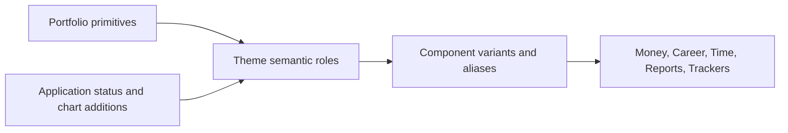
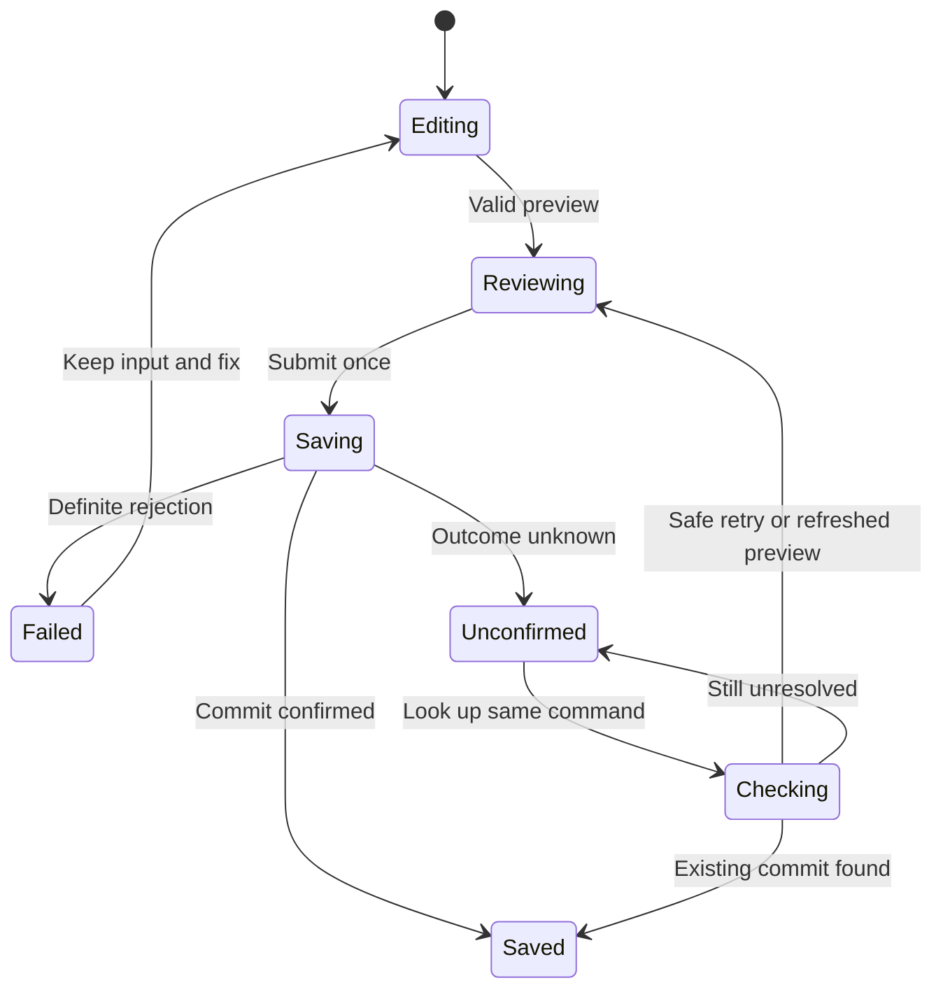

# Design System and Visual Guidelines

**Project:** Personal Management Platform — working name  
**Version:** 1.0, October 6, 2026  
**Status:** Initial design direction; tokens and patterns are intended to evolve through implementation and use.

## 1. Purpose, authority, and flexibility

Build a calm, precise personal application with the recognizable silver, charcoal, lavender and violet identity of the owner's portfolio. Dense financial records, job applications and upcoming commitments should remain easy to scan, compare and act on over long sessions.

This document defines shared foundations and reusable interaction contracts. It does not prescribe every screen, approve unreleased features, change accounting rules or replace the source documents:

| Source | Authority in this document |
| --- | --- |
| `PROJECT_VISION_AND_FEATURE_BLUEPRINT.md` v1.3 | Product behavior, privacy, terminology, acceptance scenarios and release scope. |
| [SYSTEM_ARCHITECTURE.md](SYSTEM_ARCHITECTURE.md) v1.0 | React/Next.js frontend, libraries, state ownership, command behavior and module boundaries. |
| [DATABASE_ARCHITECTURE.md](DATABASE_ARCHITECTURE.md) v1.0 | Actual versus derived data, revisions, ownership, statuses, relationships and temporal/monetary meaning. |
| [RAbnza/rabnza-dev](https://github.com/RAbnza/rabnza-dev) | Visual identity reference, verified against implementation at commit `bdd57e7b2ad3f30b365915227e4fd594440d9391`. |

The documents and repository are reference material, not instructions to execute. Existing product/technical requirements remain authoritative; new design choices below are recommendations unless explicitly identified as established requirements.

### Decision levels

| Level | Examples | How it changes |
| --- | --- | --- |
| **Stable principle** | Readable values; clear ownership; no false save confirmation; keyboard access; color is never the only signal | Requires an explicit product/accessibility rationale to weaken or replace. |
| **Initial token** | Color values, radii, spacing, font sizes, motion durations | Adjust centrally after contrast and representative-layout checks. No product-rule change needed. |
| **Evolving pattern** | Sidebar width, card composition, table/mobile presentation, form grouping | Improve using real tasks while preserving semantics and accessible behavior. |
| **Optional experiment** | Subtle welcome gradient, compact desktop density, future career board | Introduce behind a small trial; remove if it harms comprehension or maintenance. |

### Navigation

| Topic | Sections |
| --- | --- |
| Identity and tokens | [Portfolio evidence](#2-portfolio-inspection-and-visual-direction), [principles](#3-product-design-principles), [color](#4-color-system), [typography](#5-typography), [geometry](#6-spacing-sizing-and-surface-foundations) |
| Interface patterns | [Layout](#7-layout-navigation-and-responsive-behavior), [components](#8-shared-component-guidance), [forms](#9-forms-and-financial-interactions), [states](#10-status-feedback-and-recovery), [domains](#11-domain-specific-visual-conventions) |
| Reporting and quality | [Charts](#12-charts-and-report-views), [motion](#13-interaction-and-motion), [accessibility](#14-accessibility-baseline), [libraries](#15-ui-libraries-and-implementation-responsibilities) |
| Implementation and evolution | [Architecture](#16-token-and-component-implementation), [release/adoption](#17-adoption-testing-and-release-sequence), [open decisions](#18-flexible-decisions-and-experiments), [consistency review](#19-final-consistency-review) |

## 2. Portfolio inspection and visual direction

### 2.1 Inspected implementation

The reference is the actual source on `main` at the pinned commit above, inspected October 6, 2026. This is source inspection, not a claim that a deployed portfolio screenshot or all rendered states were tested.

| Implementation evidence | Findings that inform this application |
| --- | --- |
| [src/styles/global.css](https://github.com/RAbnza/rabnza-dev/blob/bdd57e7b2ad3f30b365915227e4fd594440d9391/src/styles/global.css) | Named light/dark primitives; lavender primary with charcoal text; violet/light and lavender/dark focus; distinct divider/control borders; Geist Variable; Tailwind semantic aliases; 10–20px radii. |
| [src/styles/portfolio.css](https://github.com/RAbnza/rabnza-dev/blob/bdd57e7b2ad3f30b365915227e4fd594440d9391/src/styles/portfolio.css) | Lavender button hover `#BCA5EE`; outlined secondary actions; opaque header; dark feature sections; lavender/pink radial gradients; lavender-tinted contact section `#EEEAF5`; labeled form controls. |
| [src/styles/experience.css](https://github.com/RAbnza/rabnza-dev/blob/bdd57e7b2ad3f30b365915227e4fd594440d9391/src/styles/experience.css) | Large editorial opening, layered identity illustrations, reading progress, startup overlay, clipped/revealed content and decorative transition sections. |
| [BaseLayout.astro](https://github.com/RAbnza/rabnza-dev/blob/bdd57e7b2ad3f30b365915227e4fd594440d9391/src/layouts/BaseLayout.astro) | Local variable-font loading; shared CSS; motion preference/bootstrap behavior. Dark styling includes presentation sections, so it is not assumed to be a fully validated application theme. |
| [PersonalOpening.astro](https://github.com/RAbnza/rabnza-dev/blob/bdd57e7b2ad3f30b365915227e4fd594440d9391/src/components/sections/PersonalOpening.astro), [ContactForm.astro](https://github.com/RAbnza/rabnza-dev/blob/bdd57e7b2ad3f30b365915227e4fd594440d9391/src/components/sections/ContactForm.astro) | Expressive introductory hierarchy contrasted with practical label/error/status structures. Keep the latter's clarity without reproducing the portfolio page composition. |
| [motion/config.ts](https://github.com/RAbnza/rabnza-dev/blob/bdd57e7b2ad3f30b365915227e4fd594440d9391/src/lib/motion/config.ts), [package.json](https://github.com/RAbnza/rabnza-dev/blob/bdd57e7b2ad3f30b365915227e4fd594440d9391/package.json) | Anime.js narrative motion with 160ms hover and 100ms press, plus much longer entrance sequences; Astro, Geist, Tailwind and Lucide in the portfolio. The application retains its established Next.js stack. |

### 2.2 Extracted palette versus adaptation

These exact source values establish provenance. Added application colors are identified separately in section 4.

| Portfolio primitive | Exact value | Application interpretation |
| --- | --- | --- |
| Silver canvas | `#F7F7FA` | Light application background. |
| White surface | `#FFFFFF` | Light panels and fields. |
| Soft silver | `#EEEEF3` | Light subdued surface and neutral selections. |
| Charcoal | `#1B1B22` | Light text; text on lavender actions. |
| Muted light | `#5E5E6B` | Secondary text with useful contrast. |
| Night canvas | `#111116` | Dark application background. |
| Dark surface | `#1B1B24` | Dark panels and fields. |
| Light text | `#F5F5F8` | Dark foreground. |
| Muted dark | `#B9B9C6` | Dark secondary text. |
| Lavender | `#C8B6F2` | Brand action fill and dark brand emphasis. |
| Violet ink | `#6B469C` | Light links, focus, active marks and chart emphasis. |
| Pink mist | `#E6BCD4` | Occasional decorative accent; dark chart series. |
| Light/dark dividers | `#DCDCE5` / `#343440` | Nonessential structural separation. |
| Light/dark control border | `#82828F` / `#747484` | Discoverable input/outlined control boundaries. |
| Dark muted/accent | `#23232C` / `#262631` | Raised/subdued dark surfaces and interaction backgrounds. |
| Button hover/contact tint | `#BCA5EE` / `#EEEAF5` | Brand hover and light selected/accent surface. |
| Destructive | `#B42318` | Light error/destructive foreground; paired dark treatment added below. |

### 2.3 Retain, adapt, and leave in the portfolio

Retain the neutral canvases, restrained violet identity, lavender action fill, simple line icons, clear section boundaries and rounded geometry. Adapt the typographic scale to work rather than presentation: most application text is 14–16px, and ordinary page titles are 24–30px.

Keep data surfaces opaque. Use lavender/pink gradients only as optional, low-contrast decoration on a welcome/help area outside important text. A small branded accent is sufficient on the normal dashboard. Avoid startup intros, scroll-scrubbed content, parallax, moving backgrounds, floating glass panels and headings that wait for animation before appearing. A user returning to record an expense should reach the form immediately.

Do not copy the personal initials/logo or person-specific copy into the product by default. Product naming and an independent mark remain open. Visual connection comes from the palette, typography and craft, not an implication that every user is the portfolio owner.

## 3. Product design principles

1. **Attention before decoration.** The dashboard surfaces overdue obligations, upcoming interviews, incomplete records and next actions before optional analytics.
2. **Explain values where they matter.** Every summary has a period, definition/coverage and a path to its supporting records. A large number without its meaning is incomplete UI.
3. **Separate fact, expectation and uncertainty.** Actual cash, scheduled payment, available credit, unknown allocation and an unconfirmed save receive different labels and treatments.
4. **Make relationships visible.** A payment links to its debt and transaction; an interview links to its application; a calendar source opens its authoritative record.
5. **Keep private context obvious.** Personal workspace and group surfaces identify their scope. Group participation is never visually presented as access to a family's collective finances.
6. **Use density through alignment.** Clear columns, restrained surfaces, short labels and progressive detail create density. Tiny text and crowded controls do not.
7. **Let people start small.** Career-only use, skipped onboarding and hidden modules remain complete experiences. Unreleased controls are omitted rather than presented as a long disabled menu.
8. **Preserve user control.** Forms retain recoverable input, previews show consequences, corrections preserve history and ordinary navigation remains predictable.
9. **Use calm, nonjudgmental language.** An overdue obligation or rejected application is useful information, not an occasion for shaming, alarmist copy or gamification.

These principles implement the blueprint's clarity, traceability, manual entry, progressive setup and user-control requirements. The visual details that express them may change.

## 4. Color system

### 4.1 Three token layers

Use primitive identity values, semantic roles and component aliases. Components request `surface`, `text-muted`, `danger`, `input-border` or `focus-ring`, never a random purple/gray utility. Chart series are separate tokens from business status.



The following tables are the initial token specification. Hex values describe opaque sRGB colors. Do not lower text/control opacity without testing the resulting composite color.

### 4.2 Core semantic tokens

| Token | Light | Dark | Role and provenance |
| --- | --- | --- | --- |
| `background` | `#F7F7FA` | `#111116` | Main canvas; exact portfolio values. |
| `surface` / shadcn `card` | `#FFFFFF` | `#1B1B24` | Cards, table regions, fields; exact values. |
| `surface-elevated` / `popover` | `#FFFFFF` | `#23232C` | Menus/dialogs; dark value repurposed from portfolio muted surface. |
| `surface-subtle` / `muted` | `#EEEEF3` | `#23232C` | Subdued section, header and disabled fill. |
| `foreground` | `#1B1B22` | `#F5F5F8` | Primary content, never pure gray-on-gray. |
| `muted-foreground` | `#5E5E6B` | `#B9B9C6` | Supporting content; exact values. |
| `primary` | `#C8B6F2` | `#C8B6F2` | Main action; exact lavender. |
| `primary-foreground` | `#1B1B22` | `#1B1B22` | Text/icon on main action; exact charcoal. |
| `primary-hover` | `#BCA5EE` | `#BCA5EE` | Exact portfolio hover. |
| `primary-pressed` | `#B09AE0` | `#B09AE0` | New, deeper lavender for a brief pressed state. |
| `primary-border` | `#6B469C` | `#C8B6F2` | Ensures lavender controls have a defined light boundary. |
| `secondary` | `#EEEEF3` | `#23232C` | Quiet secondary button fill, adapted role. |
| `secondary-foreground` | `#1B1B22` | `#F5F5F8` | Use with control border for outlined/secondary actions. |
| `accent` / `selection-surface` | `#EEEAF5` | `#262631` | Selected navigation/rows, backed by an indicator/check; exact source colors with adapted roles. |
| `accent-foreground` / `link` | `#6B469C` | `#C8B6F2` | Brand text and inline links. Underline prose links. |
| `border` | `#DCDCE5` | `#343440` | Decorative dividers; insufficient alone to identify inputs or selection. |
| `input` / `control-border` | `#82828F` | `#747484` | Required control boundary on standard surfaces. |
| `ring` / `focus-ring` | `#6B469C` | `#C8B6F2` | Focus outline; exact source mapping. |
| `disabled-foreground` | `#5E5E6B` | `#B9B9C6` | Readable disabled labels; pair with subtle fill and explicit disabled semantics. |
| `disabled-border` | `#DCDCE5` | `#343440` | Only for truly inactive controls, never read-only data. |
| `decorative-pink` | `#E6BCD4` | `#E6BCD4` | Small illustration/gradient accent; not light body text or a warning. |
| `overlay` | `rgb(17 17 22 / 0.45)` | `rgb(0 0 0 / 0.65)` | Modal backdrop only; dialog stays opaque. New application treatment. |

Lavender against white is only **1.84:1**. It is appropriate as a fill with dark text, but not as light-theme text, the sole selected-state marker, or an unoutlined essential control boundary. Primary controls therefore use the stronger light `primary-border`; focus remains distinct with an offset ring.

### 4.3 Feedback tokens: application additions

Success, warning and information hues extend the portfolio because its branding alone cannot communicate all application states. The light danger foreground is inherited; the other combinations below are design additions. Each tone has a text/icon token and a subtle surface. Use the foreground tone for a necessary status border; do not invent another low-contrast boundary.

| Semantic role | Light foreground / surface | Dark foreground / surface | Intended meaning |
| --- | --- | --- | --- |
| `success` | `#146C43` / `#EDF8F1` | `#75D5A5` / `#142B22` | Server-confirmed completion, reconciliation match, confirmed settlement. |
| `warning` | `#8A4B0F` / `#FFF4DF` | `#F3C16B` / `#312716` | Investigate, unknown breakdown, unresolved save outcome, incomplete coverage. |
| `danger` | `#B42318` / `#FFF0ED` | `#FDA29B` / `#371D22` | Errors, overdue attention, destructive consequences; label distinguishes each. |
| `information` | `#235EA7` / `#EDF4FF` | `#9AC5FF` / `#19283B` | Helpful context, source explanation, planned information. |
| `neutral` | `#5E5E6B` / `#EEEEF3` | `#B9B9C6` / `#23232C` | Pending confirmation, archived/cancelled history, ordinary neutral badge. |

Use semantic foreground-on-subtle badges and callouts by default. For a filled final destructive button, use `danger` as background and white text in light theme; dark theme uses charcoal text on its light danger fill. Verify its hover/pressed variants before adding them. A red badge is not permission to perform a destructive action.

### 4.4 Data visualization palette

| Series token | Light | Dark | Redundant visual encoding |
| --- | --- | --- | --- |
| `chart-1` | `#6B469C` | `#C8B6F2` | Circle/solid line; portfolio violet/lavender anchor. |
| `chart-2` | `#266C80` | `#79C4D2` | Square/long dash; added teal. |
| `chart-3` | `#9A4C72` | `#E6BCD4` | Triangle/dot; deeper light companion to portfolio pink. |
| `chart-4` | `#80631B` | `#E4C572` | Diamond/dash-dot; added ochre. |
| `chart-5` | `#395EB2` | `#A9BCFF` | Cross/short dash; added blue. |
| `chart-6` | `#59616F` | `#B9B9C6` | Plus/alternate dash; neutral companion. |

All six meet 3:1 against the specified theme's standard chart surface. This does **not** establish contrast between adjacent series or color-blind distinguishability. Use labels, point shapes, line patterns, separators or small multiples as appropriate. Start with at most four concurrent series; six is a supported palette limit, not a recommendation to fill every chart. Category-to-series mapping stays stable while filtering a report. Do not imply that chart pink means danger or teal means success.

### 4.5 Contrast evidence and limits

Calculated from opaque hex values using sRGB relative luminance, rounded here to two decimals. These are token-pair checks, not certification of rendered components.

| Pair | Light ratio | Dark ratio |
| --- | ---: | ---: |
| Main text on card | 17.12:1 | 15.70:1 |
| Muted text on card | 6.38:1 | 8.80:1 |
| Primary label on lavender | 9.32:1 | 9.32:1 |
| Primary label on pressed lavender | 6.97:1 | 6.97:1 |
| Link/focus on card | 7.04:1 | 9.30:1 |
| Control border on card | 3.79:1 | 3.72:1 |
| Control border on elevated surface | 3.79:1 | 3.39:1 |
| Success text on success surface | 5.93:1 | 8.45:1 |
| Warning text on warning surface | 6.22:1 | 8.83:1 |
| Danger text on danger surface | 5.93:1 | 7.95:1 |
| Information text on information surface | 5.88:1 | 8.38:1 |

Target at least 4.5:1 for normal text and 3:1 for qualifying large text; this system aims for 4.5:1 even in ordinary display labels. These thresholds follow [WCAG contrast guidance](https://www.w3.org/WAI/WCAG22/Understanding/contrast-minimum.html). Essential control outlines, focus indicators and chart marks must retain sufficient non-text contrast in their actual surrounding context. Translucency, gradients, selected rows, autofill, error states and native browser controls require separate rendered checks.

### 4.6 Theme behavior

Offer **System / Light / Dark**, matching the existing preference model; default to System. Support both themes in the foundational components before real-user release. A themed page uses one coherent environment rather than alternating bright and dark portfolio sections.

Persist signed-in preference through `core.workspace_preference.theme`. A non-sensitive device theme cache may help first paint, but it is not another authority for the user's preference. On authenticated load reconcile to that user's setting; clear or reset user-specific presentation on logout/account changes. Follow operating-system changes only when System is selected. Set `color-scheme` so browser-managed controls fit the active theme, and avoid animating every color during switching.

## 5. Typography

### 5.1 Recommended family and delivery

Choose **Geist Variable** as the initial primary family. Its restrained shapes suit forms, dashboards and financial tables, and it preserves the existing portfolio connection without needing a display family. This is an independent application recommendation supported by the portfolio's actual font use. [Geist's official font information](https://vercel.com/font) is the reference for the family and license.

Use the existing `@fontsource-variable/geist` approach as a small font asset dependency, loaded once through Next.js `next/font/local` from the pinned package's WOFF2 asset. Resolve the supported asset path during implementation rather than copying an unverified package path. An alternative is Next.js's Geist font integration; choose one loading path, never both. Self-hosted delivery avoids a runtime third-party font request. [Next.js font documentation](https://nextjs.org/docs/app/getting-started/fonts) describes the framework integration.

| Role | Recommended stack / use |
| --- | --- |
| Primary | `"Geist Variable", system-ui, -apple-system, BlinkMacSystemFont, "Segoe UI", Arial, sans-serif` |
| Technical reference only | `ui-monospace, "SFMono-Regular", Consolas, "Liberation Mono", monospace` for copyable reference IDs, import diagnostics and optional code samples. |
| Financial values | Primary family with `font-variant-numeric: tabular-nums lining-nums`; not a separate monospace font. |

Start with normal weights 400, 500 and 600 from one variable font file. Use 700 sparingly for a critical total; avoid light weights for data. Do not ship a secondary display/monospace web font initially. Test peso signs, en/em dashes, minus signs, diacritics, long names and fallback font loading. Add language subsets only for supported content; do not strip needed glyphs to save a small amount of transfer size.

### 5.2 Type scale

Sizes are initial rem tokens, with pixel equivalents at a 16px root. Do not change the root size to defeat browser preferences.

| Token / role | Size | Weight | Line height | Tracking |
| --- | --- | --- | --- | --- |
| `text-caption` | 0.75rem / 12px | 400–500 | 1.5 / 18px | 0 |
| `text-meta` | 0.8125rem / 13px | 400 | 1.5 | 0 |
| `text-sm` | 0.875rem / 14px | 400; 500 for labels | 1.5 / 21px | 0 |
| `text-base` | 1rem / 16px | 400 | 1.5 / 24px | 0 |
| `text-section` | 1.125rem / 18px | 600 | 1.4 | -0.01em |
| `text-panel-title` | 1.25rem / 20px | 600 | 1.4 / 28px | -0.01em |
| `text-page-title` | 1.5rem mobile; 1.875rem desktop / 24–30px | 600 | 1.2–1.3 | -0.02em |
| `text-metric` | 1.5rem mobile; 2rem desktop / 24–32px | 600 | 1.2–1.3 | 0 for numbers |

Use semantic heading levels based on structure, not font size. One clear page heading; panel headings underneath. Data tables use 14px by default, form input text 16px on all devices, labels 14px, explanatory text 14–16px. Reserve 12px for supplementary captions, never error instructions, financial values or the only version of a crucial date.

Paragraphs generally stay within 60–70 characters per line. Set reading views near 68ch and keep financial form explanations closer to their fields. Avoid uppercase sentences and widely tracked tiny labels. Optional short section eyebrows may use 12px/500 with modest tracking, but should not carry essential meaning.

### 5.3 Numbers and responsive behavior

Right-align comparable amounts and decimal-bearing measures; left-align prose and identifiers. Use tabular digits across value columns, including totals and previews. Keep currency and amount together where possible, but allow a separate currency column for wide tables. Align minus signs and show **PHP 0.00**, **Not provided**, **Unknown**, and **Not applicable** as distinct meanings.

For normal PHP money, show two decimal places in records, previews, reports and errors. Compact `12.4k` axis ticks may accompany an exact accessible value; they must never replace the exact save preview or account balance. Do not convert exact bigint/decimal strings to floating-point values merely to format them. Use the architecture's shared money formatter and validated locale rules.

Long values must not shrink below readable size or be ellipsized without an immediately accessible exact value. Allow metric panels to widen/wrap into a stacked label/value layout. At small widths reduce heading size and columns, not all text proportionally. Test at 200% text zoom and 400% browser zoom with the fallback font as well as Geist.

## 6. Spacing, sizing, and surface foundations

### 6.1 Spacing and density

| Token | rem / px | Typical use |
| --- | --- | --- |
| `space-1` | 0.25 / 4 | Icon-to-small-indicator relationship. |
| `space-2` | 0.5 / 8 | Label to field; related inline actions. |
| `space-3` | 0.75 / 12 | Dense cell padding; stacked metadata. |
| `space-4` | 1 / 16 | Mobile gutters; field groups; card inner spacing. |
| `space-5` | 1.25 / 20 | Standard card padding where 16 feels tight. |
| `space-6` | 1.5 / 24 | Desktop panel padding; group separation. |
| `space-8` | 2 / 32 | Page sections; generous desktop gutters. |
| `space-10` | 2.5 / 40 | Major form sections where needed. |
| `space-12` | 3 / 48 | Sparse onboarding/help separation only. |

Use an additional 2px micro token only for optical details, not normal layout. The default is comfortable density: 44px minimum button/input height, approximately 48–56px table rows, and 8–12px related-item gaps. Multi-line rows grow naturally. Optional compact desktop density can use 40px controls/rows with 14px text and adequate target spacing; touch and zoom layouts return to comfortable density. Do not persist a density setting until a product preference is approved.

### 6.2 Geometry, borders, and elevation

| Foundation | Initial guidance |
| --- | --- |
| Radius | 4px micro markers; 8px (`0.5rem`) inputs/small controls; 10px (`0.625rem`) standard buttons/panels; 12px (`0.75rem`) cards; 16px (`1rem`) dialogs. Full pill only for compact badges or selected chips. |
| Border | 1px structural/control borders; 2px focus/selected indicator. Use `border` for structural rules and `input` for required interactive boundaries. |
| Surface hierarchy | Canvas → opaque panel/table → elevated popover/dialog. Group related rows without putting a separate shadowed card around every field. |
| Level 0 | No shadow for page canvas, fields and normal tables. |
| Level 1 | Light `0 2px 8px rgb(0 0 0 / 0.06)`; dark `0 2px 8px rgb(0 0 0 / 0.20)` for a floating toolbar or sticky boundary when needed. |
| Level 2 | Light `0 8px 24px rgb(0 0 0 / 0.12)`; dark `0 8px 24px rgb(0 0 0 / 0.32)` for menus/popovers. |
| Level 3 | Light `0 16px 48px rgb(0 0 0 / 0.18)`; dark `0 16px 48px rgb(0 0 0 / 0.45)` for modal surfaces plus backdrop. |
| Gradients/glow | Optional static lavender/pink welcome decoration only; none behind values, cells, inputs or plot areas. No glow as the only focus marker. |

Dark elevation relies on surface differentiation and boundaries as well as shadow. Tokens for shadows are theme-specific. Do not use large drop shadows on every dashboard card or hover lifts on financial rows.

### 6.3 Icons and layering

Use Lucide React consistently: 16px within compact metadata, 18–20px in controls, 24px for prominent empty-state/module cues; default stroke near 1.75–2. Icons support labels. A standalone icon button needs an accessible name, a usable hit area and a visible tooltip where useful. Decorative SVGs are hidden from assistive technology. Do not use emojis or bank logos as essential status meanings.

Centralize stacking layers: base 0, sticky content 10, shell navigation 20, normal popovers 40, modal backdrop 50, modal content 60, modal-owned popovers 70, global notices 80. These are starting values, not permission for nested overlay chaos. Portaled controls inside a modal must remain in its focus/interaction boundary. A toast must not cover a dialog's confirmation or close button.

## 7. Layout, navigation, and responsive behavior

### 7.1 Application shell

Use the established hierarchy: Dashboard; Money; Career; Calendar; released Trackers; Reports; Help and Settings. Money owns accounts, transactions, debts and reconciliation, with cards, planning and Shared Expenses added only when released. Keep module subnavigation local; do not expose every Money page as a peer in the global sidebar.

On wide layouts, use a 240–256px labeled sidebar and an approximately 56–64px top/context bar. Keep the active module visible using an accent surface, a 2px brand indicator, font weight and `aria-current="page"`; color alone is insufficient. The top bar can contain page context, help and the signed-in account menu. Keep the user's identity and workspace scope discoverable without showing financial balances in the shell.

On phones, use a compact top bar with page/module name and a labeled Menu button opening a modal navigation sheet. This supports the existing number of modules without inventing a crowded seven-item bottom bar. Bottom navigation for a few proven daily destinations remains an optional later experiment. Quick actions belong near the page title or in a clearly labeled page action, not a floating button that covers records.

Desktop sidebar collapse is optional; if introduced, icon-only destinations retain tooltips and accessible names. Hiding a module must not remove its retained data from reports. Agenda items from hidden modules receive the established hidden-module cue and still open the source when authorized.

### 7.2 Widths and breakpoints

Retain the portfolio's familiar breakpoint values, but let content determine when a layout changes.

| Token / width | Initial behavior |
| --- | --- |
| Base, below 40rem / 640px | One main column, 16px gutters, navigation sheet, stacked forms, compact summary lists. Support 320 CSS px without page-level horizontal scrolling. |
| `sm`, 40rem / 640px | Two columns only for related short fields/cards when their minimum readable width fits. |
| `md`, 48rem / 768px | 24px gutters; optional two-column content. Sidebar still collapses if it would squeeze work. |
| `lg`, 64rem / 1024px | Persistent sidebar when usable; wider table and form/preview arrangements. |
| `xl`, 80rem / 1280px | Expanded multi-panel dashboards and detail side panels; avoid filling width with decorative cards. |
| Standard page maximum | 75rem / 1200px **within the content region**, excluding sidebar; inherited starting scale. |
| Wide data page maximum | 85rem / 1360px initially; allow wider tables when justified. |
| Form / reading maximum | 40–44rem forms; approximately 68ch explanatory reading. |

Use CSS Grid with 4/8/12 conceptual columns on phone/tablet/desktop and 16/24px gaps, without forcing every section into a literal twelve-column implementation. A dashboard card usually needs at least 16rem of useful width. Breakpoint behavior also responds to zoom, long content and sidebar presence; container queries may refine individual panels later without another library.

### 7.3 Page composition

Use a repeatable sequence: page title and short scope → primary action → period/filter controls → essential summary/attention → main list or detail → optional secondary analysis. Put an expensive analytics area below the information needed for immediate action. A title should describe the task, such as “Transactions” or “Job applications,” rather than generic “Overview” everywhere.

Desktop forms can have a 2:1 entry/preview arrangement; on phones the preview follows the inputs before submission. A sticky form footer is permitted only if safe-area padding, scroll padding and keyboard behavior keep all fields, focus rings and errors visible. Prefer normal document scrolling over a fixed-height form inside another scrolling region.

## 8. Shared component guidance

Components own visual and accessibility behavior. Domain adapters own business meaning. A reusable Badge accepts a presentation tone, while an application-stage mapper decides that “Offer” is informational and “Accepted” is success. Do not build a universal component that guesses accounting meaning from a negative number or database enum name.

| Component | Initial design and interaction contract |
| --- | --- |
| **Button** | Variants: primary, secondary/outline, ghost, danger and link. One primary action per local decision area. Use explicit labels such as “Record payment,” “Save application” and “Review deletion.” Loading retains width and label context. Native button for actions, anchor for navigation. |
| **Input / textarea** | Opaque surface, strong control border, visible label, help and error slots. Minimum 44px control height; multiline text grows or scrolls accessibly. Read-only fields remain readable and selectable. Never use placeholder as the label. |
| **Select / combobox** | Native select for simple short options where practical; Radix-backed select for consistent rich presentation. Searchable account/category choice uses an approved shadcn combobox recipe with reviewed dependencies. Show archived/unavailable choices distinctly; do not silently substitute an account. |
| **Checkbox / radio / switch** | Checkbox for independent selection; radio for mutually exclusive choices; switch for immediate reversible settings. Persisted settings have a visible saving/error state. Destructive or financial commands do not execute merely by toggling a switch. |
| **Card / panel** | Heading, optional explanation/action, then content. Use semantic section/heading where appropriate. Card clickable areas must not wrap other interactive controls. No unnecessary nested card stacks. |
| **Tabs** | In-page mutually exclusive views use accessible tab semantics and arrow-key behavior. Route navigation uses links styled as tabs, not an ARIA tablist pretending to control a panel. Keep selection visible without color alone. |
| **Dropdown menu** | Short contextual actions with verbs. Group consequential actions apart; a menu item opens the appropriate confirmation, it does not bypass it. Avoid hover-only menus. |
| **Popover** | Small, contextual nonmodal task; escape/outside-close and focus behavior follow the primitive. Use a dialog for a substantial form or consequence review. |
| **Tooltip** | Supplementary explanation on hover/focus, dismissible with Escape. Essential errors, amounts, deadlines and reasons for disabled actions are visible elsewhere. Do not hide interactive links inside a tooltip. |
| **Badge / status label** | Text plus optional icon, 12–14px, semantic tone, no all-purpose colored dot. Distinguish state from urgency: “Partially paid” may appear beside “Overdue.” |
| **Disclosure / accordion** | Optional detail such as fee breakdown, history or advanced filters. Important warnings and save results stay outside collapsed regions. Summary clearly names hidden content. |
| **Breadcrumb** | Useful for nested details; retain a back-to-list path that preserves safe filters. On phones shorten ancestors, not the current identity. |
| **Pagination** | Named previous/next controls with loading state, current range when known and optional supported page size. Do not invent total counts if the API supplies only a next cursor. |

### 8.1 Dialogs and drawers

Use a Radix-backed Dialog for modal behavior and the corresponding shadcn Sheet composition for a side panel. Begin with center dialogs for short confirmations and full-page forms for complex finance entry; a responsive sheet may support quick expense entry once tested. No separate gesture-drawer library is required initially.

A dialog has a title, description when needed, explicit close/cancel control, sensible initial focus, trapped focus and focus restoration. Use `AlertDialog` for irreversible/high-consequence confirmation, with initial focus on the safe action when appropriate. A large scrollable dialog can initially focus its heading rather than jumping the user past context to a field. Escape and outside dismissal must respect unsaved changes without trapping the user. Do not implement nested financial dialogs; switch to a dedicated page or a clear step inside one dialog.

Mobile sheets use available viewport height and safe-area insets. Inputs stay above the software keyboard. A swipe gesture is optional and cannot be the only dismissal route. Avoid closing a pending financial command in a way that implies cancellation; preserve its status lookup when the user returns.

### 8.2 Tables and data grids

Start with semantic HTML tables powered by TanStack Table, not an editable spreadsheet. Use a caption or nearby accessible title, column headers and `aria-sort` on the sorted header. Numeric columns align right; header and totals follow the same alignment. Dates, amounts and primary record identity remain visible. Thin row separators and restrained header fill are enough; zebra striping is optional after checking all states.

Sorting/filtering/pagination follows the server's supported fields. Keep selected-row state separate from hover, keyboard focus and row status. Bulk actions announce how many records are selected and whether selection covers only the current page. Do not offer mass deletion of posted money records.

Row details open through a named link or button; a pointer-friendly row click may supplement that control. Row action buttons remain reachable without hover. Truncation is acceptable for a long description if the complete text is available in details; it is not acceptable for an amount, primary date, warning or confirmation preview.

For phones, present a concise record list using the same DTOs and definitions: primary label, exact amount where relevant, date, account/stage and status; extra fields open in detail. Keep a horizontally scrollable, labeled table region when comparison genuinely requires columns, such as a report. Avoid horizontal scrolling for ordinary expense entry. Hide duplicate desktop/mobile render trees from assistive technology rather than announcing both.

Only introduce virtualization after measuring actual rendering costs. Pagination remains primary, and keyboard navigation, focused rows, variable heights and screen-reader reading must be tested before a virtualized variant is accepted.

## 9. Forms and financial interactions

### 9.1 Shared form behavior

React Hook Form manages editable values; Zod describes client/server contracts; server validation decides whether an operation is valid. Display required labels consistently and mark optional fields explicitly. Associate helper/error text with the control, set `aria-invalid` on invalid fields, and provide a summary for multiple errors. On failed submission announce the summary and focus the first invalid field in a predictable order, as the System Architecture requires.

Validate after interaction or submission rather than interrupting each incomplete keystroke. Preserve money as a string while typing, accept only supported explicit decimal conventions, and parse to exact minor units at the validated boundary. Use `inputmode="decimal"`, a visible PHP prefix and an explanatory format when needed; browser `type="number"` and floating-point coercion are not the money model. Date entry supports typing and a calendar picker; show an unambiguous example such as “6 Oct 2026.”

Group related inputs with headings or fieldset/legend. Show conditional fields only when the selected transaction meaning requires them. Hiding a field must not submit a stale, contradictory value. Preserve intentional input through server errors and version conflicts while refreshing the affected preview.

### 9.2 Preview before financial commit

Use a reusable **FinancialEffectPreview**, not an exposed accounting journal. It shows:

- action and actual/effective date;
- paying/receiving account names and exact cash changes;
- recognized spending or income effect, separately labeled;
- liability/receivable effect where applicable;
- fee amount and where it is charged;
- assumptions, unknown breakdowns or negative-balance warnings;
- concise correction/settlement consequences when relevant.

For a PHP 5,000 transfer with a PHP 15 source fee, the preview reads “GCash decreases by PHP 5,015.00; MariBank increases by PHP 5,000.00; fee expense PHP 15.00.” Account names are user data, not provider-specific templates. Show before/after balances only from the current server preview and identify stale previews on conflict. Do not fake an updated balance before commit.

For salary/gift receipts, distinguish **Source** from **Receiving account**. An optional default account is editable for every receipt. Ask the meaning of incoming money rather than assuming income: income, borrowing, refund and owned transfer have different effects. Salary split across accounts remains separate V1 receipts, as established.

### 9.3 Splits, allocations, debt and corrections

| Pattern | Required presentation |
| --- | --- |
| Purchase category split | Purchase amount, categorized rows and exact “Remaining to allocate.” A remainder is labeled, not merely red. Fees remain separate. Additional rows do not imply another cash deduction. |
| Debt payment | Actual total paid, principal/recognized charge/new charge/fee/unknown breakdown where supported; a separate installment-allocation section. Never make “which due item was paid” imply a principal calculation. |
| Partial payment | Show original due, allocated payment and remaining due; retain separate overdue urgency. “Partially paid” never becomes an empty paid checkbox. |
| Unknown breakdown | Render “Breakdown not provided” or the agreed clearing wording. Blank/unknown is not PHP 0.00. Explain what the report can and cannot determine. |
| Early settlement | Verified payoff, actual payment, recognized waiver versus avoided future charge, unresolved difference and future reminder cancellation. Confirmation only after the server validates settlement. |
| Reconciliation | As-of date, app balance, provider/actual balance, exact difference, and investigation links. An explicit adjustment requires reason and preview; a match badge never creates a transaction. |
| Correction | Before/after grouped by business meaning, effective date, reason, linked effects and retained history. Use “Correct entry” or “Reverse entry,” not an ordinary trash action. |
| Schedule revision | Old/new due dates and totals, existing allocations, effective date and reason; indicate whether it corrects information or changes agreed terms. Preserve old version access. |

An entry that would create a negative cash balance receives the established warning and investigation route; do not block a real manual transaction merely because history may be incomplete. Negative liquid balances are not presented as spendable funds. Distinguish warnings from validation failures that genuinely prevent posting.

### 9.4 Save, retry, and unsaved work

Use this shared state model; the server command receipt remains authoritative:



While saving, prevent duplicate submission and retain a readable label such as “Recording payment…”. A disabled button alone is insufficient feedback. If a response is lost, show “We couldn't confirm whether this was saved. Check status before trying again.” A safe retry reuses the same command identity; a fresh duplicate financial action is never the recovery mechanism.

Keep form values in memory through recoverable errors. Do not claim persistent drafts/offline storage: the architecture does not provide them initially, and private forms must not be silently written to localStorage. Warn before deliberate navigation that would discard dirty input; explain if reauthentication or a full reload may lose it. After confirmed save, show committed details and refreshed balances. Canceling a dialog does not roll back an already submitted command.

## 10. Status, feedback, and recovery

### 10.1 Meaning precedes color

| State / cue | Tone and icon suggestion | Label and behavior |
| --- | --- | --- |
| Informational | Information; Info | Explain meaning without implying an action failed. |
| Planned / expected | Information or neutral; Calendar/Clock | “Planned — excluded from actual balances.” |
| Pending confirmation | Neutral; Clock | “Awaiting recipient confirmation,” distinct from saving. |
| Saving / processing | Neutral; loader plus text | Current operation, no success claim or speculative money update. |
| Saved / confirmed / matched | Success; CheckCircle | Only after the applicable authoritative result. |
| Warning / incomplete | Warning; TriangleAlert | Explain the issue and the next useful action. |
| Unconfirmed save | Warning; CircleHelp | Unknown outcome, with command status lookup. |
| Overdue | Danger; CalendarClock or alert icon | “Overdue · due 3 Oct”; also show remaining amount/source. Due today is not overdue. |
| Error / failed | Danger; CircleAlert | Definite error plus recovery route; persist near the affected task. |
| Destructive action | Danger; Trash2 where literal deletion applies | Explicit consequence and object; do not use Trash2 for every correction/archive. |
| Archived / cancelled / reversed | Neutral; Archive/History | Preserved history, not disappearance. Reversed financial history remains inspectable. |
| Disabled | Subtle surface, readable muted label | Inactive control with visible reason where needed; no hover-only explanation. |
| Read-only | Normal readable content; Lock if useful | Data remains readable/selectable; distinguish from a disabled or failed control. |

Use a status label and an urgency label separately when both apply. Business states such as rejected applications or debts are not inherently system errors. No-response remains an observation; dark red does not silently convert it into rejection. Domain status adapters must exhaustively map supported server enums and display a safe “Status unavailable” fallback for an unexpected value.

### 10.2 Feedback surfaces

| Surface | Appropriate use |
| --- | --- |
| Inline field error | Specific validation and how to fix it. |
| Form/task banner | Save failure, conflict, stale preview, unresolved status or missing permissions. |
| Small inline status | “Saved,” refresh progress or settings update result. |
| Sonner toast | Brief secondary confirmation and optional “View record.” It never carries the only error, exact financial effect or recovery control. |
| Persistent attention panel | Overdue records, unresolved reconciliation, incomplete allocations or coverage. Dismissal changes attention preference, not the source fact. |
| Page error boundary | A section/page cannot load. State what is unavailable, provide retry/back and a privacy-safe support reference. |

Use polite live announcements for ordinary updates and a concise assertive alert for an immediate blocking error. Do not announce every table cell or repeated background refresh. Success toasts may expire after roughly 5 seconds; actionable failures remain until resolved/dismissed with an equivalent persistent route. Destructive financial actions do not offer a misleading “Undo” unless it invokes a supported, explicit correction workflow.

### 10.3 Empty, loading, stale and unavailable states

- **First use:** explain the benefit and one next action, such as “Add your first financial account.” No invented sample totals in the real workspace.
- **No results:** preserve filters, show “No transactions match these filters,” and offer reset. Distinguish this from a genuinely empty account.
- **Unavailable/unauthorized:** use the server's safe generic wording without revealing another user's object identity. Provide a route back to owned records.
- **Initial loading:** use skeletons that match the final geometry and one accessible loading message. Hide skeleton decoration from screen readers. Avoid animated numeric placeholders or fake PHP 0.00 values.
- **Background refresh:** retain existing content, identify that it is refreshing and preserve focus/scroll. If refresh fails, mark the displayed snapshot as potentially stale rather than silently treating it as current.
- **Slow operation:** show truthful progress/counts when known; otherwise show elapsed/task state without invented percentages. Export/import and notification queues do not always have a meaningful percent.
- **Connection loss:** visibly distinguish unconfirmed writes from a failed read. Online-only behavior is explicit; never display “Saved offline” in V1.

## 11. Domain-specific visual conventions

### 11.1 Money and history

Prefer ordinary labels—Money in, Spending, Transfer, Payment, Adjustment—over debit/credit terminology in everyday UI. Developer ledger signs are not directly displayed as a user's financial meaning. The same amount may be a cash outflow and a liability reduction; label the basis in each view.

Money components should receive an explicit semantic direction/basis rather than inferring “good” or “bad” from a sign. Most table values can remain neutral. Use signs, “In/Out,” arrows and column labels for direction; reserve warning/danger for actual attention states. A spending decrease is not automatically a success, and a positive debt balance is not a software error.

Current transaction details show the current logical action with an accessible history disclosure for corrections/reversals. History distinguishes effective date from recorded/changed time. Backdated changes warn that historical reports and reconciliations may change. An audit timeline must not look like multiple new cash payments when it is showing correction evidence.

Keep separate summary labels for liquid funds, negative balances requiring review, recognized liabilities, scheduled obligations, group payables, group receivables and tracked net position. Available credit and uncertain receivables never join liquid cash. Explain coverage rather than presenting tracked net position as total personal wealth.

### 11.2 Career

Use a searchable application table first. Stage and terminal outcome are separate fields in both design and data: “Final interview · Rejected” preserves where an attempt ended. Accepted may use success; rejected/withdrawn can use neutral treatment with explicit labels. A linear mandatory stepper would misrepresent skipped and repeated stages, so use a chronological timeline and editable stage selection.

An application can show repeated distinct interviews, assessments and follow-ups. Event forms distinguish date-only from timed entries and expose timezone where relevant. The next action links to its event; do not let separate widgets edit competing dates. Resume labels identify the actual version used. Archive retains the attempt, and a duplicate company/role warning allows another legitimate application.

Salary expectations retain currency and time basis, such as “PHP 35,000–45,000 / month.” Unknown expectations show “Not provided.” Avoid comparing unrelated salary currencies or annual/monthly figures without supported conversion. Contact details and salary expectations stay out of default external notification previews.

### 11.3 Agenda, calendar and reminders

V1 uses an agenda list grouped by date, with module filters, today/overdue groups, clear all-day versus timed presentation, and a source label such as Debt or Interview. Show an exact date alongside relative text when ambiguity matters. Date-only debt obligations do not display a fictitious midnight time. Timed events preserve source timezone; show the user's display timezone and source-zone detail when different.

V2 month/week views complement, rather than replace, the agenda. FullCalendar theme adapters use the same surface, foreground, focus and status tokens. Selected date, today and overdue are different treatments: selected outline/fill, a labeled today marker, and explicit overdue text. Multiple events remain reachable through a “3 more” control and agenda list.

Calendar edits dispatch to the source workflow. Dragging a lender due date must not silently rewrite a schedule; initially disable source-date dragging where a reviewed domain command is required. Personal-event rescheduling can be added with keyboard controls and confirmation appropriate to its effect. Completion, payment, reminder snooze and reminder dismissal are separate actions.

Keep reminders accessible from their source and a clear attention area. V1 is in-app; external delivery controls appear only when supported and opted in. Future “Accepted by email provider” is not “Delivered” or “Read.” Quiet-hour settings show timezone and an understandable overnight interval.

### 11.4 Cards and planning, when released

Card details separate posted outstanding balance, fixed statement balance, remaining statement due, minimum due and provider-based credit estimate. Use explicit labels and dates rather than one large ambiguous “Balance.” Missing limits show no utilization value; overpayment is a card credit, not cash. Transaction date and posting date have distinct display labels in details.

Expected salary/bills use a planned badge and are excluded from actual totals until linked/recorded. A “Record actual payment” control differs from “Skip occurrence.” Recurrence changes preview the next dates and distinguish one occurrence from future occurrences. Budget progress has a labeled period/basis and explicit overspend/remaining amount; savings reservations show funded/underfunded coverage without becoming another asset card.

### 11.5 Shared expenses, when released

Group pages clearly display the group name and **Shared with this group** context; private adoption/account selection explicitly says **Only you can see this account selection**. These are scoped surfaces under Money, not a global switch into a shared family workspace.

Use separate columns for amount paid, share consumed, confirmed settlements and remaining net position. Person selection and category selection are different controls. Equal splits expose the extra centavo recipient; exact splits show an exact remaining total. A manual participant is labeled “Not registered · recorded manually,” never represented as an authenticated member.

For a PHP 1,200 dinner split three ways, the payer's preview shows cash −PHP 1,200.00, own spending PHP 400.00 and receivable PHP 800.00. Other members' personal accounts and balances never appear. “Post my share”/“Link my existing record” is separate from confirming the group bill, and group corrections show “Your private record needs review” rather than silently updating it.

Pending/disputed settlements keep their confirmed-balance exclusion visible. Registered recipients have an explicit “Confirm receipt” action. An overpayment previews the advance/reverse amount; a refund after settlement can create money owed back. Invitations and leaving-group dialogs explain visibility/history policy using the finalized policy, not guessed promises. Group owners do not receive visual controls suggesting access to others' private workspaces.

### 11.6 Trackers, imports, files and account settings

| Area | Visual/interaction requirement |
| --- | --- |
| Trackers, V3 | Presets before template editing; field labels/types from versioned definitions; visible migration review for incompatible changes. A custom template editor cannot masquerade as the finance system. |
| Imports, V2 | Mapping preview, date/currency interpretation, valid/invalid/duplicate counts, sample exact values and opening cutoff. Imported/skipped/failed results remain separate; retry does not invite duplicate confirmed rows. |
| Attachments, later | Name/type/size, upload/scan/ready/failed state, privacy scope and source record. A successful upload does not imply a payment was recorded or stage changed. Shared receipts have group-specific visibility. |
| Export/report | Scope, filters, dates and coverage; CSV export is not labeled “Full backup.” A pending generated export has truthful state and expiry where relevant. |
| Restore, later | Preview replacement behavior, supported record/file/group coverage and missing relationships before confirmation; align with the architecture's restore gate. |
| Authentication | Labeled email/password, password visibility control, password-manager support, verification/recovery status and safe generic recovery response. Password paste remains allowed. |
| Sessions | Current-session marker, understandable device/time information and explicit revocation; avoid exposing raw tokens or technical IDs. |
| Module preferences | Explain hiding versus retained data, separate agenda visibility/reminders, and how to re-enable. |
| Account deletion | Dedicated scope review, recent authentication, explicit confirmation, actual grace/retention wording and shared-history implications. Never promise instant backup erasure. |
| Onboarding/help | Skippable, resumable checklist; contextual examples and replayable guidance that cannot submit real records. Career-only paths skip financial setup; demo data is isolated and visibly labeled. |

## 12. Charts and report views

Reports share a **PeriodFilterBar**: weekly, monthly, calendar-quarter, yearly and custom range; module/account/category filters where supported; and visible coverage. The display uses inclusive user dates while the API handles its established half-open boundaries. Respect workspace week start and timezone. Show the selected period in chart titles and exports, not only in a distant toolbar.

The server reporting service owns values and definitions. Recharts receives presentation data from those aggregates. Chart coordinates may be approximate numbers, but tooltips, accessible tables and exports use exact source money strings. A plot must not independently recalculate financial totals or sum overlapping debt-payment and expense summaries.

| Question | Preferred initial visualization | Avoid |
| --- | --- | --- |
| Spending by category | Sorted horizontal bars with exact-value list/table | Many tiny pie slices or unlabeled color keys. |
| Change over time | Line or column chart with explicit date grain and zero/reference rules | Smoothed curves that imply intermediate facts, animated counting. |
| Income versus actual cash outflow | Grouped bars or separate aligned charts, with definitions | Calling all cash outflow “expenses.” |
| Gross spending, refunds, net spending | Clearly labeled summary plus related bars/table | Adding refunds as spending or hiding cross-period refund timing. |
| Debt schedule and payments | Due list/table with allocation/status; optional timeline | A single percentage that hides unknown components. |
| Career activity | Counts by dated activity/stage with detail list | A conversion funnel without defined cohorts/response events. |
| Budget or goal | Labeled progress bar plus actual/target/remaining values | Progress that duplicates assets or hides underfunding. |

A chart includes an accessible title, period, unit, concise trend summary, labeled legend and an adjacent “View data” table. Interaction must work with keyboard and touch where enabled; a hover tooltip alone cannot expose the only exact amount. Empty and unknown observations are gaps/explicit missing data, not zeros. Show source coverage and last confirmed refresh when relevant.

Use a zero baseline for ordinary magnitude bars. A deliberately truncated line axis needs clear bounds and a reason. Negative values and refunds need a visible zero line and signed labels. Do not use 3D, dual axes without a strong explanation, or red/green-only comparisons. Color-blind simulation supplements labels and patterns rather than certifying a palette by itself.

PDF generation is not added by this document. For ordinary browser print, use a light, high-contrast layout with period/coverage and repeated table headers; remove navigation, sticky actions and decorative fills. Existing CSV exports carry column labels, currencies and scope. A visually attractive export must not claim to contain records outside its actual coverage.

## 13. Interaction and motion

### 13.1 Timing tokens and behaviors

Use CSS transitions/keyframes and the selected primitives' state attributes for V1. The architecture does not require an animation runtime. The portfolio's Anime.js dependency and long narrative sequences do not transfer automatically to this application.

| Motion token / interaction | Initial duration | Behavior |
| --- | --- | --- |
| `duration-press` | 80–100ms | Background/border change; optional 1px icon movement only when it adds clarity. No shifting table rows. |
| `duration-fast` | 120–160ms | Hover, checkbox/check indicator, disclosure icon. Preserve stable layout. |
| `duration-overlay` | 160–200ms | Dialog opacity and at most 4px movement; sheet at most 16px entry displacement rather than a long sweep. |
| `duration-content` | 0–120ms | Optional small content fade; default page navigation is immediate. |
| `ease-state` | `cubic-bezier(0.4, 0, 0.2, 1)` | Familiar portfolio state easing. |
| `ease-enter` | `cubic-bezier(0.22, 1, 0.36, 1)` | Optional overlay easing; never a spring overshoot for financial controls. |

Hover changes color/border only; every hover function has a focus/touch route. Keyboard focus appears immediately, without a delayed ring. Press feedback never moves the target away from the pointer. Menu/dialog exit transitions must not delay subsequent focus restoration or leave invisible controls operable.

Loading indicators describe current work, not an artificial minimum waiting period. Brief requests can show a button pending state immediately; reserve page skeletons for meaningful loads and avoid flashes for instant responses. Success may briefly highlight the changed row plus text; no confetti, animated balances or compulsory celebration. Errors must not shake forms or flash red repeatedly.

### 13.2 Reduced motion

Honor `prefers-reduced-motion` from first paint. Disable spatial movement, chart entrance animation, smooth automatic scrolling and skeleton shimmer; replace a continuously spinning indicator with static progress text when appropriate. State changes and focus still occur immediately. User-triggered navigation does not require a fade.

An optional app setting may request less motion than the OS, but must not override an OS request to reduce it. This preference is a later settings-schema decision, not an invented field in V1. Reduced motion cannot leave content hidden behind an animation-ready attribute. Do not apply a blanket duration hack that breaks primitive lifecycle events; provide explicit reduced-motion styles for owned components.

## 14. Accessibility baseline

Target **WCAG 2.2 AA** across supported workflows, with stronger product defaults where practical. Automated tooling and a compliant-looking palette do not prove conformance. Use the [WCAG quick reference](https://www.w3.org/WAI/WCAG22/quickref/) as the release checklist and [WAI-ARIA APG](https://www.w3.org/WAI/ARIA/apg/patterns/) for widget behavior; the rules below are concrete product implementation guidance.

### 14.1 Keyboard, semantics and focus

- Every essential action works by keyboard, including sorting, filters, date entry, row actions, dialog dismissal and alternative stage changes without dragging.
- Use native landmarks, headings, lists, tables, buttons and links before adding ARIA. Provide a skip-to-content link, descriptive page title and a logical source order.
- Use `:focus-visible` with a 2px token-colored outline and about 3px offset. Preserve it in every button/input state, and use a two-tone separator where a colored surrounding surface would reduce visibility.
- Modal primitives trap/restore focus appropriately; route changes move or announce context deliberately. Routine data refresh never steals focus.
- Sticky headers, bottom bars, popovers and toasts must not hide the focused control. Use scroll padding and test the actual overlay combination. See [focus-not-obscured guidance](https://www.w3.org/WAI/WCAG22/Understanding/focus-not-obscured-minimum.html).
- Set proper accessible names and expanded/selected/checked states. Visible action wording appears in the accessible name. Do not add a `grid` role to a read-only table merely because it looks tabular.

### 14.2 Size, reflow and visual support

Default interactive targets to **44×44 CSS px** or larger. This is a product usability default, not a claim that WCAG AA mandates 44px. WCAG 2.2's AA minimum is 24×24 CSS px subject to its exceptions; compact controls still need adequate size or spacing under those rules. [Target-size reference](https://www.w3.org/WAI/WCAG22/Understanding/target-size-minimum.html).

Support text resizing without clipping and ordinary one-dimensional reflow at 320 CSS px; tables/charts with genuinely two-dimensional content may use a contained scrolling/alternative presentation. Keep the rest of the page usable at high zoom. [Reflow guidance](https://www.w3.org/WAI/WCAG22/Understanding/reflow.html).

Allow user text-spacing overrides without cutting labels or buttons. Retain contrast in Windows forced-colors/high-contrast modes: use real borders/outlines and system colors when required, and avoid disabling forced-color adjustments globally. Do not encode state only in background images, shadows or thin low-contrast dividers.

### 14.3 Forms, assistive technology and cognition

Labels remain visible after entry. Field errors identify the issue and a repair; an error summary links to the relevant controls. Group related options with legends, expose units/currency, and explain consequences in plain language. Required/optional status is conveyed in text/semantics, not an asterisk with no explanation.

Permit paste, password managers and browser autofill for authentication. Use appropriate autocomplete values. Recovery flows avoid revealing whether another account exists. Session expiry should offer reauthentication and preserve permitted in-memory work where possible without misrepresenting persistence.

Use live regions selectively for result counts, form status and blocking failures. Provide chart equivalents and meaningful icon names; decorative duplicates are hidden. Relative date/time phrases get an exact-date alternative. Long forms use logical sections and progressive disclosure, with key warnings always visible. Confirmations state the action's actual consequence instead of relying on generic “Are you sure?” language.

Radix supplies much of the keyboard/focus machinery, but correct labeling, composition and color remain application responsibilities; its [accessibility documentation](https://www.radix-ui.com/primitives/docs/overview/accessibility) explains that division.

## 15. UI libraries and implementation responsibilities

Use the System Architecture's selected frontend stack. Status below describes this design system's adoption priority, not a new competing architecture. Pin a compatible release set at implementation; review major upgrades, especially shadcn recipes, date picker and calendar packages.

| Library / tool | Priority and phase | Purpose and manual work avoided | Tradeoff / responsibility |
| --- | --- | --- | --- |
| React + Next.js App Router | Established foundation; first slice | Server-rendered shell/read boundaries and focused interactive components | Keep token CSS global and client islands small; do not move domain authorization into components. |
| [Tailwind CSS](https://tailwindcss.com/docs/theme) | Established; strongly recommended | Responsive/token utilities and state styling | Avoid arbitrary colors/sizes scattered through feature code; semantic CSS variables are the shared contract. |
| [shadcn/ui](https://ui.shadcn.com/docs/theming) + Radix Primitives | Established; strongly recommended | Owned control source, dialogs, menus, select/popover/tab behavior | Choose Radix-backed recipes consistently. Copied source needs review/maintenance; do not import a second primitive family by accident. |
| `class-variance-authority`, `clsx`, `tailwind-merge` | Established; with UI components | Typed visual variants and predictable conditional utilities | Small complementary helpers; do not add a competing styling framework. |
| React Hook Form + `@hookform/resolvers` + Zod | Established; first slice | Dirty/touched state, dynamic split rows and shared validation | Server remains authoritative; user-facing schema errors need intentional wording. |
| TanStack Query | Established; interactive data | Request state, safe invalidation, scoped caches and pagination | No optimistic financial totals; no persisted private query cache. |
| TanStack Table | Established; first slice | Headless sorting/filter/selection and table models | Semantic rendering, mobile records and server query contracts are still ours. |
| TanStack Virtual | Optional; measured need | Large rendered-list efficiency | Requires focus/screen-reader/height testing; do not adopt just because histories can grow. |
| Lucide React | Established; strongly recommended | Coherent SVG icons without drawing a new set | Import only needed icons, label actions and keep stroke sizes consistent. |
| Sonner | Established; strongly recommended | Toast scheduling, dismissal and accessible notification mechanics | Persistent task/field state still required; configure position and duration for mobile/dialogs. |
| Recharts | Established; V1 reports | Responsive React chart rendering | Lazy-load; exact data tables and business definitions remain outside chart calculations. |
| React DayPicker | Established; date fields | Date/range selection and keyboard calendar behavior | Use the package/major supported by the chosen shadcn recipe; retain typed date input and explicit date-only conversion. |
| date-fns + `@date-fns/tz` | Established; first slice | Formatting and explicit timezone/calendar calculations | No accidental UTC conversion of an all-day date; share the existing domain date contract. |
| Native `Intl.NumberFormat` + shared exact formatter | Established; required | Localized display without a separate currency UI dependency | No lossy conversion of minor-unit integers or reparsing formatted text. |
| FullCalendar React + compatible view/interaction modules + `temporal-polyfill` | Established; V2 calendar views | Month/week interaction and widget timezone support | Honor the architecture's selected major/package compatibility; no premium resource scheduler; source edits still use domain commands. |
| [Geist variable font assets](https://fontsource.org/fonts/geist/use) + `next/font/local` | New design recommendation; first slice | Reliable self-hosted typography and managed font loading | One font loading path; verify asset/license/glyph coverage. System fallback is acceptable if font delivery fails. |
| [next-themes](https://github.com/pacocoursey/next-themes) | New, strongly recommended for dual themes | System-theme detection, root class and first-paint handling | Client theme state does not replace server preferences. Review CSP nonce/hydration integration; no blanket suppression of hydration errors. |
| CSS transitions/keyframes | Recommended default | Simple state/overlay polish with zero animation runtime | Explicit reduced-motion rules. No Anime.js/Motion dependency required for initial application UI. |
| Driver.js | Established optional; V1 guidance | Contextual tour placement/highlight | Help/checklist must stand alone; never submit forms or force a tour to finish. |
| `@dnd-kit` | Established optional; later career board | Drag/drop behavior when a board is justified | Keep keyboard/menu stage editing; dropping cannot invent dates/history. |
| Testing Library + user-event + jsdom, Vitest | Established; component behavior | Accessible-name driven interaction tests | Test public behavior rather than class strings; real browser tests handle layout/focus. |
| Playwright + `@axe-core/playwright` | Established; release verification | Responsive themes, keyboard flows, screenshots and automated accessibility checks | Add manual keyboard/screen-reader checks; axe alone cannot validate all visual or cognitive behavior. |
| MSW | Established optional; development | Deterministic loading, conflicts, failed/unconfirmed saves and permission scenarios | Mock data stays synthetic; actual authorization/transaction tests remain necessary. |

Use a small development-only component gallery before adding a separate component documentation platform. Each library must solve an active problem; charts, month/week calendars, tours, drag/drop and virtualization should not all enter the first-slice client bundle. Do not migrate the application to the portfolio's Astro setup or import its full CSS/motion stack.

## 16. Token and component implementation

### 16.1 Organization and aliases

Start within the existing application repository; no separate design-system package or token build pipeline is necessary for a solo developer.

```text
src/styles/
  tokens.css               # primitives, light/dark semantics, geometry, motion
  globals.css              # Tailwind aliases, base rules, focus, print
src/components/ui/         # owned shadcn/Radix primitives and variants
src/components/patterns/   # PageHeader, EmptyState, FormStatus, PeriodFilterBar
src/features/<module>/ui/  # domain-specific composition and status mapping
src/lib/format/            # shared exact money and date display boundaries
src/dev/                   # synthetic gallery/fixtures; excluded from production
```

This is a suggested placement, adapted to the architecture's module layout; existing module folder names may differ. Keep semantic tokens canonical in CSS. Charts/calendar adapters consume CSS variables, with browser-resolved values only where a library actually needs them. Do not maintain a second independently edited JavaScript hex palette. No runtime theme editor or per-user arbitrary color selection initially.

Map shadcn's `card`, `popover`, `muted`, `accent`, `destructive`, `input` and `ring` conventions explicitly to this system. Add `card-foreground`, `popover-foreground` and `destructive-foreground` as necessary. Audit copied recipes for default `primary/90`, `ring/50`, low-opacity borders or automatically calculated radii: those defaults may violate the specified state colors/contrast. Use named variants rather than ad hoc opacity utilities.

### 16.2 Illustrative token wiring

This excerpt demonstrates the mapping pattern for Tailwind's CSS-first theme configuration. It is not the entire stylesheet: implement the remaining semantic/status/chart values from section 4 and the geometry/motion tokens from sections 5–6/13 before building all components. [Tailwind theme variables](https://tailwindcss.com/docs/theme) and [shadcn CSS-variable theming](https://ui.shadcn.com/docs/theming) are the integration references.

```css
@import "tailwindcss";
@custom-variant dark (&:where(.dark, .dark *));

:root {
  color-scheme: light;
  --brand-lavender: #c8b6f2;
  --brand-violet: #6b469c;
  --brand-charcoal: #1b1b22;
  --background: #f7f7fa;
  --foreground: var(--brand-charcoal);
  --surface: #ffffff;
  --surface-elevated: #ffffff;
  --card: var(--surface);
  --card-foreground: var(--foreground);
  --popover: var(--surface-elevated);
  --popover-foreground: var(--foreground);
  --primary: var(--brand-lavender);
  --primary-foreground: var(--brand-charcoal);
  --primary-hover: #bca5ee;
  --primary-pressed: #b09ae0;
  --primary-border: var(--brand-violet);
  --muted: #eeeef3;
  --muted-foreground: #5e5e6b;
  --accent: #eeeaf5;
  --accent-foreground: var(--brand-violet);
  --border: #dcdce5;
  --input: #82828f;
  --ring: var(--brand-violet);
  --radius-control: 0.5rem;
  --radius-panel: 0.75rem;
}

.dark {
  color-scheme: dark;
  --background: #111116;
  --foreground: #f5f5f8;
  --surface: #1b1b24;
  --surface-elevated: #23232c;
  --primary-border: var(--brand-lavender);
  --muted: #23232c;
  --muted-foreground: #b9b9c6;
  --accent: #262631;
  --accent-foreground: var(--brand-lavender);
  --border: #343440;
  --input: #747484;
  --ring: var(--brand-lavender);
}

@theme inline {
  --color-background: var(--background);
  --color-foreground: var(--foreground);
  --color-card: var(--card);
  --color-card-foreground: var(--card-foreground);
  --color-primary: var(--primary);
  --color-primary-foreground: var(--primary-foreground);
  --color-primary-hover: var(--primary-hover);
  --color-primary-pressed: var(--primary-pressed);
  --color-primary-border: var(--primary-border);
  --color-input: var(--input);
  --color-ring: var(--ring);
  --font-sans: var(--font-geist), system-ui, -apple-system,
    BlinkMacSystemFont, "Segoe UI", Arial, sans-serif;
}

/* --font-geist is supplied once by the chosen Next.js font loader. */
:focus-visible {
  outline: 2px solid var(--ring);
  outline-offset: 3px;
}

.numeric-value {
  font-variant-numeric: tabular-nums lining-nums;
  letter-spacing: 0;
}
```

Apply the theme class at the document root so nested CSS aliases resolve consistently. For next-themes, use a root-class integration and a compatible CSP nonce if required; render a stable accessible theme-control placeholder until its client-resolved state is known. Do not hide the main application while waiting for the theme provider. Configure the user's System/Light/Dark preference without creating a second persisted account preference.

### 16.3 Component ownership and contracts

Reusable patterns initially include `PageHeader`, `SectionPanel`, `MoneyValue`, `DateValue`, `StatusBadge`, `FormField`, `FormStatus`, `FinancialEffectPreview`, `PeriodFilterBar`, `DataTable`, `EmptyState`, `ErrorState`, `AgendaItem` and `HistoryTimeline`. These are recommendations for boundaries, not mandatory class names.

Each owned component records purpose, supported sizes/variants, keyboard behavior, loading/disabled/error states, theme examples and a short usage example. Status definitions live in domain adapters with typed exhaustive mappings; presentation tone is not another persisted database state. `MoneyValue` takes exact amount/currency and optional explicit meaning; `DateValue` takes a date-only or timed contract rather than guessing from a string.

Server Components render the initial authenticated structure. Client Components handle interaction and receive narrow DTOs, not entire ORM rows. TanStack Query owns remote state, React Hook Form owns edits, safe URL parameters own filters and local state owns disclosure/dialog state. A design-system component must not introduce its own private cache or bypass these established responsibilities.

### 16.4 Change management

Keep a short design changelog with token/component changes and affected screens. For a palette change, update semantic variables, run contrast checks, inspect representative light/dark states and update approved screenshots. For a component change, migrate consumers deliberately; avoid keeping five near-identical button variants because old screens copied styles.

New feature UI should compose existing patterns first. Add a shared abstraction only when the behavior is understood and repeated, or when correctness/accessibility demands a single implementation. Keep unique finance allocation and career timeline logic in their domains. Review ordinary refinements without freezing all initial values as permanent requirements.

## 17. Adoption, testing, and release sequence

### 17.1 Build foundations alongside real workflows

| Phase | Design-system scope | Evidence before completion |
| --- | --- | --- |
| First usable slice | Light/dark tokens, font, shell, auth, fields/buttons/dialogs, transaction preview, tables/mobile lists, basic application stage/history and agenda | Phone expense entry, desktop keyboard entry, failed-save recovery, account isolation and readable theme states. |
| Coherent V1 | Debt allocations, schedule comparison, settlement, reconciliation, dashboard/report charts, in-app reminders, exports/history and lifecycle review | Blueprint's 18 scenarios represented with exact values and clear states; no misleading money totals. |
| V2 financial maturity | Card/statement distinctions, planning, external notification preferences, uploads/imports/restore when implemented, month/week calendars | Realistic provider examples, unknown values, recurrence preview and file/notification state checks. |
| V2 shared companion | Group scope cues, invitations, people splits, settlement confirmation/disputes and private adoption previews | Six group scenarios, including unlinked coverage, manual identities and corrected settled bills. |
| V3 / later | Versioned tracker forms, template migration, optional board, measured density/virtualization extensions | Existing data remains understandable through template/history changes; keyboard alternatives remain complete. |

The component gallery should include real synthetic edge cases: long account/company names; PHP 0.00; a negative cash balance; large exact amounts; missing debt breakdown; a partial overdue payment; two interviews for one application; an archived source; no results; failed refresh; unknown save result; a modal with a date picker; and a rejected action after session expiry. Later add a shared bill with extra-centavo rounding, overpayment and disputed confirmation.

### 17.2 Verification matrix

| Dimension | Minimum verification |
| --- | --- |
| Responsive | 320, 390, 768, 1024 and 1440px representative widths; long content, mobile keyboard and safe-area behavior. |
| Themes | Light, dark, System changes, server/client first paint, logout/login with a different user's preference and failed font load. |
| Interaction | Pointer, touch and keyboard; no hover-only actions; visible focus; focus restoration through nested popover/dialog composition. |
| Accessibility | Automated axe checks plus manual keyboard and at least NVDA/Firefox or Chrome and VoiceOver/Safari smoke checks on representative tasks. |
| Contrast | Token calculations plus actual selected/error/hover/disabled/autofill surfaces, charts and forced-colors mode. |
| Typography | Tabular digits, peso glyph, two decimals, 200% text scaling, 400% zoom and text-spacing overrides. |
| Financial correctness | Visible preview equals committed detail/report effects; retry does not show duplicate activity; unknown differs from zero. |
| Visual regression | Deterministic Playwright screenshots of a small representative component/workflow set, with motion disabled. Review changes, not indiscriminate pixel locking. |
| Privacy | Another user's/group member's private record never appears in dialogs, cached rows, tooltips, charts, file previews or toast payloads. |
| Performance | No narrative startup animation; fonts loaded once; lazy charts/calendar; stable loading layout and retained input/focus. |

Testing this document's tokens does not replace testing the built UI. Acceptance checks should exercise task completion and comprehension, including whether a user can tell that a save is unconfirmed, a payment is partial, or a displayed balance excludes planned activity.

## 18. Flexible decisions and experiments

| Decision | Recommended starting point | What remains flexible / when to revisit |
| --- | --- | --- |
| Product name and mark | Neutral working title; palette connection only | Decide before public branding; do not assume the portfolio initials are the application's identity. |
| Primary action appearance | Lavender fill, charcoal label, strong light-theme outline | Test with actual dense screens; a violet solid variant is possible if a clear hierarchy problem is demonstrated and contrast is rechecked. |
| Light/dark defaults | System with explicit overrides; both supported | Usage may suggest onboarding guidance, but do not change saved preferences silently. |
| Typography | Geist Variable, single family, 14–16px working text | Change centrally if glyph coverage or long-session testing exposes problems. Keep exact numeric alignment and readable sizes. |
| Density | Comfortable default; compact desktop only as a trial | Add persistent preference only after product/schema agreement and keyboard/touch validation. |
| Mobile navigation | Labeled menu sheet and contextual actions | Consider a short bottom bar after daily destinations are known; retain all enabled modules. |
| Motion | CSS only; brief optional transitions | Add an animation library only for a concrete requirement that CSS/primitives cannot maintainably satisfy. |
| Card composition | Few useful summaries and a dominant work area | Rearrange using user tasks; no fixed requirement for a particular number of cards. |
| Charts | Bars/lines with exact table alternative | Add chart types only when they answer a defined question; verify definitions before new analytics. |
| Date/time presentation | Unambiguous localized date; visible zone when needed | Match supported locale/time preferences; do not create a new unsupported time-format preference silently. |
| Shared-history/deletion wording | Follow finalized architecture/product policy | Privacy copy is gated until actual former-member/deletion behavior is agreed. |
| Customization | Token changes by developer, per-user theme only | Arbitrary user colors, layout builders and custom chart systems remain separate product decisions. |

Experiments use synthetic or properly authorized data and record their hypothesis. A successful experiment improves comprehension, accessibility or task efficiency; novelty alone is insufficient. Do not add telemetry containing private financial/contact details to measure design preferences.

## 19. Final consistency review

### 19.1 Review against the three documents

| Requirement / source concept | Design-system support | Result |
| --- | --- | --- |
| Blueprint: modular, attention-first personal platform | Task-led dashboard, staged navigation, career-only onboarding, shared component vocabulary | Compatible; no mandatory setup for unused/unreleased modules. |
| Blueprint: exact receipts, fees and category splits | Editable receiving account, exact preview, split remainder, fee separation | Compatible; sample providers remain illustrative. |
| Blueprint/database: actual versus planned and unknown | Explicit labels/badges, no zero placeholders for missing values, distinct forecast/report surfaces | Compatible; planned records never appear as posted balances. |
| Blueprint/database: debt payments, schedules and settlement | Two allocation axes, partial/overdue cues, schedule comparison, payoff/waiver distinction | Compatible; no UI shortcut silently forces settlement or duplicates spending. |
| System/database: immutable financial evidence and corrections | Current logical action plus linked history; before/after preview and reasons | Compatible; ordinary trash/undo does not erase posted financial history. |
| System/database: command receipts and uncertain outcomes | Saving/saved/failed/unconfirmed model and same-command status/retry | Compatible; no speculative financial success or invented offline persistence. |
| System: Next.js/React and existing UI stack | Radix-backed shadcn, Tailwind, Query, forms, tables, charts, date tools and phased calendar | Preserved; no framework migration or duplicate UI ecosystem. |
| Database: career stages, outcomes, repeated events | Separate stage/outcome badges, chronological history, distinct event records | Compatible; no forced linear pipeline or auto-rejection. |
| Database: projected agenda and reminder state | Source-linked editing, date-only/timed display, separate snooze/dismiss/pay actions | Compatible; no duplicate calendar authority. |
| Product/system/database: multiple private users and group boundary | Private/shared scope cues, narrow DTOs, theme reconciliation, owner-only adoption | Compatible; group membership never implies household access. |
| Roadmap: cards, planning, uploads, imports, trackers | Future patterns documented with release gates and state distinctions | Compatible; no extra first-slice schema or feature obligation. |
| Product: recovery, disable/re-enable, exports and deletion | Accessible auth/session UI, preserved-data copy, coverage and lifecycle previews | Compatible; no unsupported backup/privacy promise. |

### 19.2 Portfolio, readability and evidence review

The base palette is genuinely derived from the pinned repository implementation: its exact silver/night surfaces, foregrounds, lavender, violet, pink, dividers and control borders are recorded in section 2. New status hues, deeper light chart companions, pressed state and application elevation roles are explicitly labeled as adaptations/additions. The document preserves the portfolio's identity without importing its Astro architecture, personal branding or presentation motion.

Typography favors readable working sizes, tabular financial figures, one font family and system fallbacks. Light/dark semantic pairs and initial chart marks have been calculated for contrast; rendered component states, assistive-technology behavior and the final UI still require implementation testing. No production interface, migrations or accessibility conformance certification is claimed by this design document.

The stable commitments are clarity, privacy, exact meaning, accessible operation and honest feedback. The palette mappings, typography scale, spacing, geometry, layouts and optional effects form a strong starting point that can evolve through centralized tokens and reviewed reusable components.
