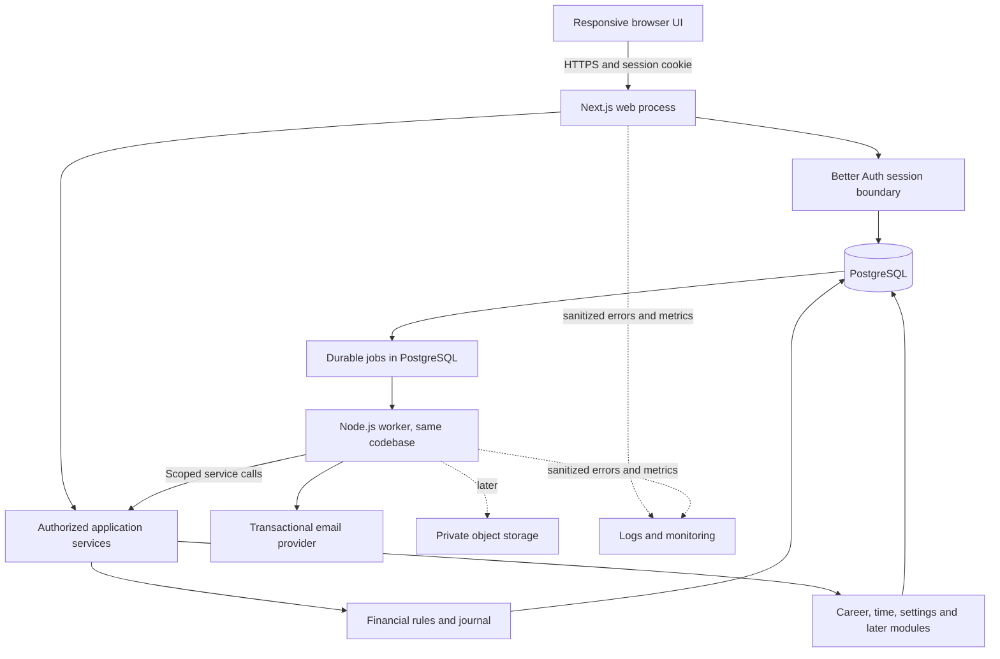
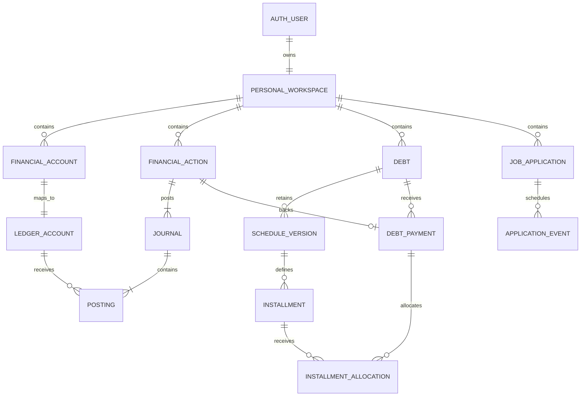
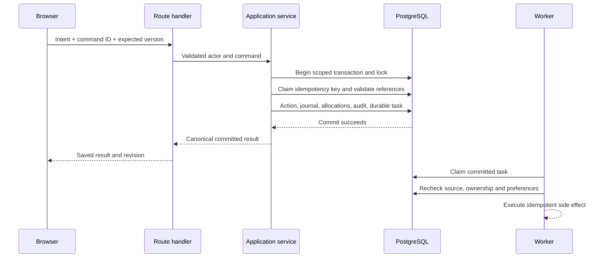
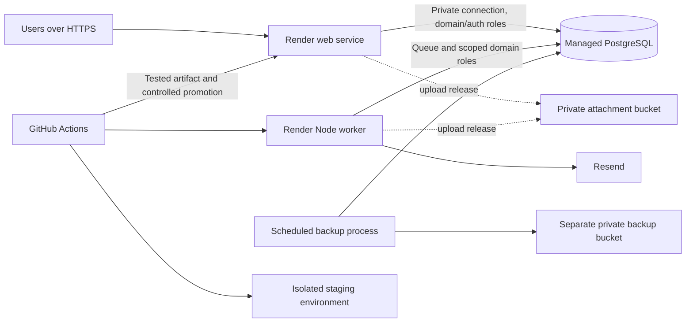

# System Architecture

**Project:** Personal Management Platform (working name)  
**Architecture version:** 1.0  
**Date:** October 5, 2026  
**Primary source:** `PROJECT_VISION_AND_FEATURE_BLUEPRINT.md`, version 1.3, October 5, 2026, read in full (sections 1–19).  
**Source SHA-256:** `AAB9E718338D3D11EC4D434330D2573456FA6BF953E4A6D3397DC9618915ECB4`  
**Status:** Recommended implementation baseline; explicit launch gates and unresolved product decisions are listed below. This document specifies a design, not an implemented or tested application.

## 1. Authority, intent, and reading guide

The blueprint defines the product requirements. The accompanying request additionally requires a complete technology recommendation and private multi-user accounts from the beginning. Instructions inside the blueprint are treated as product requirements and design context, not as commands to deploy, install software, or change accounts.

This document converts those requirements into implementation boundaries, data ownership, financial invariants, command contracts, operational controls, and release gates. It should guide the subsequent database schema, API specification, interface design, backlog, and automated tests.

Terminology used throughout:

- **Requirement:** behavior explicitly required by the blueprint or the accompanying request.
- **Decision / recommended default:** an architectural choice made here. Adopt it unless a recorded architecture decision replaces it.
- **Open / gate:** a choice that requires confirmation or evidence before the affected feature is implemented or released. An open decision does not authorize silent guessing.
- **Future:** a designed extension boundary, not a requirement to implement its tables or infrastructure in V1.

The default architecture is an online, responsive web application with a modular monolith, one PostgreSQL database, and one private personal workspace per user. The financial core uses a small balanced journal underneath user-friendly financial actions. Applications and trackers remain specialized domains. Calendar entries and reports derive from domain records. Authentication, ownership checks, database isolation, and account deletion are part of the first release.

Sections 2–5 cover scope and stack; 6–10 cover identity, data, finance, and transactional APIs; 11–16 cover UI and product modules; 17–21 cover privacy, operations, and tests; 22–24 record decisions, release sequencing, and the final consistency review.

| Quick navigation | Main references |
| --- | --- |
| System and dependencies | [Architecture](#3-overall-architecture), [stack and library matrices](#4-technology-stack-and-dependency-matrix), [modules](#5-module-boundaries-and-internal-organization) |
| Private users and data | [Accounts and isolation](#6-multi-user-accounts-authentication-and-authorization), [data model](#7-data-architecture-and-sources-of-truth) |
| Money and commands | [Ledger](#8-financial-core-and-accounting-correctness), [debt](#9-debt-schedules-payments-and-settlement), [API and consistency](#10-commands-apis-transactions-and-errors) |
| Connected product | [UI](#11-frontend-architecture-and-user-experience), [time](#12-calendar-reminders-and-background-processing), [reports](#13-reports-dashboards-and-analytical-definitions), [groups](#16-shared-expenses-separate-group-authority-and-private-integration) |
| Production readiness | [Security/lifecycle](#17-security-privacy-audit-and-lifecycle), [portability](#18-imports-exports-files-and-restoration), [operations](#20-deployment-cicd-observability-and-recovery), [testing](#21-testing-architecture-and-release-evidence) |
| Delivery and review | [Decision gates](#22-decisions-risks-and-unresolved-questions), [sequence](#23-implementation-sequence-and-development-guardrails), [blueprint consistency](#24-final-consistency-review-against-the-blueprint) |

## 2. Scope and architectural priorities

### 2.1 Release boundaries

| Release | Architectural deliverable | Explicit boundary |
| --- | --- | --- |
| First usable slice | Registration, verified sign-in, recovery, sessions, private workspace/settings; accounts; income, expenses, category splits, completed transfers and fees; application list/stages; agenda; guided setup | Multi-user isolation is already enforced. No single-owner shortcut. Core financial writes are atomic and idempotent. |
| Coherent V1 | Manual debts/schedules, imported opening liabilities, net disbursement, payment allocation, schedule revision, settlement, reconciliation, dashboard, all requested reporting periods, history, CSV exports, in-app reminder controls, deletion | Manual provider-confirmed amounts; no general amortization engine. No dependency on external reminder delivery. |
| V2 financial maturity | Cards/statements, recurring plans, budgets, goals, forecasts, richer career analytics, opted-in scheduled notifications | Actual postings remain distinct from expected occurrences. Uploads/imports/portable restoration can be added here behind separate gates. |
| V2 companion | Shared expense groups, accepted invitations, one payer, equal/exact shares, confirmation/disputes, private ledger linking | Required for the completed product. Group membership never grants private workspace access. |
| V3 | Preset trackers, then custom templates, richer tracker reporting, external calendar integration | Preserve schema versions and existing entries; agree synchronization policy before integration. |
| Later selectively | In-transit transfers, refinancing, multiple payment sources, standalone lending, richer group splits/simplification, multiple currencies, offline synchronization, general sharing | Add only with explicit financial and authorization rules; no premature implementations. |

Core partial refund support is a **recommended V1 addition** because it exercises the same journal and correction machinery and prevents users from misclassifying common receipts. It is not presented as an extra blueprint release commitment. If deferred, do not expose a refund form until its allocation and reporting rules are implemented. Credit-card refunds arrive with cards.

### 2.2 Non-negotiable architectural invariants

1. A sign-in user, a personal workspace, a financial account, and a shared expense group are distinct identities.
2. Every private read and write is scoped to an authenticated owner, including relationships, reports, exports, jobs, files, and notification destinations.
3. A financial action commits its journal, allocations, revisions, history, and relevant reminder changes together or commits none.
4. Posted account/liability balances derive from journal postings. No independent editable balance or expense total exists.
5. Planned dates and future scheduled charges never create actual funds, expenses, or recognized debt automatically.
6. Every actual cash receipt identifies a receiving account owned by that workspace. The sender is metadata, not the destination.
7. Money uses exact arithmetic. Income, spending, cash flow, principal repayment, recognized liability, and scheduled payable are separate metrics.
8. Corrections preserve evidence. Retry, double-click, duplicate worker execution, and concurrent edits must not duplicate economic effects.
9. Generated calendar entries link to one authoritative source. Reminder dismissal does not complete that source.
10. Provider names are data. No business rule switches on GCash, BDO, Maya, or a family member's identity.
11. Group and personal balances have separate authorities. Another member cannot post to a user's private ledger without that user's explicit authorization.
12. Whole-account deletion can remove financial history under the declared lifecycle policy; financial immutability is not an excuse for indefinite personal-data retention.

## 3. Overall architecture

### 3.1 Modular monolith with two process types

Use one repository and one application domain model. Run a Next.js web process and a small Node.js background worker from the same versioned codebase. They share PostgreSQL but have different credentials and responsibilities. A worker is an execution role, not a microservice with its own business rules.

The browser communicates with same-origin JSON endpoints. Route handlers authenticate, validate input, invoke application services, and shape safe responses. Application services own transactions and coordinate domain functions. Repositories execute scoped SQL. Pure financial functions construct and validate posting plans without HTTP or database dependencies.

Server-rendered reads can call the same query services directly; they do not make HTTP requests back to the application. Use Route Handlers for business mutations so there is one visible command surface. Do not independently implement the same mutation in Server Actions, route handlers, and UI callbacks.



All financial consistency remains inside a database transaction. Email and other remote I/O happen after commit through durable tasks. V1 agenda and reports query authoritative data synchronously; they must not wait for a worker to reflect a saved payment.

### 3.2 Deliberately small infrastructure

Do not introduce microservices, Kubernetes, Kafka, Redis, a search cluster, a warehouse, GraphQL, full event sourcing, or a general plugin runtime initially. PostgreSQL supports the relationships, transactional writes, filtered reporting, and modest job volume. Separate reads from commands in code without creating separate databases or distributed CQRS infrastructure.

This choice favors a solo developer's ability to understand a workflow from form to transaction to report. The main tradeoff is that module boundaries are enforced through code review, imports, and tests rather than process isolation.

## 4. Technology stack and dependency matrix

### 4.1 Selection and version policy

**Selected baseline:** TypeScript, React with Next.js App Router on Node.js 24 LTS, PostgreSQL 17 on managed hosting, Drizzle ORM with `pg`, Better Auth database sessions, Zod, React Hook Form, TanStack Query/Table, shadcn/ui with one consistent accessible primitive family, and a PostgreSQL-backed job worker.

Node 24 is an LTS choice verified against the [Node release schedule](https://nodejs.org/en/about/previous-releases). Choose the current patched stable Next.js release compatible with the selected React release when implementation starts. Pin PostgreSQL 17 for local/CI/production consistency; a supported newer major is an explicit upgrade, not an automatic provider default. Verify provider availability before provisioning.

Pin exact installed versions in the lockfile and runtime/container configuration. Do not put floating `latest` versions in production builds. Prefer stable documented APIs, review advisories, and prove the auth/ORM/database integration before feature development. Better Auth and Drizzle evolve faster than PostgreSQL; treat their integration as a tested seam. Links below are official documentation/repositories; key compatibility, isolation, session, worker, and hosting capabilities were checked on October 5, 2026. This is not a blanket certification of every future package version.

**Priority:** R = required for this chosen design; S = strongly recommended; O = optional. A future-phase R dependency is required only when that feature ships, not installed upfront. Grouped dependencies have complementary purposes, described separately in the row.

### 4.2 Application, data, and identity

| Technology / dependency | Priority and phase | Purpose and placement; work avoided | Project fit and tradeoff |
| --- | --- | --- | --- |
| [TypeScript](https://www.typescriptlang.org/docs/) with strict mode | R, first slice | Browser, services, worker and tests; shared contracts and explicit money/date types reduce mismatches | One language for a solo developer; types do not replace runtime validation. Enable unchecked-index and optional-property checks. |
| [React](https://react.dev/) + [Next.js App Router](https://nextjs.org/docs/app) | R, first slice | Components and same-origin web/API application; routing, layouts, rendering and bundling | Strong UI ecosystem and portfolio value without another backend deployment. Server/client boundaries and cache behavior require discipline. |
| Node.js 24 LTS | R, first slice | Standard web and worker runtime | Compatible ecosystem and long-lived workers. Do not use edge runtime for database transactions or assume browser APIs behave identically on the server. |
| [PostgreSQL](https://www.postgresql.org/docs/17/) | R, first slice | Single relational source of truth; constraints, transactions, row security, JSONB for later tracker values | Financial relationships suit SQL. SQL design and migration review are still required. |
| [Drizzle ORM](https://orm.drizzle.team/docs/overview) + Drizzle Kit | R, first slice | Typed query/schema layer and migration generation | SQL remains visible for journal/report queries and RLS. Some constraints/triggers need handwritten SQL; generated migrations must be reviewed. |
| [node-postgres (`pg`)](https://node-postgres.com/) | R, first slice | Connection pool and driver underneath Drizzle | Conventional persistent Node deployment; every transaction uses one checked-out connection. Bigint values must not be coerced into JS numbers. |
| [Better Auth](https://better-auth.com/docs/authentication/email-password), [Drizzle adapter](https://better-auth.com/docs/adapters/drizzle) | R, first slice | Registration, password hashing, verification/recovery tokens, cookie sessions and session APIs | Avoids custom authentication while retaining application-owned SQL data. Requires patching, configuration tests and email delivery; no authentication vendor UI lock-in. |
| [Zod](https://zod.dev/) | R, first slice | Request/response contracts, form schemas, environment and job-payload validation | Good TypeScript inference; cross-record ownership and money rules still belong in server services/database constraints. |
| [pg-boss](https://github.com/timgit/pg-boss) | S, first slice | Durable email/lifecycle jobs, retries, and later reminder scheduling using PostgreSQL | Avoids another broker and a custom queue. Adds DB load and a worker; handlers still require idempotency and retention limits. Validate its transaction adapter for the pinned Drizzle release. |
| Native `bigint` + a small `Money` module | R, first slice | Centavo arithmetic, parsing, checked ranges and explicit allocation rounding | Addition/subtraction do not need a money framework. The custom part is a narrow value type with tests, not custom floating-point mathematics. |
| [decimal.js](https://mikemcl.github.io/decimal.js/) | O, later calculations | Rates, weighted calculations and supported forecasts with explicit rounding | Avoids binary floating-point for fractional calculations. Not necessary for V1 centavo arithmetic and never evidence of a provider's interest policy. |
| [rate-limiter-flexible](https://github.com/animir/node-rate-limiter-flexible) | S, public launch | PostgreSQL-backed limits for expensive business endpoints; auth also uses Better Auth's documented limiter | Avoids hand-built distributed counters. Configure separate policies and retention; verify PostgreSQL store/version compatibility. |

Drizzle provides explicit [transaction APIs](https://orm.drizzle.team/docs/transactions) and [RLS definitions](https://orm.drizzle.team/docs/rls). Those capabilities support this design; they do not automatically make queries tenant-safe.

### 4.3 Frontend and interaction libraries

| Technology / dependency | Priority and phase | Purpose and placement; work avoided | Project fit and tradeoff |
| --- | --- | --- | --- |
| [TanStack Query](https://tanstack.com/query/latest/docs/framework/react/overview) | S, first slice | Remote state, pagination, mutation lifecycle and invalidation in interactive pages | Avoids custom request caches. Query keys include user/workspace context; disable financial mutation auto-retries unless reusing the same command key. |
| React local state + URL search parameters | R, first slice | Dialogs, unsaved view state, shareable period/filter controls | No Redux/Zustand initially. URL state excludes sensitive free-text details and private payloads. |
| [React Hook Form](https://github.com/react-hook-form/react-hook-form) + `@hookform/resolvers` | S, first slice | Form lifecycle, dynamic category/fee rows and Zod integration | Avoids repetitive touched/dirty/error handling. Server validation remains authoritative; preserve strings while entering monetary values. |
| [Tailwind CSS](https://tailwindcss.com/docs) | S, first slice | Consistent responsive spacing, typography and themes | Fast solo iteration; enforce design tokens to avoid arbitrary visual divergence. |
| [shadcn/ui](https://ui.shadcn.com/docs) + [Radix Primitives](https://www.radix-ui.com/primitives) | S, first slice | Owned component source plus accessible dialogs, menus, selects and focus behavior | Customizable without building interaction primitives. Choose the Radix-backed component variants consistently; copied code needs maintenance and accessibility verification. |
| `class-variance-authority`, `clsx`, `tailwind-merge` | S, with UI components | Component variants, conditional class names, and conflicting utility resolution | Small complementary helpers used by the component convention; avoid parallel styling abstractions. |
| [Lucide React](https://lucide.dev/guide/packages/lucide-react) | S, first slice | Consistent tree-shakeable icons | Saves custom icon work; icons need labels and cannot carry status alone. |
| [Sonner](https://sonner.emilkowal.ski/) | S, first slice | Accessible transient notifications | Saves toast lifecycle code; important save errors also stay inline. A toast is not durable transaction evidence. |
| [TanStack Table](https://tanstack.com/table/latest) | S, first slice | Ledger/application sorting, filters, selection and server pagination | Flexible headless tables; implement semantic markup and mobile layouts. Avoid a spreadsheet-style grid until needed. |
| [TanStack Virtual](https://tanstack.com/virtual/latest) | O, measured need | Rendering large currently loaded lists | Reduces DOM cost; pagination remains primary and virtualization requires accessibility testing. |
| [Recharts](https://recharts.org/) | S, V1 reports | Trend/category charts built from server-calculated aggregates | Fits React; load lazily and pair charts with exact-value tables. Numeric chart coordinates are never the financial authority. |
| [date-fns](https://date-fns.org/) + [`@date-fns/tz`](https://github.com/date-fns/tz) | S, first slice | Date formatting, calendar operations and explicit time-zone calculations | Avoids ad hoc date math. All-day dates remain separate date-only strings; DST and recurrence policy still need explicit tests. |
| [React DayPicker](https://daypicker.dev/) | S, first slice | Date and date-range form selection alongside the UI components | Saves custom calendar-grid/keyboard behavior. Match the selected shadcn recipe to its supported package major; current v10 documentation uses `@daypicker/react`. Convert selected values to explicit date-only contracts. |
| Native `Intl.NumberFormat` | R, first slice | Localized display, with exact money string formatting at boundaries | No extra currency-format dependency. Do not round-trip displayed money through a floating-point number. |
| [FullCalendar React](https://fullcalendar.io/docs/react), `@fullcalendar/react` and its supported view/interaction modules | S, V2 calendar views | Month/week presentation and event interaction | Complements the V1 agenda. Current v7 uses React package subpath modules; do not mix v6 plugin packages with v7. Premium resource views are unnecessary. Source edits still route to domain commands. |
| [`temporal-polyfill`](https://fullcalendar.io/docs/timeZone) | S, with FullCalendar v7 | Calendar peer dependency and explicit named-zone conversion at the widget boundary | Supports the selected calendar's current time model without inventing timezone conversion. Keep domain dates in the shared date contract; do not introduce a second conflicting recurrence engine. |
| [Driver.js](https://driverjs.com/) | O, V1 guidance | Replayable contextual tours | Saves overlay positioning. Checklist/help must work without the tour; tours never submit financial forms. |
| [`@dnd-kit`](https://dndkit.com/) | O, later career board | Accessible drag/drop interactions | Avoids custom dragging. Keep keyboard stage controls and explicit history dates; ship the table first. |

### 4.4 Delivery, files, jobs, and diagnostics

| Technology / dependency | Priority and phase | Purpose and placement; work avoided | Project fit and tradeoff |
| --- | --- | --- | --- |
| [Resend](https://resend.com/docs/api-reference/emails/send-email) + `resend` SDK | R capability, selected provider for first slice | Verification/recovery/security email; later opted-in reminders | Avoids SMTP operations; external cost, quota, deliverability and privacy dependency. Place behind a small email adapter. Authentication email is required even when reminder email is deferred. |
| [React Email](https://react.email/docs/introduction) | O, V1 polish | Reusable email templates and rendering | Better template maintenance; simple escaped HTML/plain-text templates are sufficient initially. |
| [csv-stringify](https://csv.js.org/stringify/) | S, V1 | Streaming quoted CSV exports with formula-escape settings | Avoids fragile CSV string concatenation. Document spreadsheet-safe escaping and export schema. |
| [csv-parse](https://csv.js.org/parse/) | S, V2 import | Streaming supported CSV inputs | Handles syntax, not semantic dates or deduplication. Import still needs mapping and preview. |
| [Amazon S3](https://docs.aws.amazon.com/AmazonS3/latest/userguide/Welcome.html), `@aws-sdk/client-s3`, `@aws-sdk/s3-request-presigner` | S, V2 uploads; also selected backup destination | Private object storage, managed API access and short-lived signed transfers | Avoids serving files from ephemeral web disks. Adds IAM/region/cost configuration; public buckets are forbidden. Backup credentials/bucket are separate from user uploads. |
| [`file-type`](https://github.com/sindresorhus/file-type) + [ClamAV](https://docs.clamav.net/) | S, upload release | Content-type inspection and quarantined malware scanning | Saves signature/scanner implementation. Neither proves a file harmless; maintain scanner updates and restrictive preview/download rules. |
| [Pino](https://github.com/pinojs/pino) | S, first slice | Structured server/worker logs with allowlisted fields and redaction | Searchable diagnostics without custom logging. Logs are not financial audit history. |
| [`@sentry/nextjs`](https://docs.sentry.io/platforms/javascript/guides/nextjs/) | S, public launch | Sanitized exception tracking and selected performance signals | Faster failure diagnosis; external processor with quotas. Disable replay and default PII collection; scrub URLs, payloads and breadcrumbs. |
| [OpenTelemetry JS](https://opentelemetry.io/docs/languages/js/) | O, measured need | Correlated spans across web, worker and database | Useful when latency diagnosis needs traces; avoid duplicate Sentry instrumentation and high-cardinality sensitive attributes. |
| [Render](https://render.com/docs) web service, worker and paid managed PostgreSQL | S, selected production platform | Managed deployments, TLS, private networking and database operations | Conventional Node hosting suits transactions and workers. Paid baseline is more predictable than a sleeping demo tier; verify pricing and recovery terms at launch. |

### 4.5 Testing and developer tools

| Technology / dependency | Priority and phase | Purpose and placement; work avoided | Project fit and tradeoff |
| --- | --- | --- | --- |
| [Vitest](https://vitest.dev/guide/) | R, first slice | Domain, service and integration test runner | Fast TypeScript tests; database behavior needs actual PostgreSQL, not mocked repositories alone. |
| [fast-check](https://fast-check.dev/docs/introduction/) | S, financial core | Generated money, rounding, reversal and allocation invariants | Finds edge cases beyond examples. Keep deterministic seeds on failure and independent assertions. |
| [Testing Library](https://testing-library.com/docs/react-testing-library/intro/) + `user-event` + `jsdom` | S, first slice | Component tests by accessible behavior | Avoids tests coupled to implementation details; use browser tests for actual navigation/rendering boundaries. |
| [Playwright](https://playwright.dev/docs/intro) + `@axe-core/playwright` | R for E2E; S for axe, V1 | Isolated multi-user browser workflows, downloads, mobile emulation and accessibility checks | Covers cross-layer acceptance; automated accessibility checks need manual keyboard review too. |
| [MSW](https://mswjs.io/) | O, UI development | Deterministic API failures/loading in component tests | Useful for failed-save UX; not a substitute for real authorization/transaction integration tests. |
| [Docker Compose](https://docs.docker.com/compose/) | S, development/CI | Repeatable PostgreSQL and mail sandbox; isolated test database | Avoids environmental drift. Windows users need a working container environment or an equivalent dedicated development database. |
| [Mailpit](https://mailpit.axllent.org/) | S, local development | Capture verification and recovery mail without real delivery | Safe local inspection; production uses the provider adapter. |
| [pnpm](https://pnpm.io/), ESLint, Prettier, `tsx` | S, first slice | Reproducible dependency install, architectural lint rules, formatting and development scripts | Familiar tooling; pin package manager and avoid unnecessary monorepo orchestration. |
| [GitHub Actions](https://docs.github.com/en/actions) + Dependabot | S, first slice | CI checks, migration/build tests and dependency update proposals | Avoids manual release checklists alone; do not auto-merge major/security-sensitive changes without relevant tests. |
| [k6](https://grafana.com/docs/k6/latest/) | O, launch/load validation | Repeatable workload and percentile latency tests | Useful once realistic fixtures exist; load tests use synthetic data in staging. |

### 4.6 Meaningful alternatives

- **Next.js versus Vite + Fastify:** a separate SPA and API is valid, but adds routing, deployment and contract wiring. Choose Next.js for one deployable web boundary; keep domains framework-independent so extraction is possible.
- **Drizzle versus Prisma:** both can support PostgreSQL. Drizzle is selected for visible SQL, custom constraints and reporting. Prisma is a reasonable team-familiarity alternative, but do not install both or assume either replaces transaction/ownership design.
- **Better Auth versus managed auth:** managed auth can reduce credential operations, but introduces pricing and provider lifecycle dependencies. The selected library preserves control and conventional database sessions; patching and recovery delivery are explicit responsibilities. If the auth proof fails, choose a managed provider through an ADR before building product features.
- **Balanced journal versus ad hoc signed transaction rows:** a small journal requires more careful initial modeling, but it prevents contradictory handling of financed spending, upfront fees, refunds, and group receivables. Users never have to learn accounting terminology.
- **Render versus Vercel plus separate services:** long-lived Node processes and a colocated worker simplify database connections and scheduling. Vercel remains possible later if worker/database topology and caching are revalidated.

## 5. Module boundaries and internal organization

| Module | Owns | Allowed dependencies / contracts |
| --- | --- | --- |
| Identity and workspace | User lifecycle, profile, owner mapping, preferences, session-facing operations | Auth library and narrowly scoped workspace provisioning; does not calculate finances. |
| Financial core | Financial accounts, ledger accounts, actions, journals, postings, reversals, category allocations, reconciliation | Ownership context, categories and transaction infrastructure. All money-affecting modules post through this module. |
| Debt | Debt terms, schedule versions, installments, payment/settlement allocations | Financial core commands in the same transaction; exposes due-source queries. |
| Career | Applications, stage/outcome history, events, role/resume snapshots | Shared validation/history; exposes due-source queries. No dependency on finance. |
| Time and reminders | Personal events, unified agenda DTOs, reminder preferences/occurrence state | Read interfaces from source modules; source adapters handle mutations. |
| Reporting and dashboard | Read queries, definitions, period controls, export schemas | Approved read contracts/views; no domain mutation or separately maintained expense records. |
| Guidance and settings | Onboarding state, guide versions, enabled modules, user help | Calls normal commands for real setup; tutorial playback is read-only. |
| Cards and planning, later | Statements, plans, expected occurrences, goal allocations | Financial core plus time contracts; cannot redefine cash or expense rules. |
| Shared expenses, later | Groups, participants, bills, group balances, confirmations/disputes | Separate group authorization; private integration through explicit per-user finance commands. |
| Trackers, later | Versioned templates, definitions, entries | Shared time/history capabilities; cannot implement a competing ledger or job pipeline. |

Use a simple repository layout:

```text
src/app/                    pages, layouts, thin route handlers
src/modules/<module>/       domain functions, services, repositories, contracts, UI
src/platform/auth/          Better Auth configuration and session boundary
src/platform/db/            pools, scoped transaction helper, migrations
src/platform/jobs/          job transport and handlers
src/platform/email/         delivery adapter and templates
src/shared/                 Money, dates, errors, IDs, safe UI primitives
src/worker.ts               worker entry point
tests/{unit,integration,e2e}/
docs/adr/                   decisions that change this baseline
```

Repositories require an authorized transaction/query context, never a loose `userId` supplied from the browser. Avoid a generic repository abstraction. Domain modules export explicit use cases and DTOs; other modules do not reach into their tables to mutate them. Use ESLint restricted-import rules to keep database/auth code out of browser bundles and cross-module internals out of callers.

Synchronous module coordination uses typed function calls within one transaction. Durable tasks carry IDs, version, scope and a small allowlisted payload. A lightweight job interface is justified; a general event bus or plugin framework is not.

## 6. Multi-user accounts, authentication, and authorization

### 6.1 Identity and workspace model

`AuthUser` is managed by Better Auth. `UserProfile` holds application-facing name and lifecycle status. `PersonalWorkspace` contains `id`, `owner_user_id`, `kind`, `currency`, `timezone`, `week_start`, and lifecycle timestamps. Enforce a unique owner for the personal-workspace kind. The initial default is PHP, Asia/Manila, and Monday week start, confirmed during setup.

Each real user gets exactly one private personal workspace. Do not add a general workspace-membership table or household administrator in V1. The separate workspace ID leaves room for future workspace types without implying sharing now. A future demo is a distinct sandbox scope or deployment with synthetic data, not a boolean filter casually mixed into real financial queries.

Workspace provisioning is idempotent after verified authentication: a transaction inserts the profile/workspace/default categories/settings only if absent. A unique constraint prevents duplicate workspaces under concurrent first requests. Until provisioning succeeds, show a recoverable setup error and block domain commands. Do not assume the auth library's user-creation hook and application provisioning share a transaction. A partial registration can be retried safely.

Currency becomes immutable once postings exist in V1. Changing timezone affects display and future reminder scheduling, not financial effective dates or stored instants. Different users can enable different modules and reminder settings.

### 6.2 Chosen sign-in and recovery experience

Use email/password with email verification. Registration supports distinct people, not a hardcoded owner. An initial closed beta can use a configurable registration allowlist or expiring invitation codes; opening registration later must not require a schema rewrite. Normalize identity email using the auth library's semantics; do not remove dots or plus suffixes using provider-specific assumptions.

Delegate password hashing, token generation, verification and reset flows to Better Auth. Set application policy to allow long passphrases, password-manager autofill/paste, and a documented minimum length (recommended 12 characters) without arbitrary composition rules. Keep a reasonable library-supported maximum to bound hashing work. Authentication endpoints must not disclose account existence through different recovery messages.

Recommended flows:

1. Registration → verification email → verified sign-in → idempotent workspace setup → optional onboarding.
2. Forgotten password → generic acknowledgement → short-lived one-time link to an allowlisted application route → new password → revoke all existing sessions → sign in again.
3. Password change or email change → recent reauthentication; verify a new email before replacing the old identity; notify the prior email of the change without sensitive financial content.
4. Unavailable email → direct the user to recover their mailbox. V1 has no informal administrator password reset based on knowing a family member. Additional recovery methods need a designed proof-of-ownership flow.

Better Auth documents [email/password recovery](https://better-auth.com/docs/authentication/email-password). Explicitly enable `revokeSessionsOnPasswordReset`; its [configuration reference](https://better-auth.com/docs/reference/options) shows this is not a behavior to assume from defaults. Reset and verification URLs must never enter ordinary logs, analytics, referrers, or public error reports.

Use the provider only for delivery; verification and recovery state remains under the auth library. Delivery callbacks must durably accept the send task or return a retriable failure. If asynchronous delivery needs a bearer link, encrypt that short-lived payload with a dedicated rotating server key, restrict queue access, and delete it after send/expiry. Do not retain token-bearing job results. An unavailable email provider must not result in a misleading success claiming that mail was delivered.

### 6.3 Session policy

Use opaque database-backed sessions in secure HttpOnly cookies. Production cookies are Secure, appropriately SameSite (Lax for the same-origin application), host-scoped, and unavailable to JavaScript. No bearer tokens in localStorage. Configure a seven-day session lifetime with documented refresh behavior; add a maximum thirty-day absolute lifetime checked server-side. Shorten these if risk or user feedback warrants it.

Disable session cookie caching/stateless-only validation for protected reads and writes so server revocation takes effect on the next request. Use database session verification at the application boundary. Expose session/device list, current-session logout, logout all devices, and individual revocation. Store only the metadata needed to help identify sessions; trim IP/user-agent retention.

Require reauthentication within five minutes for deletion, password/email changes and later recovery/MFA changes. Session renewal alone is not proof of a fresh password challenge. After logout or account switch, clear Query caches, refresh server-rendered state and notify other tabs. Request-scoped session memoization is acceptable; cross-request user-data memoization is not. These controls build on the library's [session APIs](https://better-auth.com/docs/concepts/session-management).

The released V1-C4 deletion challenge uses a Better Auth plugin endpoint and the pinned library's password verifier, origin protection and persistent rate limiter. It records a five-minute server-owned `auth.session_assurance`; renewal never creates proof. Session review returns estimated device and timestamps without tokens or IPs, and revocation uses supported library operations. A password change verifies the current password and revokes other sessions. Expired session metadata and verification credentials have an auth-only bounded housekeeping process; it also removes global library abuse counters inactive for thirty days, retaining active limit windows. Production must configure its cadence rather than imply that expiry itself deletes stored metadata.

MFA/passkeys are a sensible later security improvement using supported auth-library capabilities; they are not a second homemade authentication system. Finalize backup/recovery behavior before enabling them.

### 6.4 Authorization at every boundary

Authentication answers who is signed in. Authorization answers whether that user can perform this operation on every involved record. A login page or middleware redirect is not sufficient. Every route handler, server query, download, command and worker handler enforces its own applicable policy.

Build `ActorContext` from a validated server session: user ID, personal workspace ID resolved from the database, session ID, and request ID. Reject or ignore client-supplied owner/workspace fields on personal commands. Do not trust a URL workspace ID merely because it looks valid.

For a transfer, validate both financial accounts, all fee bearers, categories and linked source records against the same workspace. For a debt payment, validate the debt, paying account, schedule version, installments and any original action. Apply identical checks to search, counts, joins, relation expansion, charts and export filters. Random UUIDs reduce guessability but do not grant access.

Return 404 for a missing or nonowned private record so enumeration does not disclose existence. Use 403 for a known, visible resource on which a role cannot perform a particular action. Report unexpected foreign-key errors as safe validation failures without exposing another user's identifiers or data.

### 6.5 Database isolation as a second barrier

All private domain tables carry `workspace_id NOT NULL`. Parent tables provide a unique `(workspace_id, id)` key; child relationships use composite foreign keys such as `(workspace_id, account_id)` → `FinancialAccount(workspace_id, id)`. This blocks cross-workspace links even when two valid IDs are submitted together. Tags, allocations, audits and attachment relations follow the same rule.

Use PostgreSQL RLS with both read/update `USING` and insert/update `WITH CHECK` policies. The common policy requires that the row's workspace matches transaction-local context and belongs to the authenticated user. `PersonalWorkspace` itself is scoped by `owner_user_id`; queries must avoid recursive policies. Use an invoker-rights view or scoped query rather than an owner-bypassing report view. PostgreSQL documents owner/superuser bypass and default-deny behavior in its [row-security reference](https://www.postgresql.org/docs/17/ddl-rowsecurity.html).

The transaction helper checks out one connection, starts a transaction, installs trusted user/workspace context with transaction-local `set_config`, executes only through that transaction object, then commits or rolls back. A missing context denies access. Never use connection-global tenant settings or issue a query on the general pool halfway through this helper. This applies to read-only reports too.

Use separate roles:

| Role | Permitted purpose | Restrictions |
| --- | --- | --- |
| Migration owner | Schema, policies, constraints and queue schema upgrades | Deployment-only secret; never available to normal request handling. |
| Application domain role | Scoped domain SQL | Not table owner, superuser or BYPASSRLS; no role switching, DDL or TRUNCATE; force RLS on private tables. |
| Auth adapter role | Library-managed auth tables and required auth housekeeping | No financial/career/table access; session and credential data never exposed through generic repositories. |
| Queue broker role | Claim/acknowledge job envelopes | No unrestricted private-domain access. Payloads are minimized; credential is worker-only. |
| Worker domain role | Execute a job in its verified owner/group scope | Re-establish context, check lifecycle/membership and source version; no global bypass for convenience. |
| Lifecycle operator | Narrowly scoped deletion/restore procedures | Separate credential/process authorization, recorded execution; not a general public admin endpoint. |

RLS protects against missing query predicates, not a fully compromised server that can forge context. Parameterized SQL, restricted credentials and safe server code are still essential. Test the actual runtime roles; tests run only as a database owner cannot prove isolation.

## 7. Data architecture and sources of truth

### 7.1 Core relational model

Names below are conceptual; the later schema may use snake_case. UUIDs identify records. Store `created_at`/`recorded_at` as UTC `timestamptz`, mutable aggregate `version` as an integer, and relevant effective dates as PostgreSQL `date`. An event's original timezone is a separate IANA name.

| Aggregate / records | Source-of-truth responsibility | Key relationships and constraints |
| --- | --- | --- |
| AuthUser, Session, credential/token tables | Identity and session lifecycle | Library-owned schema; application profile references immutable auth user ID. |
| PersonalWorkspace, Preferences, ModulePreference, OnboardingProgress | Private scope and user configuration | One personal owner; unique per-workspace settings/module step keys. |
| Category, Tag, record-tag joins | User-controlled classification | Seed per workspace; category archive preserves history; joins have scoped FKs. |
| FinancialAccount, LedgerAccount | User-visible fund locations versus internal accounting buckets | One cash ledger account per financial account; currency and normal balance; no mutable authoritative balance. |
| FinancialAction, ActionRevision | User-visible economic action and immutable change chain | Unique workspace/client command ID; reversal/replacement links; current revision pointer is controlled. |
| Journal, Posting | Dated balanced accounting movement | One action may own several journals; each journal has one currency/date, at least two postings and zero signed sum. |
| Debt, DebtScheduleVersion, Installment | Liability identity, provider terms, versioned schedule | One active schedule version; immutable former versions and mappings; due status derived from obligations and allocations. |
| DebtPayment, PaymentComponent, InstallmentAllocation, Settlement | Meaning of a payment and its due allocations | Exactly one linked financial action per payment; explicit recognized/unallocated components. |
| Reconciliation | Statement/app comparison and evidence | Account, cutoff, observed amount, app amount/version, reason and optional correction action. |
| JobApplication, StageHistory, ApplicationEvent | Application identity, stages, interviews and follow-ups | Repeated interviews have separate IDs; effective and recorded dates retained. |
| PersonalEvent, ReminderRule, ReminderOccurrence | Manual events and user reminder state | Generated agenda entries are queries; reminder source references must be validated. |
| AuditRevision, Activity | Evidence versus friendly activity feed | Scoped target links; revision records transactional; activity is a sanitized presentation. |
| CommandReceipt, durable job records | Idempotency and asynchronous intent | Unique command key/hash; tasks queued in the same transaction as their source change where required. |

Financial category allocations are represented by categorized expense postings. A separate editable expense table must not become a second authority. A join/metadata table can associate postings with a purchase line or fee component, but totals always reconcile to those postings.



The diagram omits audit/ownership columns and internal expense/income/equity ledger accounts for readability; these remain mandatory in the actual schema. Use concrete foreign keys for financial relationships. A generic `source_type/source_id` reference is allowed only in nonfinancial presentation/job metadata with a controlled resolver, source-lifecycle tests, and an orphan detector. It is not a replacement for debt/payment/account foreign keys.

### 7.2 Authoritative versus derived values

| Value | Authority | Projection / refresh policy |
| --- | --- | --- |
| Posted cash, recognized liability | Posted journal entries | Sum by ledger account and date; rebuildable cache only after measurement. |
| Outstanding principal | Principal-classified liability movements, if known | Null/unknown when breakdown cannot be supported; never infer from scheduled total. |
| Remaining scheduled payable | Active schedule's remaining obligations and due allocations | Separate from ledger liability; include coverage/breakdown flags. |
| Expense/category totals | Classified expense postings and linked credits | Shared report queries; no UI-side second formula. |
| Statement balance, later | User-verified closed statement snapshot | Preserved even when remaining amount due changes. |
| Agenda | Debt/career/personal/other source dates | Indexed source queries through adapters; no duplicate generated event row. |
| Reminder dismissal/snooze | ReminderOccurrence | Does not alter source status. |
| Group balances, later | Confirmed group bills/corrections/settlements | Separate from any user's optional private ledger link. |

Avoid ambiguous stored flags such as `isPaid` on both an installment and its payment rows. Derive due residuals; if a summary is persisted, make its rebuild strategy and transaction owner explicit.

### 7.3 Dates and historical setup

Financial `effective_date` is a user-selected local accounting date. A created timestamp does not substitute for it. All-day deadlines use `date` and travel across zones unchanged. Timed events store UTC instant plus entered IANA timezone; handle nonexistent/ambiguous DST times explicitly rather than choosing silently.

**Opening cutoff default:** an entered balance dated D means the balance at the end of D; normal activity begins D+1. The UI states this prominently and offers a prior-day cutoff when today's actions need recording. Prevent ordinary new entries at or before an account's opening cutoff. A controlled historical-import/correction workflow can revise the opening baseline with a before/after reconciliation. This prevents importing old activity on top of a balance that already includes it.

Opening cash and existing liabilities post to opening-equity buckets, not income/expense. Paid historical installments are imported as historical schedule state with evidence; they create no new cash payment. Coverage starts at the cutoff and is visible on reports.

## 8. Financial core and accounting correctness

### 8.1 A small internal balanced journal

The UI offers actions such as Receive income, Add expense, Transfer, Record borrowing, Pay debt, Refund and Correct. Each command creates a posting plan. Users never choose arbitrary debit/credit accounts.

Use internal ledger kinds: cash asset, receivable/clearing asset, liability, expense, income, opening equity and explicit adjustment equity. Future cards use liability accounts; future group receivables and payables use scoped subaccounts. Categories are dimensions on expense/income postings, not independently maintained balances.

Store signed centavos: debit positive, credit negative. A journal must sum to zero. Asset/expense balances are debit-normal; liability/income balances are credit-normal, so displayed liability is the negated signed sum. Every posting names a ledger account of the same workspace and currency as its journal. A journal's effective date applies to all its entries.

One user action can contain multiple balanced journals when fee components have different dates. The whole action is saved atomically; each component affects the correct reporting period. V1 completed transfers move both principal sides on the same effective date. Different departure/arrival dates require the future transit workflow.

### 8.2 Exact money and rounding

- PostgreSQL `bigint` stores centavos; TypeScript `bigint` performs arithmetic. `SUM(bigint)` can return numeric text from PostgreSQL: parse exact integer strings rather than Number.
- JSON transmits minor units as decimal strings, for example `{ "currency": "PHP", "amountMinor": "501500" }`. Form input remains a decimal string until strictly parsed. Reject malformed grouping, exponent notation, NaN and more than two decimal places for PHP.
- Set a recommended per-component maximum of PHP 1,000,000,000.00 and validate aggregate overflow against the storage range; this is a product limit, not a technical claim that all bigint values are safe browser numbers.
- Reject negative user amounts where the command already expresses direction. Dedicated refund/reversal commands determine signs. Zero-value actions are rejected unless a documented nonfinancial operation needs them.
- Equal splits use quotient/remainder centavo allocation in a stable participant order. Show who receives each extra centavo and persist that assignment. Weighted future splits use largest remainder with a stable tie rule.
- Percentages and estimates round only at a declared boundary. Chart plotting can use bounded numeric approximations after server calculation, but labels and exported financial values remain exact.

### 8.3 Posting recipes

Amounts in this table are PHP for readability. Each debit total equals its credit total.

| Action | Debit | Credit | Reporting meaning |
| --- | --- | --- | --- |
| Opening bank balance 2,000 | Bank cash 2,000 | Opening equity 2,000 | Opening funds; no income. |
| Salary actually received 10,000 | Selected bank cash 10,000 | Salary income 10,000 | Cash and period income increase; sender remains metadata. |
| Gift actually received 500 | Selected wallet cash 500 | Gift income 500 | Distinct income classification; destination is mandatory. |
| Purchase 1,000 split 700/300 | Grocery expense 700; household expense 300 | Paying cash 1,000 | One deduction and two category portions. |
| Completed transfer 5,000 with source fee 15 | Destination cash 5,000; fee expense 15 | Source cash 5,015 | Internal principal cancels; spending and external outflow are 15. |
| Fee withheld from a 5,000 source debit | Destination cash 4,985; fee expense 15 | Source cash 5,000 | Preview makes gross/deposited amounts explicit. |
| Loan with principal 10,000, net proceeds 9,800 | Receiving cash 9,800; fee expense 200 | Loan liability 10,000 | Borrowing is not income. |
| Loan 10,000 received, extra 200 fee capitalized | Receiving cash 10,000; fee expense 200 | Loan liability 10,200 | Do not also deduct the fee from cash. |
| Existing recognized debt 6,400 at cutoff | Opening equity 6,400 | Loan liability 6,400 | No new borrowing flow or expense. |
| Financed purchase 6,000 | Purchase expense 6,000 | Relevant liability 6,000 | Spending now, cash later. |
| Pay principal 1,000, newly recognized interest 100, cash fee 10 | Loan liability 1,000; interest expense 100; fee expense 10 | Paying cash 1,110 | Expenses 110; net liability decrease 1,000. |
| Pay already recognized liability 1,100 plus new fee 10 | Loan liability 1,100; fee expense 10 | Paying cash 1,110 | Expenses only 10, even if prior liability included interest. |
| Refund 250 into cash | Receiving cash 250 | Original expense category 250 | Refund-classified spending offset on refund date, not income. |
| Confirmed waiver of recognized interest 400 | Loan liability 400 | Interest expense/recognized-cost offset 400 | Noncash reduction linked to a recognized charge. Imported unknown components use disclosed opening/adjustment treatment. |
| Unexplained positive reconciliation adjustment 100 | Cash 100 | Adjustment equity 100 | Explicit adjustment, not inferred income. |

Separate fee bearer accounts produce separate cash/liability postings; their classification remains fee expense. A fee cannot be both deducted from proceeds and added again to debt unless the user confirms two distinct real charges. Multi-fee previews show labels, amounts, dates, bearers and combined effect.

### 8.4 Database and service safeguards

Application services validate command semantics and create the complete plan. Database constraints enforce referential/row-level facts; a deferred constraint trigger validates each committed journal's balanced sum, minimum posting count, scope, currency and posted parent state. `CHECK` constraints alone cannot validate sums over child rows. Test this trigger with direct SQL under the runtime role, including attempted partial inserts.

Posted journals/postings reject UPDATE/DELETE through protected database rules, and new postings cannot be appended to an already finalized journal. Within one write transaction, create a building journal, insert its entries, then finalize it; a deferred commit check rejects any journal left building. Thus the journal can be assembled atomically without leaving an editable posted parent. Financial form drafts, if offered, live separately and never enter balance queries. In V1 a save command either posts the full action or fails; no persistent half-posted action is exposed. The lifecycle purge role is the deliberate exception for whole-workspace deletion.

Balances are sums of all posted signed entries, including originals and their offsetting reversals. Never filter out the original while retaining its reversal. Financial action detail groups correction chains so users see the current meaning and history without mistaking corrections for new purchases.

### 8.5 Refunds, rebates and correction semantics

Refunds are real new events dated when they occur. Link each to a purchase and allocate its categories. Lock the original purchase when validating cumulative refunds. Ordinary purchase refunds cannot exceed the refundable purchase amount; fees need an explicit separate fee refund and unusual extra compensation needs a separately classified action. Multiple partial refunds are supported without rewriting the purchase.

Gross spending is signed purchase/charge activity after correction cancellation; refunds and recognized-cost rebates are separately classified offsets. Net spending subtracts those offsets. A reversal inherits the original reporting class with opposite sign, so a correction does not inflate gross spending, cash flow or refund totals. The replacement carries the corrected economic meaning. Count business actions by their logical identity/current revision, not by journal-row count.

Recommended cashback rule: merchant cashback explicitly linked to a purchase is a spending offset; general wallet/bank rewards are labeled reward income. The user selects the meaning when recording actual receipt. Expected cashback stays planned. A debt waiver produces no cash receipt unless a separate real receipt occurred. A waiver of unrecognized future interest changes schedule/avoided-charge metadata only, not expense postings.

Changes to amount, account, currency, effective date, recognized fee, category allocation or liability allocation create a reversal-and-replacement command with a required reason. Correct an erroneous historical action at its original effective date (and replacement's corrected date); record the correction timestamp now. A real refund or later settlement uses its actual new date. Simple descriptions, notes and references can have audited metadata revisions without financial reversal. Category renaming changes the label, not historical amounts; category reclassification is an explicit financial revision.

### 8.6 Cash, availability and reconciliation

Tracked liquid funds is the signed sum of cash accounts, including unexplained negative balances, so reconciliation identities remain true. Available-to-spend presentation excludes negative balances as usable funds, shows a separate deficit/incomplete-history warning, and never adds credit limits. Do not relabel the sum of positive accounts as net liquid funds. An archived account remains in historical and current financial totals while it carries tracked value; archive changes navigation, not ownership of money.

Allow a real transaction that makes a manual account negative after a clear warning and explicit acknowledgement. Record the warning outcome; do not invent an overdraft policy or drop the transaction. A genuinely pending transfer is outside the completed-transfer command and must not be falsely posted as completed.

Archived accounts reject ordinary new activity until explicitly restored. Historical corrections/reversals can still reference them through the correction workflow, preserving old financial evidence and updating totals. Archiving an account with a remaining balance requires an explanatory preview; it never clears that balance.

A reconciliation records the user's observed balance and cutoff, the calculated amount at comparison, difference, source version and optional statement reference. If another write or backdated correction changes the comparison, flag the reconciliation as needing review rather than claiming it remains verified. An explicit adjustment requires date, amount and reason and links back to the reconciliation. Never auto-adjust to the provider balance.

## 9. Debt schedules, payments, and settlement

### 9.1 Supported V1 debt semantics

Support manually entered personal loans, installment loans and financed purchases with provider-confirmed amounts. A flexible obligation can be represented through manual charges and dates, but issuer-specific revolving-credit calculations belong to the card release. Do not generate universal amortization or infer an interest rate from installment totals.

Persist separately:

- Original principal as known contractual metadata.
- Recognized liability from the ledger, with principal/interest/fee classifications where supported by evidence.
- Outstanding principal, either a defensible classified amount or unknown.
- Current and historic schedule versions, including future expected charges.
- Paid amounts and allocation evidence, including amounts awaiting classification.
- Lifecycle state (active, settled, settled early, cancelled) and separately derived overdue status.

Cancellation is not permission to erase a live liability. A debt with postings requires a correction, waiver, settlement or other explicit resolution before its recognized balance can disappear.

### 9.2 Payment components versus installment allocation

A payment has two distinct allocations. **Accounting allocation** says how cash reduces an existing liability, recognizes a new charge, or remains pending classification. **Due allocation** says which contractual installments have been satisfied. Paying an installment does not prove its whole amount was principal.

One `DebtPayment` references one `FinancialAction`; its components and installment allocations are saved in the same transaction. The form can propose oldest-due-first allocation, but the user sees and confirms it. Partial payments leave a positive due residual. Extra payments require explicit allocation to future obligations, recognized principal, or an advance/clearing amount; never force a negative outstanding debt silently.

Fees paid outside the contract are not automatically counted toward installment satisfaction. The sum of due allocations plus an explicit unapplied contractual amount equals the payment's contractual portion, excluding separately identified external fees. Accounting components plus such fees equal the actual cash deduction.

**Unknown breakdown default:**

1. If the provider-confirmed recognized total exists and the payment is confirmed to reduce that total, reduce an unclassified liability component. Preserve unknown principal/interest rather than inventing percentages. Previously recognized charges are not expensed again.
2. If the amount includes a known new charge, recognize that charge separately and reduce the known liability portion.
3. If neither liability reduction nor new charge allocation is known, record actual cash against a clearly labeled payment-clearing asset. A user-confirmed due payment may still satisfy a scheduled amount, but recognized debt remains unresolved until classified. The dashboard/report discloses the clearing balance and incomplete liability picture.
4. Later classification reclassifies clearing into liability reduction and/or expense without another cash deduction. Do not mark settlement complete while unresolved clearing or a liability mismatch remains.

Clearing is an accounting control, not a claim that money is available or collectible. Exclude uncertain clearing from available funds and default tracked net position; disclose it separately. This conservative default resolves an ambiguity in the blueprint without manufacturing a provider breakdown. Validate its wording with representative users before debt implementation.

### 9.3 Schedule revisions

Schedules are immutable versions with reason, effective date, creator and type: correction or renegotiation. A revision previews old versus new due dates/amounts, carried paid amounts, remaining payable, and affected reminders. Keep stable obligation identities where the obligation survives a date correction. For changed obligations, record explicit supersession and allocation mappings rather than copying payments into a second schedule.

Historic payment allocations retain their original references. A current-schedule mapping is a projection of those same payments, not an additional payment. Sum each payment once. Validate that retained allocations plus explicit unapplied amounts reconcile, and never mark historical paid installments as newly due. Old schedule versions remain available for explanation.

Commit the new active version, allocation mapping, audit, reminder cancellations/rescheduling and any required financial correction together. A due-date-only change needs no posting. A new provider-confirmed charge requires a posting; future scheduled interest alone does not. Reject stale revision previews using the debt's version. Refinancing is deferred and must eventually settle the original debt and create a new borrowing action.

### 9.4 Early settlement

The command accepts settlement date, actual paying account/payment, confirmed payoff, recognized charge/waiver components, avoided future charges, reference, reason and expected debt version.

For a recognized PHP 6,400 liability: debit liability PHP 6,000 / credit cash PHP 6,000, then debit liability PHP 400 / credit the appropriate recognized-charge offset PHP 400. After the complete atomic action, recognized liability must be exactly zero, with no unresolved payment allocation. Preserve old terms and cancel future unpaid obligations/reminders.

If PHP 6,400 is only future scheduled payable while recognized liability is PHP 6,000, payment of PHP 6,000 clears that recognized amount. Record the avoided PHP 400 in settlement/schedule history with no expense reversal. If the recognized amount is different again, show the mismatch and require a supported correction/charge/waiver before allowing `settled_early`.

Do not derive a payoff from months remaining or hide a residual with a rounding adjustment. Settlement is a user-confirmed record of what occurred; the application does not execute payment or claim to calculate the lender's official payoff.

## 10. Commands, APIs, transactions, and errors

### 10.1 API convention

Use same-origin REST-like JSON under `/api/v1`. Better Auth owns `/api/auth/*`. Resource IDs are UUIDs; typed schemas and inferred DTOs are shared with the client. Keep internal database entities and credentials out of response types. Start with code-defined contracts; add generated OpenAPI only when an external client makes it worthwhile.

| Endpoint example | Contract and responsibility |
| --- | --- |
| `GET /api/v1/me` | Minimal user/workspace/settings and capabilities; no credential fields. |
| `POST /api/v1/accounts` | Create owned financial account plus opening posting atomically. |
| `POST /api/v1/financial-actions/preview` | Validate intent, show postings/effects/warnings and dependency versions; no saved money movement. |
| `POST /api/v1/financial-actions` | Discriminated income/expense/transfer/borrowing/refund command; no arbitrary client-authored journal. |
| `GET /api/v1/financial-actions/:id` | Explain action, categorized amounts and correction chain in owner scope. |
| `POST /api/v1/financial-actions/:id/corrections` | Reason, replacement intent, preview token/version and idempotency key. |
| `POST /api/v1/debts/:id/payments` | One payment action plus accounting/due allocations. |
| `POST /api/v1/debts/:id/schedule-revisions` | Explicit versioned terms and allocation mapping. |
| `POST /api/v1/debts/:id/settlements` | Verified payoff workflow with strict residual checks. |
| `POST /api/v1/reconciliations` | Cutoff comparison; optional adjustment is an explicit separate confirmed command. |
| `PATCH /api/v1/applications/:id` | Versioned metadata/stage change; history effective date required for stage changes. |
| `POST /api/v1/applications/:id/events` | Interview/assessment/follow-up source; automatically visible through agenda query. |
| `GET /api/v1/agenda` | Bounded date range, module/status filters and stable source keys. |
| `POST /api/v1/reminders/:id/snooze` | Reminder-state operation; does not change debt/event status. |
| `GET /api/v1/reports/financial` | Shared period definitions, filters, currency, coverage and drilldown references. |
| `GET /api/v1/exports/transactions.csv` | Scoped, bounded streaming CSV with explicit schema/coverage. |
| `GET /api/v1/commands/:commandId` | Retrieve the owner's persisted result after an uncertain save. |
| `POST /api/v1/account/deletion-requests` | Fresh authentication, explicit scope and confirmation; begins lifecycle workflow. |

Collection queries have allowlisted sort keys, bounded page size (default 50, maximum 100), and stable ordering such as `(effective_date DESC, id DESC)`. Use opaque cursor pagination for large ledgers/activity. Offset pagination is acceptable for small administration/settings lists. Filtering happens before pagination; report totals are never totals of the currently loaded page.

### 10.2 Transaction protocol

For V1, serialize financial commands within a workspace by locking its financial-state/workspace row first. This simple choice is appropriate for a personal finance workload and avoids subtle concurrent settlement/refund errors. Lock any remaining aggregates in deterministic ID order. Ordinary career writes use optimistic versions and do not need to block on unrelated finance work. Revisit the coarse lock only after measured contention.

The service executes:

1. Validate session, current user/workspace lifecycle, origin/CSRF controls, body size and input schema.
2. Open a scoped transaction, obtain the workspace write lock, and claim the command key.
3. Check expected aggregate versions, referenced record ownership, account status, currency and all allocation totals.
4. Recompute the preview/posting plan from authoritative current state. If material assumptions changed, require review rather than accepting a stale preview.
5. Insert complete action/journals/postings, payment/schedule metadata, immutable audit revisions, a financial data revision increment, and durable tasks/cancellation state.
6. Validate database constraints and commit once.
7. Return the committed result and affected query scopes. Only now show success; invalidate relevant client views.

Preview is advisory, never a reservation. Store or sign its normalized payload hash and dependency versions when useful, but always revalidate at commit. A negative-balance warning acknowledgement is bound to the current intent; it cannot bypass ownership or arithmetic validation.

Use READ COMMITTED plus the explicit write locks for commands. Multi-query reports use a read-only REPEATABLE READ transaction so cards, charts and detail totals share one database snapshot. SQL deadlocks/serialization failures can retry the whole idempotent command a small bounded number of times with jitter. Do not retry validation conflicts as if they were transient infrastructure faults.



### 10.3 Idempotency and concurrency

Generate one client command UUID when an action is ready to submit. Retain that UUID across retries and uncertain network outcomes. Scope uniqueness by workspace and command ID; store command type, normalized payload hash, result identity and completion status in the same transaction as the action. Same key/same payload returns the prior result; same key/different payload returns 409. A second request that waits on the first transaction must read its committed result rather than create another action.

Persist financial action command IDs and compact command receipts for the life of the financial record; ordinary nonfinancial receipt bodies may expire after a documented interval. Do not delete the uniqueness evidence and allow an old financial retry to become a new payment. The client can retain only the opaque pending command ID in sessionStorage for reload recovery, without financial payloads or auth tokens. A commit followed by a lost response is resolved through the command-status endpoint or a same-key retry.

Mutable resources use integer versions/conditional writes; stale updates return 409 with safe conflict details. Two concurrent partial refunds, debt payments or settlements must re-evaluate remaining amounts after locking. Bank reference strings are not globally unique and are insufficient idempotency keys. Similar date/amount/content can produce a duplicate warning, never an unconditional merge.

### 10.4 Error contract and validation layers

Use a consistent problem response with `status`, stable `code`, safe `message`, optional field errors, `requestId`, and `retryable`. Typical codes: `VALIDATION_FAILED`, `STALE_VERSION`, `ALLOCATION_MISMATCH`, `CURRENCY_MISMATCH`, `IDEMPOTENCY_CONFLICT`, `SOURCE_CHANGED`, `RATE_LIMITED`, and `TEMPORARY_UNAVAILABLE`.

- 400: malformed JSON or query syntax; 401: no valid session; 404: unavailable/nonowned private resource.
- 409: stale version or command-key conflict; 422: business validation failure; 429: abuse/usage limit with retry guidance.
- 500/503: unexpected/internal or transient failure; return a request ID, not SQL, stack trace, tokens or private record content.

Client schemas provide immediate feedback; server schemas enforce external input; domain services enforce cross-record business rules; database constraints are the final guard. Use a discriminated union per financial action, bound string lengths/array counts/date ranges, and reject unknown write fields to prevent mass assignment. HTML forms cannot choose an arbitrary journal account or change ownership.

The UI distinguishes validation failure, confirmed failure, saving, saved, and **outcome unknown**. A timeout does not prove rollback. Preserve recoverable in-memory form input, expose status lookup/retry, and do not promise offline durability. Correlate technical errors through the request ID while keeping actionable field errors visible.

## 11. Frontend architecture and user experience

Build the screen hierarchy from the blueprint: Dashboard; Money with accounts, ledger, debt/reconciliation and later cards/shared expenses/planning; Career; Calendar; later Trackers; Reports; Help/Settings. Capability flags hide unreleased features rather than presenting unfinished onboarding requirements.

Use Server Components for authenticated initial reads and lightweight layout; Client Components for forms, tables, charts and interactive controls. Mark database/auth modules server-only. Return narrow DTOs rather than complete ORM rows. Follow the framework's [data-security guidance](https://nextjs.org/docs/app/guides/data-security) for server/client boundaries; authorization is in the service layer, not just UI rendering.

TanStack Query owns interactive server state; React Hook Form owns editable form state; URL parameters own safe filters and periods; component state owns dialogs and transient selections. Avoid duplicating these stores. Use a fresh server QueryClient per request when hydrating, scoped client keys, and no persisted private Query cache. Financial mutations have no speculative balance update: show a pending indicator and replace/invalidate from the committed server result. Small reversible UI preferences may use optimistic updates with rollback.

Every amount-bearing workflow has a summary preview: paying/receiving accounts, actual cash effect, spending effect, liability effect, fees, effective date and warnings. Category splits use an exact remaining-to-allocate indicator. A receipt form asks whether money is income, borrowing, refund or owned transfer. Salary destination is editable on each receipt; optional defaults only prefill.

Responsive forms prioritize phone entry, keyboard focus and readable labels. Tables collapse into useful detail views on small screens. Error summaries focus the first invalid field; status is conveyed with text/icons as well as color. Charts have accompanying tables, named periods and links to the underlying records. Money amounts retain exact visible values even when a chart uses approximate plot coordinates.

Onboarding persists versioned steps and progress independently from actual records. Completed setup commands use ordinary idempotent services. Skipping, resuming or replaying a tour must not recreate accounts or transactions. Career-only users bypass money setup; optional modules remain opt-in. Help includes task instructions, empty-state actions and an accessible feedback route with user-controlled diagnostic sharing.

**Module-disable default:** hiding a module preserves its data and keeps existing agenda items visible with a hidden-module badge. Explain this before disabling and offer a separate agenda filter and reminder setting. Financial reports continue to include retained financial records by default; a navigation preference cannot make debt or spending vanish. No irreversible data change occurs when a module is hidden or re-enabled.

## 12. Calendar, reminders, and background processing

### 12.1 Agenda as a projection

Each source module supplies a bounded `listAgendaItems` query and an authorized source route. The common DTO includes stable source kind/ID/occurrence key, title, date-only or timed interval, source status, display module, reminder capability and source version. V1 merges debt installments, career events/next actions and personal events. Avoid showing both an application next-action field and its linked follow-up event as separate items.

Query projections directly in V1, ordered by date/time with module filters. A generated event is not another editable appointment record. Editing it opens the debt, application or tracker command; only manual personal events are edited directly by Calendar. Completion/cancellation/settlement automatically changes visibility because the source query changes. Overdue means an unresolved eligible source whose date is before today in the user's zone.

Do not compare a date-only debt deadline against UTC midnight. A due-today debt becomes overdue on the following local day. Timed event conflicts can be flagged; the application never silently moves an interview or provider due date.

### 12.2 Reminder state

Use rules (explicit per-source override or module default) and occurrence state (dismissed, snoozed-until, disabled, delivery state). In-app indicators are computed on reads; persist occurrence state when a dismiss/snooze/settings command first needs it, not as a side effect of GET. Correctness does not depend on a browser remaining open or a nightly cron task.

Define a logical reminder key from owner/scope, source, occurrence, reminder rule and channel. A source version is a validity check, not a reason to resend the same reminder after editing an irrelevant note. Relevant date/status/rule changes cancel old scheduling generations. A new materially changed due date can create a new generation; explain it in history. Payment that clears the relevant due amount invalidates all its unpaid reminders. Preserve a debt due-resolution epoch in reminder metadata so a later correction that makes the same obligation due again, even within the same schedule, uses a fresh notification generation. Partial payment updates the displayed residual without resetting acknowledgement. Reminder generation changes never rewrite authoritative financial or schedule evidence.

Dismissal only dismisses the reminder. Snooze moves its next display/delivery time and is visible to the user. Disabling reminders is separate from disabling a module. Recommended V1 overdue behavior is a persistent in-app badge rather than repeated external alerts; external overdue cadence remains a V2 preference gate.

### 12.3 Durable tasks and external delivery

Use pg-boss's supported transaction integration to enqueue required application work alongside the source mutation. Prove rollback behavior in the integration spike. If the pinned adapter cannot share the existing transaction, use a small transactional outbox and dispatcher instead; never perform a post-commit best-effort enqueue as the only record of required work. Select one approach and record it, rather than maintaining both by default.

V1 worker jobs cover auth/security mail, lifecycle cleanup and maintenance; later jobs cover opted-in reminders, exports/imports, attachment scanning and bounded recurrence generation. Job schemas are versioned. Keep only IDs/scope where possible, not snapshots of salary, employer or account names. Handlers recheck current lifecycle, permissions, preferences, source version and unresolved status immediately before acting. A deleted user or removed member cannot receive a queued private export because it was authorized hours earlier.

Delivery state records scheduled, claimed, suppressed/cancelled, provider-accepted, delivered if evidenced, bounced and failed. Provider acceptance is not proof the user received or read the message. Use exponential retry, bounded attempts, a dead-letter state, and an operator-visible backlog age. Webhooks require signature validation and idempotent event IDs.

Internal notification rows have a unique logical delivery key. External delivery uses that key as the provider idempotency key where supported. A crash after provider acceptance but before acknowledgement is an uncertain outcome; reconcile with provider evidence or hold for review after its deduplication window. Do not promise exactly-once email on an at-least-once worker. There is also a small race if a source is resolved after the provider has accepted a message; an already-sent message cannot be recalled.

External reminders require opt-in, local timezone, quiet hours, content privacy preferences and a channel-level opt-out. Default notification text omits amounts and company names. Quiet hours defer reminders without moving source deadlines. Separate required account-security mail from optional financial/career reminders.

### 12.4 Recurrence, later

Recurring definitions generate expected occurrences with unique `(rule_id, logical_occurrence_date, generation)` identity. Generate a bounded rolling horizon, not an infinite schedule. Occurrences can be planned, linked/paid, completed, skipped or cancelled. Arrival of a date never posts money. A completion command links an existing action or posts one idempotently.

Implement the limited supported recurrence grammar with date-fns calendar operations: daily/weekly/monthly and explicit end/count/interval. For monthly days 29–31 default to an explicitly selected last-valid-day rule, with a preview. If arbitrary RFC-style recurrence is needed later, evaluate a mature recurrence library then; it must not silently replace the product's shorter-month rule with skipped months.

Changing one occurrence records an override; changing future occurrences creates a rule version effective from a boundary. Preserve completed/past occurrences and cancel obsolete pending jobs. Do not shift weekends/holidays without a confirmed rule. External calendar synchronization is deferred until direction, scopes, conflict policy, stable external IDs, echo suppression and deletion semantics are agreed.

## 13. Reports, dashboards, and analytical definitions

One reporting service supplies weekly, monthly, calendar-quarter, yearly and custom periods. Use inclusive date inputs converted to half-open boundaries `[start, next_day_after_end)`. Financial queries filter effective dates; timed career activity filters converted UTC boundaries. Week start is user-configurable. Invalid or excessively broad interactive ranges are rejected or routed to a bounded export.

Financial reporting derives from classified postings and source metadata. Store/report a calculation-definition version so future semantics can be explained. Every response includes period, filters, PHP currency, workspace timezone, coverage/cutoffs, generation time, financial data revision and relevant uncertainty flags. Backdated corrections intentionally revise historical reports. An exported snapshot remains a dated artifact; it is not silently rewritten or promised as immutable official accounting.

| Metric | Definition and exclusions |
| --- | --- |
| Income | Salary/gift/reward-income postings within the period; excludes loan proceeds, own transfers, principal recovered and purchase refunds. |
| Gross recognized spending | Purchase/recognized-charge expense activity net of correction reversals; includes financed purchases and separately identified fees/interest. |
| Refunds/rebates | Applicable linked expense credits by actual refund/waiver date; distinguish cash refunds from noncash liability waivers. |
| Net recognized spending | Gross spending minus eligible spending offsets; no duplicate principal repayment. |
| External cash inflows/outflows | Cash legs crossing the tracked cash boundary; classify borrowing, refunds, payments, income and expenses separately. Internal completed-transfer principal is excluded, fees included. |
| Opening and closing liquid funds | Signed ledger cash balances immediately before start and through period end. Opening setup entries during the interval are disclosed as explicit baseline additions/adjustments, not income. |
| Debt payment total | Cash paid toward obligations, with principal/known charges/unallocated components displayed; overlapping expense components are disclosed, not added twice. |
| Recognized liabilities | Credit-normal balances of supported liabilities, separately showing credit/advance states and unknown components. |
| Scheduled payable | Remaining contractual dues including identified future charges; never added to recognized liability as another debt. |
| Tracked net position | Included tracked cash/assets/confirmed receivables/card credits less recognized liabilities; list included kinds, excluded uncertain clearing and missing history. Available credit is excluded. |

Cash reconciliation must satisfy:

```text
Closing liquid funds
  = Opening liquid funds
  + External cash inflows
  - External cash outflows
  + Explicit balance/baseline adjustments
```

The blueprint's cash-flow fixture must produce PHP 36,915 closing funds from PHP 24,500 opening + PHP 30,000 salary − PHP 12,400 cash spending − PHP 4,500 principal − PHP 500 newly recognized interest − PHP 185 fees. Recognized expenses are PHP 13,085; net cash change is PHP 12,415. These are separate assertions, not alternate labels for one total.

Retain source posting labels to split transfer principal from fees even within one journal. In the future transit workflow, departure/arrival moves between liquid cash and transit assets; add a separately disclosed net movement to/from owned nonliquid funds so the expanded identity remains true. Do not reclassify a transfer as income merely to balance a report.

Debt/liability roll-forward separately reconciles opening recognized debt + newly recognized borrowing/charges − reductions/waivers + corrections = closing debt. Expense, cash-flow and liability reports use complementary lenses; never sum their totals into a meaningless overall amount.

Report SQL must pre-aggregate postings and allocations at the appropriate grain before joining. A purchase with three tags and two installments must not appear six times in totals. Filters such as category constrain category amounts; account filters require documented behavior for two-sided transfers. Consolidated reports eliminate internal movements only within the included tracked scope and label single-account movements appropriately.

Dashboard queries reuse these definitions: attention items first, then financial/career summaries, agenda and activity. A pending/unclassified payment, missing principal breakdown, stale reconciliation or unlinked group allocation is visible as incomplete coverage. Every number links to a detail query using the same period/filter contract.

Use actual-period refunds by default, even when the purchase was last year. An optional purchase-cost view combines original and linked refunds without rewriting period reports. Career cohorts count applications submitted in a period and outcomes observed by an identified as-of time; event counts and distinct-application counts are different measures. Empty denominators return null with “not applicable,” not zero or NaN.

## 14. Career and tracker domain design

### 14.1 Applications and history

`JobApplication` represents one attempt, not one company. Store company/role, source, URL, role-description snapshot, actual application date, location/work arrangement, optional salary range/currency, technologies, contact information, notes, resume-version reference and next action. Provider URLs can expire; do not fetch them automatically server-side in V1.

Keep stage and outcome distinct. Saved is not submitted. Support skipped stages and repeated interviews; record stage-change effective date and entry timestamp. Accepted, rejected, withdrawn, offer-declined, offer-expired and employer-cancelled are explicit outcomes. A reopened attempt is a recorded transition, not an overwritten terminal history. No-response is a dated observation, never an automated rejection.

Each interview/assessment is an `ApplicationEvent` with time/timezone, link/location, preparation notes and outcome. Follow-ups can be dated events. A stage change and any explicitly requested next event can commit together, but a stage alone must not fabricate an interview date. Duplicate company/role attempts produce a warning with a choice to continue.

V1 resume versions are immutable identifiers/notes/reference links; later uploads preserve the exact file/version used. Updating the user's latest resume does not rewrite an old application. Contact details and salary expectations are private fields excluded from logs and defaults in external notifications.

Career reporting uses history to calculate elapsed stage durations and explicitly handles repeated stages, open stages and corrections. Count interviews separately from applications that reached an interview. Define the response event and as-of cutoff before adding conversion funnels; richer cohort analytics can wait until V2 without losing the required raw history.

### 14.2 Versioned trackers, V3

`TrackerTemplateVersion` owns field definitions with stable field IDs, type, validation, choices and primary title/status/deadline mapping. `Tracker` references a template lineage/version; `TrackerEntry` stores validated JSONB values plus version and indexed extracted title/status/due date. Extracted columns update transactionally with entry values and are rebuildable, not separately edited.

Begin with preset Learning, Books and Tasks templates and field types text, number, date, checkbox and single-select. TypeScript/Zod validation is constructed from a strict allowlist of definition types. No arbitrary JavaScript, SQL, formulas or executable template content. Number fields are not the financial Money type unless a separately designed nonfinancial display use requires it.

Adding optional fields can be compatible; adding required fields needs defaults or a migration plan. Removing a field archives its definition and retains values; changing type/select options creates a version and migration preview with invalid-entry handling. Do not rewrite every entry silently. Date/status mappings drive agenda projections through the same source contract as Career and Debt.

Habit streaks require dated check-in records and timezone rules; they cannot be derived reliably from a single completion checkbox. Tracker template sharing is later content sharing, not permission to read instances. Trackers may link to financial/career records, but those modules remain authoritative.

## 15. Financial roadmap extension design

### 15.1 Cards and statements, V2

Map a card to a liability ledger account with issuer/name/limit metadata. A credit-card purchase remains an expense-entry workflow even though its funding recipe differs from cash.

The UI should use the existing purchase/expense experience as the primary entry surface. When the selected funding source is a credit card, the server uses the card-purchase financial recipe:

recognized spending increases;

card liability increases;

liquid cash does not move.

Do not require the user to enter the purchase once in Expenses and again in a Cards module.

The dedicated Cards surface manages liability, activity, statements, payments, reconciliation, fees, interest, refunds, card credits, utilization and installment plans rather than acting as another purchase tracker.

Purchases and recognized fees/interest post spending/liability; payments post cash reduction and liability reduction; refunds offset spending and liability or create an overpayment credit. Pending authorizations are separate informational records until recognized as posted activity.

Persist transaction date, posting date and statement membership separately. Recommended report default is transaction-date spending for recognized purchases, with explicit provider-posted cutoff views for reconciliation. Statement assignment follows verified posting/cycle information rather than a guessed date rule.

CardStatement stores immutable verified cycle dates, statement balance, minimum due and due date. StatementEntry links recognized activity; allocation records explain payments/credits against the statement. Closing a statement does not create another purchase or recalculate its original balance after payment. Remaining statement due changes through effective allocations while the original verified statement balance remains fixed.

Do not assume minimum-payment, interest, available-credit or payment-allocation formulas across issuers. A manual closed statement snapshot can reveal unrecorded transactions; reconciliation must resolve them explicitly rather than manufacturing postings.

Card installment plans link the original spending and provider-confirmed scheduled obligations without recognizing the same purchase every month. Installment count alone is insufficient evidence for interest, fees, total repayment or due-date behavior. Newly recognized provider charges become separate financial actions.

An overpaid card is shown as card credit in presentation and excluded from liquid funds. A credit-normal card balance is not displayed as negative debt.

Utilization handles missing/zero limits, identifies its balance date, and computes aggregate eligible outstanding balances divided by aggregate eligible limits. Exclude card-credit balances from the used-credit numerator and disclose missing-limit cards. Available credit remains an estimate and is never cash.

When a card-funded purchase is also a shared expense, the same real-world purchase is entered once. Private Finance records the card liability and the owner's private spending/receivable effects; group authority records payer contribution and participant shares. Other group members never receive the payer's private card/account identifiers.

### 15.2 Planning, budgets and savings goals

Budgets are category/period limits compared against defined net or gross spending (recommended net, with refunds displayed). Changing a budget does not change expenses. Forecasts combine opening actual position with expected occurrences and assumptions; actual and predicted totals appear separately.

Savings goals are reservations against eligible owned cash, not another asset. Goal allocations sum within an allowed eligible pool; allocate under the same workspace financial lock to prevent concurrent over-reservation. Recompute underfunding when actual spending lowers the pool and show a warning rather than silently changing past reservations. A transfer between accounts does not make additional savings. Releasing/reserving funds changes only reservation records.

### 15.3 Transfers in transit and later receivables

When introduced, transit uses an owned nonspendable asset: departure debits transit/credits source cash; arrival debits destination/credits transit. Failure/return and fee refunds are separate confirmed actions with their own dates. An initiated transfer is a lifecycle record, not a cash posting until actual departure occurs. Preserve paired references and prevent duplicate completion.

Standalone lending uses cash-to-receivable postings and principal recoveries reduce receivable, not income. Write-offs require explicit reasons/classification. Group receivables are released with shared expenses even if standalone lending remains deferred. Investments/noncash assets need valuation and reporting policy before they enter tracked net position. Currency conversion needs rates, realized differences and balancing rules before a workspace supports multiple currencies; storing a currency code now does not implement FX.

## 16. Shared expenses: separate group authority and private integration

### 16.1 Authorization and membership

Create `ExpenseGroup`, `GroupMembership`, `Invitation` and `Participant`. Group-owned tables use `group_id` and composite group-scoped foreign keys/RLS, not a personal workspace ID copied from the creator. Active membership permits only the documented group actions. Personal ledger links carry the owner's workspace and remain invisible to other members.

Use owner/member roles. Owners manage membership/settings and archive the group; members record permitted bills/settlements. Only a bill's creator revises it initially. An owner can flag/propose a correction, not silently edit another person's bill or inspect their private account. Restrict group membership administration to current owners with recent authentication for consequential changes. Design membership RLS without a policy recursively querying itself: use a narrowly audited permission predicate with fixed search path and no broad data-return privileges where needed. Membership changes and authorization-sensitive group commands coordinate on the group lock, then recheck membership before commit.

Invitation tokens are random, expiring and single-use; store a hash. Acceptance requires a signed-in verified target user and explicitly shows historical group visibility. Bind email-targeted invitations to the verified invited email; do not expose user-directory search to arbitrary callers. Each registered user has at most one active participant identity per group.

Nonregistered participants have display names and a manual-recording flag, no auth identity, no private workspace and no notifications. Claiming/linking one requires an invitation, explicit acceptance and balance/history review. A name match never performs a merge.

Recommended former-member policy: retain read-only access to records visible before exit and subsequent resolution/corrections of those existing obligations; hide unrelated new bills, contacts and uploads. Implement this with explicit visibility bounds/record entitlements, not only `membership.active`. Removal revokes write rights and unrelated access immediately. Leaving preserves obligations; archived groups preserve history. Finalize this policy and its deletion implications before building invitations.

### 16.2 Group financial model
SharedExpense versions contain description/date/currency/total and their PayerContribution and ParticipantShare rows.

V2 supports one or multiple payers per bill. Single payer remains the simplest/default UI, but the model and service rules must not assume exactly one contribution.

For every finalized current bill revision:

sum(PayerContribution.amount) = bill total
sum(ParticipantShare.amount) = bill total

Validate both independently under the group lock.

The payer need not consume a share, a participant need not pay, and any subset of members may participate.

Initial V2 participant split methods are equal and exact/custom. Category splitting and participant splitting remain separate dimensions.

Store group-level corrections as explicit revisions rather than editing finalized evidence.

The current participant balance is derived across all current effective bills, refunds and confirmed settlements:

Group net receivable
  = Current contributions paid for bills
  - Current shares consumed
  - Effective refund amounts returned to payers
  + Effective refund reductions of consumed shares
  + Confirmed settlements paid
  - Confirmed settlements received

Positive means the group owes the participant money. Negative means the participant owes the group.

All current participant net positions must sum exactly to zero.

Reciprocal obligations therefore net automatically in current presentation while original bills remain unchanged. If A owes B PHP 1,000 from one bill and B owes A PHP 800 from another, their current relationship is A owing B PHP 200.

Pairwise relationship views and whole-group settlement suggestions are derived projections, not mutable balance stores.

Reported/proposed/disputed settlements contribute zero to confirmed group balances. The read model may additionally expose pending outgoing/incoming settlement amounts and a clearly labeled projected balance if those pending settlements are confirmed.

Confirmed settlements contain payer, recipient, date, amount, allocations, confirmer, version and state. Support full settlement, custom partial amounts, selected-expense allocations, partial settlement of one bill, and allocation of one settlement across multiple eligible bills.

Overpayment is explicit and becomes an advance/reverse position rather than being truncated.

Settlement suggestions may match group debtors to creditors to reduce payment count while preserving participant net positions. Suggestions never post money or alter balances. Do not claim mathematically minimal transfer count unless the algorithm guarantees it. Redirected settlement through indirect obligations requires explicit agreement/confirmation from the affected participants.

Bill disputes keep the obligation visible with disputed meaning and suppress automatic settlement suggestions for that disputed amount.

Deterministic centavo allocation handles PHP 100 / 3 as PHP 33.34, PHP 33.33 and PHP 33.33 with the extra recipient identified.

Serialize writes by group row/version, separate from private workspace locks. Explicit private-link commands touching both scopes lock in the documented order: group first, then workspace IDs ascending. Revalidate membership after acquiring locks. Do not acquire the reverse order elsewhere.

### 16.3 Optional per-user private posting

Group history records what participants agree happened. Personal posting requires each user's own account selection and approval. `PrivateLedgerLink` uniquely associates workspace, source kind/ID/version and posting purpose with a financial action. Hide account IDs/names/balances from group DTOs. Group reports and private reports are separate and never added together as independent expenses.

The blueprint's PHP 1,200 dinner is implemented as follows:

| Person / action | Private postings | Group effect |
| --- | --- | --- |
| Payer explicitly posts the linked dinner | Debit dinner expense 400 and group receivable 800; credit selected GCash 1,200 | Shares 400 each; payer net +800, brothers -400 each. |
| Brother accepts his allocation | Debit dinner expense 400; credit group payable 400 | No new group bill; acceptance affects only personal coverage. |
| Brother pays 400, recipient confirms, both link their actual movement | Brother: debit payable 400 / credit own cash 400. Payer: debit own receiving cash 400 / credit receivable 400 | Confirmed settlement reduces their group positions once. |
| Other brother pays 150 | Same recipe for 150 | His remaining payable is 250; payer remains owed 250. |

Confirmation alone does not choose a receiving account or post into both private ledgers. The recipient can combine confirmation and their own posting in one command; the payer receives an actionable pending link/classification state. Personal adoption can occur later and has its own idempotency key. No distributed all-or-nothing transaction between different users' approvals is required.

If a participant uses groups without a private ledger, show their group balance and the lack of personal posting without fabricating private spending. If a settlement is posted privately before adopting the related bill, require bill adoption or an explicitly labeled clearing path so an unexplained negative payable is not created.

Actual cash sent before recipient confirmation can debit settlement-clearing/credit payer cash. Confirmation later reclassifies clearing against the payable without another deduction. Actual received cash before linkage can debit recipient cash/credit pending-receipt clearing; confirmation/linking reclassifies it against the receivable. Pending cash movements are real privately, while the group settlement remains unconfirmed. Show the difference and its explanation.

Link an existing private purchase through an explicit conversion: reverse/reclassify the other participants' expense shares into receivable without another cash movement. Existing private transfers/payments are linked and reclassified, never reposted. A private action cannot be linked twice for the same amount/purpose. Group payable/receivable subaccounts cannot also be created as lender debts for the same obligation.

The user-entry experience should avoid duplicate representation of one real-world purchase. If the current user records an expense and marks it as shared, the application may create the linked private financial evidence and group bill through one reviewed workflow. Likewise, a card-funded shared purchase may create card liability, the user's own spending share and group receivable without duplicate spending or duplicate card liability.

For a multi-payer bill, each registered payer controls only their own private financial adoption. The group records exact contribution amounts but does not expose how another participant funded that contribution. One participant may privately use cash while another uses a credit card without exposing those account/card details to the group.

Group confirmation never grants authority to write another participant's private ledger.

### 16.4 Corrections, overpayments and settlement suggestions

Bill edits retain versions and notify affected registered members. A group correction changes group balances atomically but never silently rewrites another user's private ledger. Their previously adopted private version becomes visibly out of sync and offers a reviewed corrective path. Reports disclose pending differences.

A confirmed settlement reversal follows the same rule: reversing group settlement evidence does not pretend that a real-world cash transfer was physically returned.

Refunds reverse the relevant payer/share effects. A fully settled participant can become owed money after a refund or correction; retain prior payments rather than erasing them.

Overpayments require a preview and create a reverse balance or advance rather than truncating at zero. A payer's transfer fee remains private spending unless a distinct agreed shared fee is recorded.

Nonregistered settlement confirmations identify the recording member and explicitly state that no authenticated recipient verified receipt. Dispute resolution retains evidence and before/after allocations. A group owner's role is not an automatic adjudication override.

V2 includes settlement suggestions derived from current confirmed participant net positions. A deterministic simplifier may match debtors and creditors to suggest fewer transfers while preserving every participant's net position.

Suggestions:

never rewrite original bills;

never count as payments;

never affect confirmed balances;

exclude disputed amounts;

remain within one group/currency;

preserve explainable allocations when applied;

do not claim mathematically minimal transfers unless proven.

Direct reciprocal netting is inherent in current balance derivation and requires no destructive rewriting. Redirected discharge through participants without a direct obligation requires explicit agreement/confirmation from the affected participants before the resulting settlement is applied.

## 17. Security, privacy, audit, and lifecycle

### 17.1 Threats and controls

| Threat | Required control and verification |
| --- | --- |
| Cross-user record access / ID substitution | Service ownership, composite scoped FKs and RLS; test GET/PATCH/delete/links/search/reports/exports with another user's IDs. |
| Session theft or stale access | Secure HttpOnly cookies, DB-backed revocation, fresh reauthentication for sensitive actions, no persistent browser credential storage. |
| CSRF and malicious origins | Retain auth-library origin protection; business mutations validate exact configured Origin/Fetch Metadata, same-origin policy and JSON/custom-header contract. Reject untrusted/missing browser origins; future nonbrowser APIs need separate token/CSRF design. No state-changing GET routes. |
| XSS / unsafe links | React escaping, notes as plain text initially, allowlisted URL schemes, Content Security Policy, no untrusted HTML rendering or server fetch of arbitrary links. |
| SQL injection / mass assignment | Parameterized SQL, allowlisted filters/sorts and write DTOs; never spread request bodies into ORM updates. |
| Brute force / abuse | Persistent per-IP and per-identity auth limits, signup/reset resend limits, payload/export quotas, trusted proxy configuration and user-visible recovery. |
| Cached private responses | Private no-store responses, request-scoped server caches only, user/workspace Query keys, purge client state at sign-out/switch. |
| Sensitive diagnostics | Allowlist log fields, scrub monitoring payloads, no tokens, passwords, descriptions, financial amounts or contacts in ordinary logs. |
| Malicious imports/files | Bounded parsing, quarantined scans, private ownership checks, CSV formula escaping and no executable document previews. |
| Supply-chain/configuration compromise | Locked versions, reviewed updates, least-privilege deployment secrets, production-only origins, migration checks and rapid security patch procedure. |

Better Auth's [rate-limit documentation](https://better-auth.com/docs/concepts/rate-limit) supports database storage and notes that direct server API calls are not covered by its client-request limits. Do not create a wrapper around login/reset that accidentally bypasses abuse protection. Only trust forwarding headers sanitized by the hosting proxy; test spoofed headers.

Use HTTPS, encryption at rest from configured managed services, restricted database networking, separate environment secrets and a private object-storage policy. This is server-accessible encryption, not end-to-end encryption. No bank credentials, wallet PINs, full payment-card details or unnecessary identity documents are collected. Mask optional account reference metadata. Production support access is exceptional, explicitly scoped and audited; a group owner has no platform support privileges.

### 17.2 Three kinds of history

1. **Financial evidence:** immutable posted journal/actions, reversals, allocations, schedule versions, settlement/reconciliation references. Retained with the workspace until deliberate lifecycle deletion.
2. **Domain audit:** actor, action, subject, effective/recorded timestamps, before/after safe domain values, reason, request/command ID and version. Contains private data, so it has the same authorization as its source.
3. **Operational logs/activity UI:** logs contain technical identifiers/status/timing; the activity UI contains authorized summaries. Neither is the financial ledger. Activity can be regenerated or pruned without changing balances.

Write mandatory financial/domain audit records in the same transaction as the change. A failed audit write must fail a financial mutation. General activity formatting and email can be asynchronous. An append-only application audit is traceable history, not a claim of cryptographic tamper resistance against database administrators.

### 17.3 Account and workspace lifecycle

Differentiate archive, reversal/correction, workspace deletion and identity deletion. Referenced financial accounts cannot be individually deleted. Applications/trackers can be archived; record removal cancels/removes derived reminders through the source workflow and does not leave an orphan agenda item.

Recommended full deletion flow:

1. Require fresh authentication. Show a scope preview: private records, settings, history, files, exports, sessions and future shared-history implications. Offer exports with their known limitations.
2. Confirm explicitly; set account/workspace to `deletion_pending` and revoke all ordinary sessions immediately. Block domain writes, new jobs and file downloads. A limited reauthenticated lifecycle page can cancel within a recommended seven-day grace period.
3. After grace, a scoped purge job removes private domain data, private files/export objects, job payloads, auth credentials/tokens and identifying profile data. Purge in bounded resumable steps with checkpoints; never reopen a partly purged account.
4. Retain a minimal deletion tombstone of internal IDs and dates through the backup window to prevent resurrection after a restore. It contains no financial content. Issue completion evidence without retaining the deleted dataset.
5. Backups expire on the documented schedule; recommended maximum application-controlled retention is thirty days. Publish the actual configured provider, object-version and log retention, not an unverified promise. Disable unexpected indefinite object versioning/soft-delete retention.

Recommended operational logs retain thirty days, short-lived export objects twenty-four hours, and token-bearing email payloads only until send/expiry. Financial/domain audit lasts with the live workspace. Unverified abandoned registrations can expire after seven days. Tune security abuse metadata retention independently and disclose it.

V1-C4 implements a seven-day deletion grace period, exact count/type scope review, explicit whole-workspace-and-identity confirmation, blocked lifecycle state and coordinated ordinary-session revocation. It records successful revocation only after the pre-request sessions are absent. Interrupted requests remain blocked and can be inspected through limited reauthenticated lifecycle access. The separate lifecycle operator performs reviewed resumable projection batches and one bounded atomic private-evidence graph, then scrubs the manifest and records a minimal tombstone. Cancelled request links are detached during the final identity purge. This process has no ordinary runtime evidence-delete bypass. See [ADR 0003](adr/0003-v1-c4-reviewed-lifecycle-maintenance.md) and the [lifecycle runbook](LIFECYCLE_OPERATIONS.md).

The product explicitly states that actual backup expiry is unverified for this deployment and does not promise immediate backup erasure. Tombstones have a recommended thirty-day minimum date but are not automatically deleted until actual retained backup windows are established. Independent deletion-register retention, restore reapplication, maintenance scheduling, support contact and durable security-email delivery remain production acceptance gates. No uploaded files, stored CSV objects or shared-workspace records are claimed in the V1 deletion preview.

Future shared history requires a product/privacy decision before shared expenses launch. Proposed default: preserve nonidentifying bill/settlement participant references needed by other members, remove the departing user's private ledger links/contact details, and display “Deleted participant.” Do not silently erase others' settlement evidence or claim that pseudonymization removes all identification from their notes. Owner transfer/group archival and treatment of shared receipts must be included in the deletion preview.

## 18. Imports, exports, files, and restoration

### 18.1 V1 exports

Provide distinct CSV exports for transactions/postings or action details, debt schedules/payments, application history, and report aggregates as supported. Define column names, schema version, date/amount formats, filters, coverage, and source IDs. A readable report CSV is not a complete restorable workspace backup. Include a manifest/README when an export consists of several related files.

Stream modest exports from a consistent scoped snapshot with a size/time cap. Large jobs later export to private short-lived storage; reauthorize when requested and again when downloaded. Apply spreadsheet-safe formula escaping to untrusted text beginning with dangerous spreadsheet characters; `csv-stringify` documents [formula escaping](https://csv.js.org/stringify/options/escape_formulas/). Preserve exact monetary strings and identify text sanitization in the export schema.

### 18.2 V2 imports

Create an import batch with content checksum, source format/version, explicit column mapping, date format, currency, account cutoff and per-row status. Parse into staging; show invalid/ambiguous rows, suspected duplicates and money totals before posting. Do not guess whether `03/04/2026` is March 4 or April 3.

Confirmed rows invoke the same authorized posting services. Each row has a stable batch/row command ID; retries cannot duplicate committed rows. Identical files and provider references produce warnings and proposed skips, but unrelated equal amounts are not necessarily duplicates. Chunked imports report imported/skipped/failed counts and allow restart; each financial action remains atomic even when an entire large batch is not.

Preview a cutoff strategy: history begins after the opening baseline, or replace the baseline with an earlier opening amount before importing earlier history. Do not simply add old transactions to a current opening balance. Historical imports do not generate new reminders for already paid installments. Cancelling an already committed import uses explicit batch reversal where supported, not deletion without evidence.

### 18.3 Attachments

Use private S3 objects with metadata scoped to a workspace or group and validated source relation. Recommended first limits: PDF/JPEG/PNG, 10 MiB per file, 1 GiB per workspace, adjustable after measurement. Resume/assessment formats such as DOCX require explicit support and scan/preview decisions; do not accept every Office/archive type by default.

Upload flow: authorize source and quota → create pending object record → short-lived constrained upload → verify actual size/type/checksum → quarantine/scan → mark available. Claimed browser MIME type is insufficient. Failed/quarantined objects cannot be downloaded; lifecycle jobs delete abandoned uploads. Strip image location metadata where practical and do not render active SVG/HTML inline.

Downloads recheck authorization, then use a short-lived signed URL or authenticated proxy. Signed URLs are bearer capabilities; keep expiry short (recommended five minutes), do not log them, and acknowledge the residual access window after membership revocation. Use a proxy if immediate revocation is necessary. [S3's presigned URL model](https://docs.aws.amazon.com/AmazonS3/latest/userguide/using-presigned-url.html) supports this tradeoff. Upload evidence never automatically posts money or advances an application.

### 18.4 Portable restore versus disaster recovery

A portable workspace bundle later contains a versioned manifest, supported entities/relationships, exact values/dates, template versions, checksums and stated attachment coverage. It excludes password hashes, sessions and recovery tokens. Validate and remap identities to the receiving authenticated owner; do not trust workspace IDs or unsafe paths in an uploaded archive. Preview counts, totals, unsupported features and conflicts in staging.

Initial restore recommendation is **replace the user's one private workspace after explicit confirmation**, with a recovery snapshot and atomic activation of validated replacement data. A staging namespace is not an additional active personal workspace. A future “restore as separate workspace” option requires the multiple-workspace product model first. Suspend writes during final activation; rebuild derived values, recheck journal balance/ownership and suppress historical notification replay.

Service disaster recovery restores a whole managed environment from trusted backups. It does not use a user's portable import endpoint. Both paths validate financial invariants and relationship counts, but have different permissions, scope and communication requirements.

## 19. Performance, caching, limits, and growth

### 19.1 Initial measurable targets

These are recommended engineering targets, not measured performance claims. Validate them against the selected paid deployment before storing real family/user data.

| Area | Initial target / bound |
| --- | --- |
| Load fixture | 100 users, 20 concurrently active; at least one workspace with 10 years, 50,000 financial actions, up to 300,000 postings, 5,000 applications/events and versioned debt history. |
| Common API reads | p95 under 800 ms at target load, excluding client-network transit. |
| Financial commands | p95 under 1 second excluding user interaction and external email; no unbounded network call while holding a transaction lock. |
| Dashboard / ordinary period reports | p95 under 2 seconds at target dataset; bound query plans before adding caches. |
| Mobile interaction | Clear immediate saving indicator; primary initial content target under 3 seconds on representative mobile network/device testing. |
| Listing | Default 50/max 100 rows per request; server-side sort/filter; agenda defaults to a month and caps interactive ranges. |
| Synchronous export | Recommended maximum 50,000 rows or 30 seconds; larger data uses an async export once that path ships. Do not silently truncate. |
| Input | Ordinary JSON body cap 256 KiB; default maximum 100 category/fee/allocation rows per command; explicit bulk endpoints for imports. |
| Worker health | Alert on dead letters, auth-email backlog over 2 minutes, or later reminder backlog over 5 minutes. |

Set upload storage/size limits only when uploads ship. Report storage, database connection and provider-email quota costs before increasing registration limits. A product limit must produce a clear actionable error rather than an unexplained save failure.

### 19.2 Query and cache strategy

Create indexes beginning with scope and common access keys: `(workspace_id, effective_date, id)` on financial action/journal reads, `(workspace_id, ledger_account_id, journal_id)` on postings, debt/status/due-date indexes on schedule queries, application/status/date indexes, and unique scoped command/source keys. If effective date is denormalized onto a posting for performance, enforce equality with its parent rather than allowing divergence.

Use EXPLAIN on realistic multi-year fixtures and avoid N+1 application/agenda detail fetches. Use indexed PostgreSQL search or full-text/trigram capabilities only when basic search is too slow; do not add a search service initially. Keep queue maintenance/retention from dominating financial tables and monitor connection pools across auth, domain and worker roles.

Private responses use `Cache-Control: private, no-store`; explicitly configure framework data/render caching rather than relying on a version-specific default. Public static assets and help content can be cached aggressively. Client query caches are per signed-in user/workspace and expire/reset at session change.

V1 balances/reports derive directly from SQL. If measurements justify summary tables, keep them transactionally updated for critical balances or version-tagged for analytical results, with a rebuild command and invariant check against postings. Backdated changes invalidate summaries from the earliest affected date. Stale analytics must display freshness; stale summaries must not validate a financial command.

### 19.3 Evolution triggers

Scale the web process horizontally only after database session/rate-limit state, private caching and connection budgets are verified. Add worker replicas for backlog, using idempotent handlers and database claiming. Optimize/index queries and raise database capacity before introducing a read replica. A later reporting replica may be stale; read-after-write balances stay on the primary.

Replace the workspace-wide financial lock with finer aggregate locking only if real per-workspace contention warrants it. Partition large audit/queue data only after measured volume. Extract a service only when independent deployment/load/team ownership justifies the extra consistency boundary. The journal and its allocations should remain in one transactional store unless a new design deliberately replaces that guarantee.

## 20. Deployment, CI/CD, observability, and recovery

### 20.1 Recommended topology

Deploy a containerized Next.js Node web service, a separately started worker using the same source revision, and a paid managed PostgreSQL instance on Render. Prefer Singapore for the initial Manila-centered audience, subject to confirmed latency/data-location requirements. Render lists Singapore and regional private networking in its [region documentation](https://render.com/docs/regions), and supports [long-running workers](https://render.com/docs/background-workers).



Use development, staging and production environments with different databases, auth secrets, email configuration and object namespaces. Preview deployments contain synthetic data, never copied production financial data. Bind auth redirects/origins to the exact environment. No production secret may be prefixed for browser exposure.

Container builds run as nonroot, use a pinned LTS base and contain only runtime dependencies/artifacts. Runtime files are ephemeral; do not save uploads/backups on a web instance's local disk. Health endpoints reveal no private data. Readiness checks database/schema compatibility; worker health uses heartbeat/backlog metrics. Handle graceful shutdown and in-flight job leases so a restart cannot silently drop required work.

### 20.2 Build and migration pipeline

For each change: frozen lockfile install → format/lint/type checks → unit/property tests → real-PostgreSQL migration and integration tests → production build → E2E smoke/acceptance subset → dependency/security review → staging deployment and smoke checks → controlled production promotion.

Apply reviewed migrations in a single deployment job with the migration credential, not from each starting web replica. Test migrations from an empty database and the last released schema. Never use automatic destructive schema push in production. Verify new private tables have scoped keys and RLS policies before enabling routes.

Prefer expand-and-contract changes: add compatible columns/tables, deploy tolerant code, backfill in bounded batches, verify, then remove old structures in a later release. Coordinate web and worker versions; versioned queued payloads must remain readable during a rollout. Code rollback is safe only when the schema remains compatible. A database restore is an incident recovery action with potential data loss, not the routine rollback for a UI defect.

Keep deployment runbooks, environment-variable schema, role bootstrap scripts and migration commands in the repository. Use protected production credentials and record the deployed commit/schema revision. Dependency updates to auth, database, date or financial libraries run the relevant integration/acceptance suites before merge.

### 20.3 Observability and support

Logs include request/command ID, route template, outcome/error code, duration, database/queue timing and an internal pseudonymous scope identifier when necessary. Never include free-text descriptions, monetary amounts, email/reset tokens, cookies, SQL parameters or full report payloads. Monitoring processors receive scrubbed events. Turn off session replay initially.

Monitor response errors/latency, database saturation/locks/connection count, queue age/retries/dead letters, failed auth-email delivery, reminder suppression/failure, reconciliation invariant violations, backup age and restore-drill outcome. Alert on any nonzero journal imbalance or cross-scope integrity failure. Audits can detect invalid state; they must not auto-correct it.

The support/feedback route lets users submit a description and request ID, with explicit consent before including screenshots/exported data. Do not send private reports automatically. Keep a small incident procedure: contain writes if consistency is at risk, preserve evidence, assess scope, restore/fix, communicate known impact and verify recovery.

### 20.4 Backup and restoration contract

Enable paid managed PITR and verify its configured recovery window. Add daily encrypted logical backups to a separate private bucket with thirty-day lifecycle expiry and restricted recovery credentials. Keep backup-role/role-definition restoration instructions and keys independently available. Attachment protection needs its own backup/version policy before uploads ship; a database dump cannot recover missing files.

**Recommended targets:** recoverable-point objective at most 15 minutes for the PITR-covered database; recovery-time objective at most 4 hours for the initial dataset. These are acceptance targets, not provider guarantees. Daily off-provider logical backup has up to 24 hours of data loss if PITR is unavailable; disclose this different disaster scenario. Choose and fund a tighter off-provider strategy if that risk is unacceptable.

Render documents plan-dependent PITR windows, a recovery-time lag, and separate logical exports in its [backup documentation](https://render.com/docs/postgresql-backups). Verify the purchased configuration against the targets and retention promise; free database plans are unsuitable for this production recovery baseline.

Run a restore drill before launch, monthly thereafter, and after major storage/schema changes. Restore into an isolated environment; validate migration version, role/RLS enforcement, per-scope record counts, balanced journals, selected account/debt totals and attachment references. Reapply deletion tombstones from an independently retained deletion register before any restored environment accepts users. Otherwise an old backup could resurrect a deleted account.

Revoke all restored sessions/recovery tokens, pause outbound queues, reconcile tasks that may already have sent mail, and avoid replaying historical reminders. Identify any financial writes lost after the recovery point and communicate the recovery cutoff to affected users. Switch connections only after validation; retain or remove old instances according to the incident and retention policy. Never claim a backup works solely because an export job succeeded.

## 21. Testing architecture and release evidence

The following specifies required implementation tests; no application implementation or passing test result is claimed by this architecture document.

| Layer | Required evidence |
| --- | --- |
| Pure domain | Posting recipes, exact parsing/rounding, fee treatments, schedule residuals, reversals/refunds, report classifications and date/recurrence boundaries. |
| Property tests | Every generated valid journal balances; category/participant allocations equal the original; reversal nets to zero; group net sums remain zero; permutation/order tests do not duplicate value. |
| Database integration | Real PostgreSQL constraints/triggers, runtime-role RLS, composite FK isolation, transactional rollback, job enqueue rollback, optimistic versions and command-key uniqueness. |
| Concurrency | Simultaneous same-key commands, two final debt payments, two refunds against one remaining amount, schedule edit/payment races, deletion/write races and source-change/reminder races. |
| API/security | Ownership across all nested IDs/filters/exports, mass assignment, CSRF/origin rejection, session expiry/revocation/reset, rate limits and safe errors. |
| Browser workflows | Multi-user isolated sessions, phone forms, preview/save/failure/retry, application stages/events, reports/drilldowns, CSV download, onboarding skip/resume/replay and deletion preview. |
| Accessibility | Keyboard-only workflows, focus/error handling, screen-reader labels, contrast/status text and automated axe checks. |
| Operational | Migration upgrade, deployment rollback compatibility, worker crash/retry, email provider failure, restored session revocation, backup restore and purge retry. |

Do not use SQLite as a substitute for PostgreSQL isolation, numeric, locking or trigger tests. Unit tests can use in-memory pure functions; finance service tests need the real transaction layer. Test failure injection after each intermediate write to prove no partial financial action survives.

Reference test fixtures include:

- The blueprint's exact PHP transfer, salary, gift, net-disbursement, principal/interest and early-settlement examples.
- A PHP 1,000 category split, zero/oversized/invalid amounts, centavo remainders, negative cash and archived-account history.
- A previous-period purchase with multiple later partial refunds and a backdated correction across a year boundary.
- Unknown payment breakdown, payment clearing resolution and a schedule revised after partial payment.
- Leap-year dates, month-end recurrence, Manila day boundaries and DST zones despite Manila being the initial default.
- A report query with multiple tags/allocations proving joins do not multiply totals; snapshot reports under concurrent writes.
- Account A attempting to use every private ID belonging to B, including audit, reminder, command result, source link and CSV export.
- Lost response after commit followed by a same-key retry returning exactly one financial action.

For future group tests, include registered/nonregistered participants, departed members, token reuse, settled bill corrections, partial/pending/disputed/reversed/overpaid settlements, unlinked private records and no leakage of paying account details. For cards, test statement closure, partial payment, credits/overpayment and installments without repeated spending. For trackers, migrate a definition while preserving entries and prior values.

Release evidence is workflow-based: required acceptance tests pass, invariants hold, migration/restore tests succeed, and observed performance meets the chosen launch budget. Do not use a high line-coverage percentage as a substitute for these proofs.

## 22. Decisions, risks, and unresolved questions

### 22.1 Architecture decision register

| ID | Decision | Reason and consequence |
| --- | --- | --- |
| ADR-001 | One modular monolith, PostgreSQL, web + worker | Keeps financial workflows transactional and operations manageable; modules need enforced import boundaries. |
| ADR-002 | One private personal workspace per user from first slice | Matches multi-user requirements; no owner/household special cases or shared credentials. |
| ADR-003 | Email/password with Better Auth DB sessions | Provides explicit recovery/revocation and portable SQL identity; requires secure delivery and patching. |
| ADR-004 | Service ownership + composite FKs + RLS | Prevents both unauthorized access and mixed-owner relationships; requires scoped transaction and runtime-role tests. |
| ADR-005 | Balanced journal with integer centavos | One explainable source for money; more initial modeling than a CRUD expense list. |
| ADR-006 | Immutable postings; reversal/replacement corrections | Preserves history and supports backdated fixes; reports must distinguish corrections from real refunds. |
| ADR-007 | Schedules and planned occurrences separate from recognized postings | Prevents future interest and unpaid plans from changing actuals; UI must show multiple debt figures clearly. |
| ADR-008 | Read-derived agenda/reports in V1 | Avoids stale duplicated deadlines/balances; database queries need appropriate indexes. |
| ADR-009 | Workspace-level serialization for financial commands | Simple safe concurrent financial writes; finer-grained locking deferred until measured contention. |
| ADR-010 | PostgreSQL-backed durable jobs with transactional enqueue | Avoids another broker and missed side effects; DB load and delivery uncertainty remain observable concerns. |
| ADR-011 | Group sharing separate from workspace ownership | Enables required family workflows without broad data exposure; each private ledger adoption is explicit. |
| ADR-012 | Online first; minimal private caching | Honest failed-save behavior and less synchronization risk; offline/PWA is a separate later design. |

### 22.2 Gates and open product decisions

| Decision / evidence needed | Recommended starting position | Finalize by / accountable role |
| --- | --- | --- |
| Developer familiarity and hosting budget | Adopt this TypeScript/Render baseline unless a short integration spike reveals a material obstacle; estimate paid web + worker + DB + mail + backups | Before scaffolding/purchasing; developer/product owner. |
| Auth/ORM/worker compatibility | Pin stable versions and demonstrate verify/reset/revoke, scoped Drizzle transactions and atomic pg-boss enqueue | Before domain implementation; technical lead. |
| Registration policy | Configurable closed beta followed by public registration with persistent abuse limits | Before inviting additional users; product owner. |
| Exact debt coverage and unknown allocation UX | Manual schedules/confirmed totals; explicit clearing for genuinely unresolved cash payments | Before debt screens/schema; product owner with representative provider examples. |
| Imported recognized-charge waiver classification | Offset identified prior charges; otherwise show explicit opening/adjustment treatment with unknown breakdown | D10: source-linked `waiver_offset`, or disclosed `adjustment_equity` backed by imported opening evidence. |
| Refund/cashback release scope | Include core partial cash refunds in V1 if feasible; merchant offsets versus general reward income | Before V1 scope freeze; product owner. |
| Card recognition/statement policy | Transaction-date spending for recognized purchases; provider-posted statement reconciliation and manual allocation | Before V2 card schema; product owner/technical lead. |
| External reminder cadence and quiet-hour behavior | In-app first; explicit channel opt-in, no repeated external overdue default | Before scheduled reminder release; product owner. |
| Deletion grace, retention, backup expectations | Seven-day grace; thirty-day controlled backup/log ceiling; published actual provider behavior | Before any production personal data; owner/operator. |
| RPO/RTO, cost and region | 15-minute PITR target / 4-hour recovery target; Singapore; daily off-provider backup's weaker RPO disclosed | Before production launch; operator, validated by restore drill. |
| Group historical access and deletion | Former members see prior obligations and their resolutions; pseudonymized shared evidence survives private deletion | Before group membership/schema/UI implementation; product/privacy design decision. |
| Group disputes, creator loss and unlinked corrections | Creator-only bill revisions; recorded resolution workflow; never auto-correct another private ledger | Before shared-expense release; product owner/technical lead. |
| File limits and approved formats | PDF/JPEG/PNG initially, scan/private access, exact export coverage | Before uploads; owner/operator. |
| Portable restore and shared-history scope | Replace private workspace after preview; group history excluded from portable private restore unless a separate controlled merge is designed | Before portability release; technical lead. |
| External calendar synchronization | No integration until direction, permissions, deletion and conflict policy are agreed | Before integration implementation; product owner. |
| Public-launch performance/capacity | Measure section 19 targets and set real quotas; adjust infrastructure or promises to evidence | Before public launch; technical lead/operator. |

These gates prevent unresolved behavior from becoming an accidental schema convention. They do not postpone the baseline account model, ownership rules, exact money or core transactional guarantees.

### 22.3 Important risks and mitigation

| Risk | Mitigation / trigger for reconsideration |
| --- | --- |
| Financial model overwhelms V1 | Keep the hidden chart of accounts fixed and small; implement only tested action recipes; no general accounting UI or financial rule engine. |
| “Unknown” provider information becomes invented accuracy | Preserve null breakdowns/clearing states, visible coverage warnings and explicit reconciliation requirements. |
| Auth or RLS silently bypassed | Separate roles, no cached session authority, direct SQL/runtime-role tests, checks for all new private tables/views. |
| Changed library API breaks transaction/session behavior | Lock versions, integration spike and regression suite; update one sensitive layer at a time. |
| Reporting joins double-count money | Declare query grain, aggregate before joins, maintain exact fixture/property tests and drilldown reconciliation. |
| Background retries duplicate notifications or postings | Durable intent, unique command/delivery keys, current-source validation and explicit uncertain external-delivery handling. |
| Group/private records diverge | Versioned links and visible pending correction states; private owner approves ledger reclassification. |
| Backups restore deleted or already-notified records | Independent deletion register, session revocation, paused queues and explicit reconciliation before reopening. |
| Dependency/infrastructure costs grow faster than use | Add future libraries only with their feature; monitor quotas; use one database/worker and measured performance work. |
| Portfolio scope prevents a usable product | Complete vertical slices with working UI, ownership and tests; do not begin cards/custom trackers before core acceptance is met. |

## 23. Implementation sequence and development guardrails

1. **Foundation proof:** pin dependencies, run local PostgreSQL/mail sandbox, create runtime roles/RLS helper, prove authentication/recovery and transactional job enqueue, define Money/date types and first ADRs.
2. **First vertical slice:** verified user → private workspace → optional setup → opening account → actual income/expense → account history, with a second user's isolation tests. Add completed transfer with fees and category splits next.
3. **Career and agenda:** application attempt/history, timed events, manual events and source-driven agenda; onboarding skip/resume/replay and module preferences.
4. **Financial core completion:** existing debt cutoff, net proceeds, known/unknown payment allocations, schedules/revisions, early settlement and reconciliation. Build the ledger and financial test fixtures before elaborate charts.
5. **Coherent V1:** dashboard, all period reports with drilldown, in-app reminder controls, CSV coverage, corrections, lifecycle deletion, support route and accessibility checks.
6. **Production readiness:** CI/migrations, isolation attack tests, failure/retry/concurrency tests, real-size performance, paid backup configuration and successful restore/purge drills.
7. **V2 financial workflows:** cards/statements and planning, then opted-in notifications; uploads/imports/portability have independent readiness gates.
8. **V2 shared expenses:** group authorization/invitations and zero-sum bill model first, then confirmations, disputes, explicit private links/corrections and guided privacy explanation.
9. **V3 and selective growth:** preset trackers before editing, versioned migration before customization, calendar integration only after synchronization policy; defer remaining expansions to proven demand.

For AI-assisted implementation, every task specifies the owning module, applicable invariant/ADR, authorized transaction boundary, source contract, migration impact and acceptance evidence. Never accept generated shortcuts that add mutable account balances, cast money to Number, accept client ownership, post expected occurrences automatically, use production data in demos, or implement a second expense source. Update this architecture/ADRs when behavior changes and keep the subsequent database/API specifications consistent with it.

## 24. Final consistency review against the blueprint

This is a design-level review of the full blueprint and the additional multi-user/stack request. “Covered” means a concrete architectural path and test obligation are specified; it does not mean software has been built or acceptance tests have run.

### 24.1 Requirements and roadmap coverage

| Blueprint source | Architectural coverage | Consistency finding |
| --- | --- | --- |
| §§1–4: vision, users, principles and modules | §§2–6: connected modular monolith, private identities, configurable providers and separate domain models | Covered; no household owner shortcut or generic-tracker substitution. |
| §5: dashboard | §§11, 13: attention first, shared report definitions, drilldowns, coverage and credit/cash distinction | Covered. |
| §§6.1–6.4: accounts, receipts, ledger, expense splits, fees | §§7–8, 10: exact journal recipes, destinations, fees and idempotent commands | Covered; completed transfer only in V1. |
| §§6.5–6.6: debts, schedules, settlement, refunds | §§8–9: recognized versus scheduled, versioned allocation, clearing and explicit settlement | Covered; ambiguous breakdown/waiver policies identified as recommendations and gates. |
| §§6.7–6.10: cards, reconciliation, planning, extensions | §§8.6, 15: verified statements, correction history, planned occurrences, goals and future transit/receivables | Covered with staged implementation; no automatic interest engine or FX. |
| §6.11: required shared expenses | §16: separate group scope, exact splits, confirmations/disputes, private links, corrections and simplification boundary | Covered as V2 companion, not dropped as merely optional. |
| §7: financial accuracy | §§2, 8–10, 13, 21: invariants, recipes, atomicity, idempotency, period semantics and tests | Covered. |
| §8: Career | §§11, 14: attempts, snapshots, flexible stages/outcomes, events and cohort definitions | Covered. |
| §9: Calendar/reminders | §12: source projections, date/time distinctions, reminder state and durable opt-in delivery | Covered; dismissal never pays an obligation. |
| §10: Trackers | §14.2: presets, typed fields, immutable definition versions and migration | Covered in V3; financial/career authority remains specialized. |
| §11: Reports | §13: all requested periods, cash identity, actual-period refunds, cohort reporting and coverage | Covered; report export explicitly differs from full backup. |
| §§12–13: onboarding, guidance, screens and online UX | §11 plus §10 error state: responsive flows, skip/resume, replay, module hiding and honest uncertain saves | Covered. |
| §14: scope and delivery | §§2, 23: first slice, coherent V1, V2 cards/planning/groups, V3 and later boundaries | Covered; additional refund recommendation clearly labeled. |
| §15: engineering boundaries | §§3, 5, 7: one relational system with explicit module ownership | Covered; balanced journal is a justified recommendation, not claimed as prescribed by the source. |
| §16: privacy/lifecycle/imports/files/operations | §§6, 17–21: access enforcement, deletion/retention, portable restore, uploads, measurable limits and backup drills | Covered; actual retention and recovery performance remain launch gates. |
| §17: acceptance | Detailed mappings below and §21 test layers | Covered as testable design obligations. |
| §§18–19: success, portfolio and decisions | §§19, 21–23: usable slices, observable reliability, open-decision deadlines and focused backlog | Covered; production evidence matters more than breadth of unfinished features. |

### 24.2 All eighteen coherent-V1 acceptance scenarios

| # | Scenario | Design mechanism and required assertion |
| --- | --- | --- |
| 1 | Transfer with fee | §8.3: source -5,015, destination +5,000, liquid -15, spending 15; one atomic action. |
| 2 | Income/expense and reconciliation | §§8.3, 8.6: correct postings and explicit reasoned adjustment; no inferred income from a discrepancy. |
| 3 | Existing debt setup | §§7.3, 9: opening liability/equity and historical schedule state; no duplicated proceeds/payments. |
| 4 | Partial/full debt payment | §9.2: one cash action, accounting and due allocation; principal not re-expensed. |
| 5 | Early settlement | §9.4: recognized waiver versus avoided future charge, zero verified residual, preserved schedule and cancelled future reminders. |
| 6 | Repeated interviews/calendar | §§12.1, 14.1: distinct interview source IDs and stable agenda keys; no duplicated event authority. |
| 7 | Weekly/monthly/quarterly/yearly reports | §13: one period/definition service; identical drilldown semantics, plus custom ranges. |
| 8 | Skip/resume/replay onboarding | §11: separate progress and normal idempotent setup commands; replay produces no business data. |
| 9 | Backdated correction | §§8.5, 10, 13: reversal/replacement and consistent revised balances/reports; reconciliation review flag. |
| 10 | Cross-user references | §6: server ownership, scoped composite FKs and RLS across linked accounts/applications, reports and exports. |
| 11 | Category split | §8: 700 + 300 = 1,000 expense allocation with exactly one 1,000 cash deduction. |
| 12 | Net loan disbursement | §8.3: cash 9,800 + fee 200 against liability 10,000; no income or duplicate fee. |
| 13 | Schedule revision | §9.3: old/new terms and payment mappings preserved; no double allocation; future reminders reflect active version. |
| 14 | Recovery/session revocation | §6.2–6.3: verified reset flow, session invalidation and device revocation tested with separate browser sessions. |
| 15 | Module hide/restore and deletion scope | §§11, 17.3: no data loss from hiding; deadline/reminder behavior stated; explicit lifecycle preview. |
| 16 | Failed/uncertain save and retry | §10: no premature success; command lookup/same-key retry; rollback or exactly one committed financial action. |
| 17 | Salary into selected BDO | §8.3: opening 2,000 + received 10,000 = 12,000; period income +10,000; other accounts unchanged. |
| 18 | Gift versus borrowing into GCash | §8.3: 200 + gift 500 = 700 and income +500; borrowed 500 increases wallet/liability and contributes zero income. |

### 24.3 Later-release acceptance and consistency checks

| Release / scenario | Required architectural evidence |
| --- | --- |
| Cards: purchases, closure, partial payment, refund, fee, overpayment and installments | §15.1 preserves spending/liability/statement distinctions and credit presentation; fixture tests must verify each before card release. |
| Trackers: validation and template changes | §14.2 versions definitions and preserves values with explicit migrations. |
| Imports/portability: dates, duplicates, cutoffs and restored relations | §18 stages data, requires mappings/cutoff confirmation, uses row idempotency and validates/restores scoped relations. |
| Partial later-period refunds | §§8.5, 13 classify the credit on its real date and retain original purchase history. |
| Shared #1: independent family privacy | §§6, 16 keep group roles separate from personal ownership, including files, reports and ledger-link DTOs. |
| Shared #2: PHP 1,200 dinner | §16.3 posts personal cost 400, receivable 800 and cash -1,200 exactly once; brothers adopt their own shares. |
| Shared #3: settlement states and overpayment | §16.2–16.4 separates proposed/disputed from confirmed balances, handles actual private cash through clearing and records reversals/advances. |
| Shared #4: nonregistered participants | §16.1 requires explicit identity acceptance and balance review; manual confirmation is identified. |
| Shared #5: rounding/refunds/corrections/leaving | §16 preserves immutable history, stable centavo assignment, zero-sum net positions and limited former-member access. |
| Shared #6: simplification | §16.4 requires consent, preserves net positions and original bills, and excludes unrelated/disputed scopes. |

### 24.4 Review conclusion

The proposed architecture supports the blueprint's complete roadmap and all stated acceptance scenarios without treating future modules as V1 prerequisites. Multiple independent users, secure recovery/session management, private data ownership and deletion are foundational. Shared expenses remain a required later module with narrower group permissions. Financial actuals, planned obligations, recognized spending and cash movements have separate, testable meanings.

The main additions made by engineering judgment are the internal balanced journal, explicit clearing for unknown payment allocation, layered RLS/foreign-key isolation, transactional job intent, concrete operational targets, and versioned private/group reconciliation. Their tradeoffs and unresolved product choices are documented above. Implementation should proceed through the release gates rather than silently weakening these invariants to accelerate a screen or feature.
